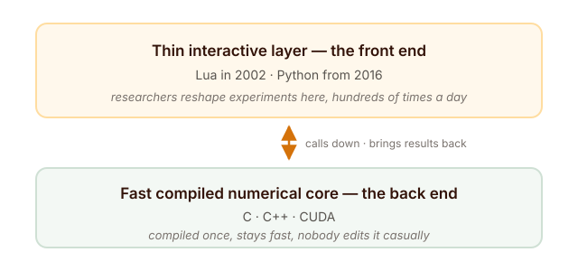
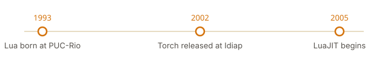
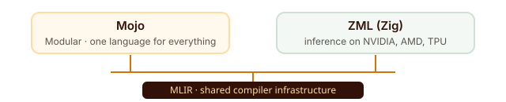

## Introduction

Imagine you own a car. To change the radio station, you must take the engine apart, put it back together, and only then can you hear the new station.

That was machine-learning research in the early 2000s.

Not because anyone was lazy. It was simply the only option available. Researchers wrote their code in C and C++ — **compiled languages**. You write the code, a compiler turns it into instructions the machine understands, and then it runs. Extremely fast. That speed is why C and C++ still sit underneath almost everything in AI today.

But there is a price. Change one line, and everything stops while the computer rebuilds the whole program. Compiled languages are not built to be *thought in*.

Think of the difference between writing a letter and making a phone call. With a letter, you write it, post it, and wait days for a reply before you can fix one wrong sentence. With a phone call, you fix the mistake inside the same conversation.

**Research is a conversation, not a letter.** It is a loop: try something, look at the answer, change one thing, try again. Change the learning rate. Add a layer. Swap a function. Every one of those small changes meant a full rebuild — minutes of waiting, hundreds of times a day.

Go to Balogun Market in Lagos and watch a tailor work. Measure, cut, sew, try it on, adjust the sleeve — all in one afternoon. That is what research needs. A tailor who takes two weeks per fitting would lose the customer. And a compiler that takes minutes per change loses the thinking.

> The loop you work in shapes the science you can do inside it.

::: {.callout-note title="The short version"}
Lua was created in 1993 by three researchers in Rio de Janeiro, to help Brazil work around a ban on importing foreign software. Twelve years later, it became the language of a machine-learning library.

Python was created in 1989 as a holiday project by a man who just wanted a nicer programming language. Twenty-seven years later, it became the language of the framework that trains the world's AI.

Neither language was built for machine learning. Both ended up at the centre of it. And here is the strangest part: **we are still doing it.**
:::

## Torch, 2002: two layers, one idea

In 2002, three researchers at the Idiap Research Institute in Martigny, Switzerland — **Ronan Collobert**, **Samy Bengio** and **Johnny Mariéthoz** — decided to fix this. They released *Torch: a modular machine learning software library*, a free, BSD-licensed library that collected most of the best machine-learning algorithms of the day into one framework.

The important part of their solution was not a language. It was a **division of labour**.

{#fig-two-layer}

Think of a buka. The big pot of rice is cooked once, in bulk, by the kitchen. The person serving plates it up differently for every customer — more stew here, less pepper there, extra meat for the next person. The heavy work happens once. The adjusting happens per customer, and it is fast.

Torch did exactly that to software: a heavy number-crunching engine written in C, cooked once, with a light scripting layer on top that a researcher could adjust all day long.

So the question the Torch team faced was never "what is the best programming language in the world?" It was much smaller and much more useful:

> What is the best language to sit on top of a fast C engine, adding as little weight as possible, while letting a researcher work in real time?

That reframing is the whole trick. And more than twenty years later, Mojo would discover the exact same idea again.

## The five languages Torch could have chosen

The bottom layer was never really a debate. For pure speed, C — and later CUDA — was the only serious answer. The open question was the top layer, and in 2002 several existing languages were genuinely in the running.

Think about how we move around Lagos or Abuja. A staff bus is fast and cheap, but it follows one fixed route and it will not turn because you asked it to. A keke napep is slower, but you can stop it anywhere and turn at any corner.

That is the trade-off between compiled and scripting languages. In 2002, the ideal would have been a keke that moved at bus speed. Here were the keke on offer:

### Python

Already ten years old, and it even had a real numerical library called **Numeric** — the direct ancestor of NumPy. But in 2002 it had three problems for this job. Its C extension API was heavier to bind against than Lua's, its interpreter used more memory, and it had no just-in-time compiler at all. The scientific ecosystem we now take for granted was still years away.

### Perl and Tcl

Both mature. Both embeddable. Both doing real production work in serious systems. But neither was designed around the clean, minimal C-embedding API that Lua was built for from day one. For a library whose entire selling point was "almost no weight on top of C," that mattered.

### Java

Genuinely fast by 2002, thanks to the HotSpot JIT compiler. But the Java Virtual Machine used a lot of memory, took time to start, and paused unpredictably to clean up after itself — bad news for tight numerical loops. And connecting Java to native C and CUDA code was far clumsier than Lua's C API.

### Ruby

Released in 1995, with no JIT of any kind for years afterward, and if anything slower than Python for numerical work. Ruby was a serious contender — but it was built for programmer happiness, not for speed, and it lost on exactly that.

### And Lua

A language built to be tiny, easy to embed, and almost frictionless to connect to C. It added barely any weight to Torch's C engine while still giving researchers a live, interactive environment.

::: {.callout-note title="The honest version"}
Nothing about Torch's idea *required* Lua. Lua simply offered the best combination available at that moment: small, easy to embed, and out of C's way.

But Lua was missing something that would matter enormously fourteen years later. It had no **ecosystem**. No NumPy. No pandas. Almost nobody outside game scripting was using Lua for numbers, so nobody built those libraries for it.
:::

## Where Lua came from, and why that mattered

Lua's own story has nothing to do with machine learning. It is nearly a decade older than Torch, and it starts with a trade policy.

In 1993, three researchers at **Tecgraf**, the Computer Graphics Technology Group at the Pontifical Catholic University of Rio de Janeiro, created Lua: **Roberto Ierusalimschy**, **Luiz Henrique de Figueiredo** and **Waldemar Celes**.

Through the 1980s, Brazil had a "market reserve" — a policy that restricted imports of foreign computer hardware and software, in order to grow a local technology industry. Engineers at **Petrobras**, the state oil company, needed flexible tools for processing and visualising their data. They could not easily buy the commercial software that existed. So Tecgraf built its own.

If you have ever watched a Nigerian industry build its own solution because importing was impossible or too expensive, you already understand the mood in that room. The existing scripting languages were judged too slow, too hard to move between systems, or too awkward to connect to C.

Lua's answer was a language that was fully ANSI C compliant, small, and designed from the ground up to extend C programs.

> The language underneath 2002's most advanced machine-learning library was a workaround for an import ban.

And nobody owns Lua. There is no company behind it and no foundation holding the keys. It is free, open-source, MIT-licensed software, still cared for at the same Brazilian university by essentially the same team — Ierusalimschy has led its design for over thirty years.

{#fig-lua-timeline}

## 2011: the gap closes

Lua had one real weakness as a front end: speed. A scripting language sitting on top of compiled C always costs you something.

That weakness did not survive **LuaJIT**, Mike Pall's just-in-time compiler for Lua, in continuous development since 2005. By the early 2010s, the Torch team had rewritten the library as **Torch7** on top of LuaJIT — and now the thin scripting layer ran at speeds close to native C.

Lua's last real gap against a compiled language had closed. Torch7 also brought the library to a much wider audience, and it is the version most researchers still remember. By any fair measure, it was excellent engineering.

And then, in 2016, it was replaced.

## 2016: PyTorch changes its mind

PyTorch was released in **September 2016** by **Adam Paszke**, **Sam Gross**, **Soumith Chintala** and **Gregory Chanan** at Facebook AI Research.

If you have followed the story this far, the surprising part is what PyTorch kept. It kept the shape. PyTorch was built on Torch's existing C++ engine — fast core underneath, light scripting layer on top. The two-layer idea survived completely intact.

What changed was the layer on top. **Lua out. Python in.**

Three things drove that decision.

### 1. The libraries were already there

By 2016, Python had already become the default language of scientific computing, on the strength of NumPy, SciPy and pandas. Lua's use outside Torch was mostly limited to scripting inside other programs, with games being the best-known example. This is what finally sank Lua — not a flaw in the language itself, but the absence of a scientific toolkit around it.

### 2. Nobody had to learn a new language

Making every new researcher learn a second language before they could touch the framework was pure friction. Wrapping the same C++ engine in Python meant new users could start with tools they already knew. You do not ask a new staff member to learn your village dialect before they are allowed to use the photocopier.

### 3. You could see your code actually run

This one is subtle but it changed everything. Python made it natural to build the computation step by step *as the code ran*, instead of defining the whole calculation up front as a separate static graph — which is the approach TensorFlow launched with on 9 November 2015. The practical result: fixing a PyTorch model felt like fixing ordinary Python code, because that is exactly what it was.

> Torch picked the fastest front end available. PyTorch picked the one every researcher already had on their laptop.

## Why Python, and not R, MATLAB or Julia

Python did not win by being the best language at mathematics. It won because each rival had one specific, structural reason it could not do this particular job.

| Language | Why it could not do the job |
|:---|:---|
| **R** | Built by statisticians to analyse *tables* of data, and it shows. The way it copies data in memory, its object system, and its design around two-dimensional data frames made the huge grids of numbers and graphics-card memory handling that deep learning needs feel glued on rather than built in. |
| **MATLAB** | Strong early popularity in universities, thanks to friendly matrix syntax and mature numerical routines. But MathWorks sells it under a proprietary licence, charged per user — which could not survive how research scaled after 2012: thousands of disposable machines in the cloud, and code shared openly between labs. |
| **Julia** | On paper, exactly the right technical shape — the speed of C without having to write C. But it was simply too young. In 2016 it had not even reached version 1.0 (that came on 8 August 2018), its APIs were still changing between releases, and it had no mature way to talk to CUDA or C++. |
| **Python** | None of those problems, plus one advantage none of the others had: it was useful for everything else too. It could run web servers, talk to databases and drive data pipelines. A team could build the whole path from research to production in one language. |

Two more things then let Python actually *win* instead of merely qualify.

### The spare-parts rule

Why does almost everyone in Nigeria drive a Toyota? Not because it is the nicest car. Because there is a mechanic on nearly every street and spare parts in every market. You buy the car you can keep on the road. Buy something exotic, and every small repair means ordering from abroad and waiting weeks.

Software works the same way. **The language is the car. The libraries are the spare parts.**

Lua was an excellent car with no parts anywhere. Python was the Toyota.

**NumPy was the first real part.** Built by Travis Oliphant — work starting in 2005 and released in 2006 by combining two earlier libraries, Numeric and NumArray — it gave Python something R and MATLAB never had in the open: one shared way to store a grid of numbers in memory, which SciPy, pandas and scikit-learn could all build on. pandas followed from Wes McKinney in 2008.

So a full data-science toolkit already existed *before* deep learning took off. That timing was not luck. It was fifteen years of work landing exactly when it was needed.

**And Python was easy to plug fast code into.** Connecting performance-critical C and CUDA code to Python was comparatively simple — exactly what PyTorch needed in order to expose its C++ engine through a clean Python surface. The very thing that made Python second-best in 2002 made it the obvious choice in 2016.

## The ground under everything: C, C++ and CUDA

Below all of this sits a layer that never competes for attention, because it never had a marketing budget or a conference keynote.

Think of a road. **C is the road itself** — the surface everything drives on. **C++ is that road with lanes, signs and traffic rules** added on top. **CUDA is the express lane reserved for the heavy trucks** — and only certain trucks are allowed in.

**C** was created by Dennis Ritchie at Bell Labs in 1972, mainly so that the Unix operating system could be rewritten in a portable language instead of assembly. No company owns it; it is defined by an international ISO standard maintained by committee. It is still the language that everything else in this story eventually compiles down through or connects to.

**C++** began as "C with Classes," a project Bjarne Stroustrup started at Bell Labs in 1979 to add object-oriented features to C without losing its speed or its ability to talk directly to hardware. The first version was in use inside AT&T by August 1983, the name C++ arrived around the same time, the first commercial version — Cfront 1.0 — shipped on 14 October 1985, and the first international standard was ratified in 1998. Like C, no company owns it. It is the language behind the actual number-crunching engines of Torch, PyTorch and most other frameworks.

**CUDA** is not quite a language in the same sense, but a platform and programming model for running code on NVIDIA graphics cards. NVIDIA released it in 2006–2007 so that ordinary software could use hardware that had previously only drawn pictures on screen. Unlike everything else here, CUDA is proprietary NVIDIA technology and only runs on NVIDIA hardware. It is the layer every framework in this story ultimately calls down to.

So the full stack, from top to bottom, looks like this: **researcher's idea → Python (or Lua) → C++ engine → C → CUDA → silicon.** Every layer earned its place by being the best available option for one narrow job. And not one of them was designed with the others in mind.

## The popular languages that missed the boat

Three languages from the 1980s and 90s are worth mentioning, because together they prove the whole point. All three were widely used, well designed, and completely absent from the AI story.

**Tcl** — 1988, John Ousterhout, UC Berkeley. He created it while building tools for designing computer chips, so that every tool would not need its own custom scripting language. That is *exactly* the problem Lua solved better, and Tcl is one of the languages Lua's creators openly judged too slow and too awkward to connect to C. Tcl did not die, though. It is the scripting layer underneath almost every major chip-design tool in the world, including Synopsys Design Compiler and Cadence Innovus. Chip designers still learn it today.

**Perl** — 1987, Larry Wall. Built as a practical scripting language for Unix, mainly to make report processing easier. Wall is a linguist by training, which is why the design motto is "there is more than one way to do it" — the thinking of a natural language, not a machine. It was another of the alternatives Lua's creators rejected. Perl survives in older system administration work and in bioinformatics pipelines, and its intended successor, Perl 6, split off to become a separate language called Raku.

**Ruby** — 1995, Yukihiro "Matz" Matsumoto, Japan. Built deliberately for programmer happiness, borrowing ideas from Perl, Smalltalk, Eiffel, Ada and Lisp. Of the three, Ruby came closest to this story: it was a genuine contender for Torch's front end in 2002 and lost on speed. Ruby on Rails is still a serious web framework. The language did not fail. It just won a different race.

::: {.callout-tip title="The punchline"}
Tcl runs chip design. Perl runs bioinformatics pipelines. Ruby runs web applications.

It is like three very good traders in the market — known, respected, busy all day — who simply never stocked the one item the whole market came to buy.

**None of them run tensors.** Being popular was never the advantage. Having a numerical ecosystem was — and that is the one thing none of the three ever built.
:::

## Who owns a language?

One quiet pattern runs through every entry in this story, and it is the part most histories skip.

The languages that became infrastructure ended up owned by **neutral non-profit institutions** — not by the companies that made them famous.

- **C and C++** — no corporate owner at all; defined by international standards committees.
- **Python** — the Python Software Foundation, founded in 2001, and since 2018 run by a steering council rather than one person.
- **R** — the R Foundation, with CRAN as the authority for its packages.
- **Julia** — the Julia Language organisation, with commercial support from JuliaHub.
- **Rust** — the Rust Foundation, formed on 8 February 2021 with founding members including AWS, Google, Huawei, Microsoft and Mozilla.
- **PyTorch itself** — on **12 September 2022**, Meta handed PyTorch to the Linux Foundation, creating the PyTorch Foundation with AMD, Amazon, Google Cloud, Meta, Microsoft Azure and NVIDIA as founding members.

And Lua, the language that carried this whole story for fourteen years? It never got one. It stayed with its three creators at a Brazilian university.

That is not automatically a bad thing. Lua is still free, still maintained, still used. But it tells you something. Frameworks get handed to neutral foundations when an entire industry depends on them and no single company can be trusted to hold the keys. Think of a market association: when the whole market relies on something, no one trader gets to control it.

Lua never reached that point, because the ecosystem around it never reached the point of mattering to an industry.

> A language becomes infrastructure when people stop asking who owns it.

## 2026: the problem nobody has solved

Here is where the story gets honest, because the problem Torch spotted in 2002 is **still unsolved**.

Remember the shape: a fast compiled core, with a friendly scripting layer on top. That means you still write two languages to do one job. Python for the model, C++ or CUDA for anything that must be fast. Every serious PyTorch user eventually hits this wall — you drop into a custom kernel, or write your own CUDA extension, and suddenly you are maintaining two codebases, in two languages, with two sets of tools.

It is like working in a Nigerian office. The memo goes out in English, but the moment you need someone to really understand the numbers, you switch to your own language. You need both. And every switch costs you something.

This is called the **two-language problem**, and as of 2026 three different groups are attacking it from three different directions.

### Rust — make the bottom layer better

Started as a personal project by Graydon Hoare in 2006, taken up by Mozilla from 2009, and stable since version 1.0 on 21 May 2015. Rust aims at the same territory as C++ — speed with safety — which makes it a natural fit for the *bottom* of the stack. Frameworks like **Candle** and **Burn** are building deep-learning tools directly in Rust, with a focus on lightweight inference on small and edge devices rather than training. This is the least ambitious of the three answers: it does not try to remove the second language, it tries to make that language better.

### Mojo — collapse the two layers into one

Announced by Modular in May 2023 and led by Chris Lattner, the creator of LLVM and Swift, Mojo is the most direct attack on the problem. The goal is one language that is as easy to write as Python but can also write hardware-level code — a single language for the whole stack. Technically it is built on **MLIR**, a compiler framework that grew out of LLVM. Adoption is still early and it is not compatible with the whole Python ecosystem, but Modular open-sourced Mojo's standard library in March 2024 under the Apache 2.0 licence. The intention is unmistakable: this is Torch's 2002 idea, except the ambition is to eventually not need two languages at all.

### Zig — an honest C replacement, with MLIR underneath

Announced by Andrew Kelley in February 2016, and aiming to replace **C** rather than C++ — a different job from Rust's. Its priorities are full compatibility with C, no hidden control flow, no hidden memory allocations, and excellent cross-compilation. It is governed by the Zig Software Foundation, a non-profit, and as of 2026 it still has not reached version 1.0.

Its entry into the AI story is **ZML**, a machine-learning framework for Zig that — like Mojo — is built on **MLIR**, alongside XLA. It focuses on inference rather than training, and targets NVIDIA, AMD and Google TPU hardware.

::: {.callout-important title="The detail worth sitting with"}
Mojo and ZML are built on **the same compiler foundation** — MLIR — yet they are different languages, built by different people, attacking the same problem from opposite ends of the stack.

Two separate teams betting on one piece of technology is usually a sign that the problem is real, and that nobody has found the answer yet.
:::

{#fig-mlir}

For all of that activity, one fact should calm any prediction: **as of 2026, Python still dominates model training.** The two-language problem has three credible challengers and no winner.

## What the pattern tells us

Look back across more than fifty years and the lesson is not the simple one. It is not "Python won because Python was better." It is narrower, and far more useful.

1. **You do not pick a language for a job. You pick one for a job at a moment.** R, MATLAB and Julia were not worse languages than Python. Each was ruled out by one specific constraint of that specific time — a data model, a licence, a release date.
2. **Structure outlives popularity.** C++ has never been anyone's favourite language, and it is still the load-bearing wall of modern AI. Tcl, Perl and Ruby were all more pleasant to write at some point. None of them run tensors.
3. **Ecosystems beat languages.** Lua lost to Python not because it was slow — LuaJIT fixed that — but because nobody ever built a NumPy for it. The library you can import matters more than the syntax you type.
4. **The right design at the wrong time loses to an adequate design at the right time.** Julia is the cleanest example in this entire history.
5. **And the core problem was never solved.** Torch's 2002 division of labour is still the shape of PyTorch in 2026. We have simply stopped noticing that we write two languages to do one job.

> No single language had to win everything. That was never the requirement.

Seen that way, the future looks less like a race to replace Python and more like a slow widening: one language for exploring ideas, several for running them fast, and the line between them always moving. Which is exactly what Mojo, Rust and Zig are arguing about — without agreeing on the answer.

::: {.callout-note title="Coming next in this series"}
This article is the trunk of the story. Each language below gets its own deep dive, published over the coming weeks:

1. **Lua** — the import ban, Tecgraf, and the language chosen to carry Torch
2. **Python** — Christmas 1989, ABC, and the climb to becoming the default
3. **R, MATLAB & Julia** — three rivals, three structural reasons
4. **C, C++ & CUDA** — the invisible layer everything runs on
5. **Tcl, Perl & Ruby** — popular, and nowhere near the tensors
6. **Rust, Mojo & Zig** — three answers to the two-language problem
:::

Which language did you start with, and how did you end up in Python? I am curious whether people here came to Python through science, or came to science through Python. Let me know in the comments below — and if you found this useful, share it with someone who is starting out.
