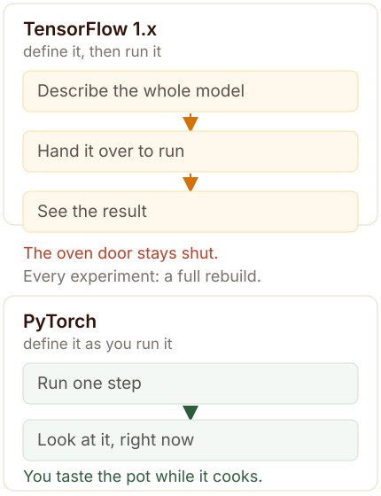
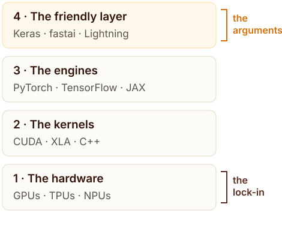

::: {.callout-note title="The short version"}

TensorFlow arrived in **November 2015** from Google Brain, built to take deep learning out of the research lab and into production. PyTorch arrived in **September 2016** from Facebook’s AI lab, built by a handful of people who wanted the opposite kind of tool: something you could change while you were thinking.

PyTorch won the researchers. TensorFlow won the deployed systems. Then Google moved its own researchers off TensorFlow and onto **JAX** — the framework it had quietly released in December 2018. That is the part of the story people usually get wrong: Google did not lose the framework war to PyTorch and leave the field. It changed frameworks, and left TensorFlow to do the job TensorFlow is still genuinely excellent at.

Along the way, an entire second war was fought one floor above the frameworks, over who owns the friendly layer that people actually type: **Keras**, **fastai** and **PyTorch Lightning**. That fight included one very public accusation, in February 2021, that has never really been settled.

:::

**In this article**

1. [The pot you can taste, and the oven you cannot open](#problem)
2. [Who was actually behind them](#who)
3. [The floor everyone fights over](#wrapper)
4. [fast.ai: the class that changed its textbook](#fastai)
5. [What fast.ai’s students did with it](#kaggle)
6. [Why anyone would still learn Keras](#keraswhy)
7. [Two stalls, one *Ankara* print](#ankara)
8. [Why Google left its own framework](#jax)
9. [Why academia picked PyTorch](#academia)
10. [Where all of them are now: September 2026](#now)
11. [What the fight was really about](#close)
12. [Sources and further reading](#sources)

## The pot you can taste, and the oven you cannot open {#problem}

Two people are cooking for the same *owambe* — the big Nigerian party where the food matters as much as the music. One is making *jollof* rice. She tastes it as it cooks, adds a little water, drops the heat, tastes again, and only then serves it. The other is baking a cake. He mixes everything, puts it in the oven, closes the door, and cannot taste or adjust anything until the cake is out.

Both are cooking. Only one of them can change her mind halfway.

That single difference is the cleanest way to understand the war between the two frameworks that have trained most of the world’s AI. [TensorFlow](https://www.tensorflow.org/){target="_blank" rel="noopener"}, in its first three years, was the cake. [PyTorch](https://pytorch.org/){target="_blank" rel="noopener"} was the *jollof*.

Technically, this is the difference between a **static graph** and a **dynamic graph**. In early TensorFlow you described the entire computation first — every tensor, every operation, every connection — and then handed that finished description to something called a session to run. The graph was built, then executed. Your Python code was really just a description of a computation that would happen somewhere else, later. To find out whether you had got it right, you ran the whole thing and looked at what came out the other end.

PyTorch worked the other way round. The graph was built as the code ran, one line at a time. The line you wrote was the line that executed. If you wanted to know what a tensor looked like halfway through a training step, you printed it. You could stop in the middle, change one line, and run again — the same way you would debug any ordinary Python program.

If that sounds like a small thing, think about how music is actually made. Nobody produces an Afrobeats record the way a composer writes sheet music for an orchestra — writing every part perfectly, then handing it over to be performed. A producer lays down a kick, listens, drops it, adds a log drum, listens, takes the hi-hat out, listens. The whole craft lives inside that loop between *do it* and *hear it*. Shorten that loop and better music comes out of the same hands.

Research works the same way. It is not one submission and a result. It is a thousand small “hmm, what if” moments, and each one needs to be cheap. TensorFlow 1.x made each one expensive. PyTorch made each one cheap. That is the seed of everything that came after.

{#fig-two-philosophies}

## Who was actually behind them {#who}

Both frameworks came out of the same kind of place — a big company’s research lab — but they were asked to do opposite jobs.

### TensorFlow: Google’s second attempt

Google’s first serious deep learning system was called **DistBelief**, built around 2011 and described in a 2012 paper titled, with no modesty at all, *Large Scale Distributed Deep Networks*. Its whole reason for existing was scale: training models spread across thousands of machines, the way Google had already learned to spread web search across thousands of machines. It worked. It was also internal, awkward to extend, and never meant to be handed to the public.

TensorFlow was the second generation, released as open source on **9 November 2015** under the Apache 2.0 licence. The name described the design: data flowing through a graph of operations, as tensors. Version 1.0 followed on 11 February 2017. This was a Google Brain project, from the organisation that had built the distributed systems everyone else was trying to catch up with — and the pitch to the world was simple: *this is the machinery Google uses to run machine learning in production, and now you can use it too.*

The intent matters. TensorFlow was designed to be a system you deploy. That is why its early graph felt like paperwork: a deployed system wants the whole computation defined and frozen, so it can be optimised, exported, and served to millions of users without surprises. The cake analogy was not an accident. It was a requirement.

### PyTorch: a small team’s fix for a daily annoyance

PyTorch came from the other side of the same world — Facebook AI Research, opened in 2013 — and it came out of Torch, the Lua library we met in the last article. The four original authors are usually listed as **Adam Paszke**, **Sam Gross**, **Soumith Chintala** and **Gregory Chanan**. PyTorch was released in **September 2016**. The paper describing it, published in 2019, has more than twenty authors, which tells you how quickly it grew from a small tool into infrastructure.

PyTorch was not designed to serve search results to a billion people. It was designed to make a researcher’s afternoon less annoying. That is a much smaller ambition — and, as it turned out, a much larger market.

Here is the part that decided the war later. Google needed TensorFlow to serve Google. Its design had to satisfy an enormous internal customer with production requirements. Meta had nothing like that to protect: Facebook’s AI lab wanted to publish papers and attract researchers, and the fastest way to do that was to give the world a tool that felt like ordinary Python. A framework built for its owner’s production needs is optimised for stability. A framework built for its owner’s reputation is optimised for *adoption*. PyTorch was optimised for adoption.

- **2011** &mdash; DistBelief, Google’s first deep learning system, goes into internal use.
- **2012** &mdash; The DistBelief paper describes training on clusters of thousands of machines.
- **2015** &mdash; TensorFlow released as open source on 9 November.
- **2016** &mdash; PyTorch released in September by a small team at Facebook AI Research.
- **2017** &mdash; TensorFlow 1.0 lands in February; Google holds its first TensorFlow Dev Summit.
- **2018** &mdash; Google quietly open-sources [JAX](https://jax.readthedocs.io/){target="_blank" rel="noopener"} in December.
- **2019** &mdash; TensorFlow 2.0 arrives in September, with the “run it as you write it” behaviour PyTorch had all along — and [Keras](https://keras.io/){target="_blank" rel="noopener"} becomes its official interface.
- **2022** &mdash; PyTorch is handed to the Linux Foundation as the [PyTorch Foundation](https://pytorch.org/foundation){target="_blank" rel="noopener"}.
- **2023** &mdash; Keras 3 makes the friendly layer multi-backend: one API, three engines.
- **2025** &mdash; Soumith Chintala leaves Meta in November, after almost eight years leading PyTorch.
- **2026** &mdash; Alban Desmaison becomes lead core maintainer in May; PyTorch 2.14.0 ships on 2 September; TensorFlow 2.21.0 (6 March) narrows its own focus to security and bug fixes.

## The floor everyone fights over {#wrapper}

To understand the rest of this story, you need to see the whole building. Modern AI tools stack up in four floors.

{#fig-four-floors}

Floors one and two do the actual arithmetic: matrix multiplications running on chips, written in C++ and CUDA. Floor three holds the engines — PyTorch, TensorFlow, JAX — the layer that turns your Python into those operations and tracks gradients for you. Floor four is the friendly layer: the short, human API that people actually type.

Everybody outside the field thinks the framework war was about floors two and three. It was not. Most working data scientists never chose a kernel or a graph design in their lives. They chose a *typing experience*. And the typing experience — the top floor — was contested by far more projects than the two famous ones.

### TensorFlow’s crowded top floor

Google’s own framework had so many friendly layers competing inside it that the acronyms alone are a small history: `tf.layers`, `tf.contrib`, Estimators, TF-Slim, TFLearn, and a beautiful one called Sonnet from DeepMind. Each promised to make TensorFlow easier. Each was maintained by a different group, with a different idea of what “easier” meant.

And then there was Keras.

### Keras: one cube that works in any pot

Think about *Maggi*. A single seasoning cube, and suddenly a pot of rice, a pot of beans and a pot of stew can be made by the same person with the same hand movements. That is what Keras was: one friendly interface that worked on top of different engines underneath.

It was created by **[François Chollet](https://fchollet.com/){target="_blank" rel="noopener"}** in March 2015, when it could run on Theano, TensorFlow or Microsoft’s CNTK. Then TensorFlow 2.0 arrived in 2019 and Keras became the official way to write TensorFlow. Many people, to this day, believe that was Keras’ creator’s master plan. It was not, and he has said so plainly. Asked on Hacker News in November 2024 why he decided to merge Keras into TensorFlow in 2019, Chollet answered:

> “I didn’t! The decision was made in 2018 by the TF leads — I was a L5 IC at the time and that was an L8 decision. The TF team was huge at the time, 50+ people, while Keras was just me and the open-source community. In retrospect I think Keras would have been better off as an independent multi-backend framework — but that would have required me quitting Google back then.”

*Source: François Chollet, answering “Why did you decide to merge Keras into TensorFlow?” in a Hacker News discussion, 14 November 2024 — [news.ycombinator.com/item?id=42133844](https://news.ycombinator.com/item?id=42133844){target="_blank" rel="noopener"}.*

Read that again, because it is the clearest sentence anyone has written about how these decisions really get made. A researcher in California had built a tool used by millions. A management decision inside a large company folded it into a framework. And the person who wrote it says that, looking back, the tool should have stayed independent.

In 2023, Keras 3 did exactly that: it became multi-backend again, running the same code on TensorFlow, JAX or PyTorch. Chollet left Google in November 2024 to start his own company. Keras, by his own count, has around two million developers, and shows up in production at places like Waymo, YouTube, Netflix, Spotify and Midjourney. There is something delightfully strange in the current arrangement: **the friendliest way to use TensorFlow is now also a perfectly good way to use PyTorch.**

## fast.ai: the class that changed its textbook {#fastai}

If the framework war was fought on the top floor, the most important weapon was not code. It was teaching.

**[fast.ai](https://www.fast.ai/){target="_blank" rel="noopener"}** was founded in May 2016 by **Jeremy Howard** and **[Rachel Thomas](https://rachel.fast.ai/){target="_blank" rel="noopener"}**, with a teaching philosophy that annoyed a lot of people at the time: go top-down. Do not start a beginner with linear algebra and a proof. In lesson one, train a model that would have been unthinkable a few years earlier. Let the student be amazed first, and curious second. Then explain why it works.

The philosophy had a name and a paper trail behind it. Howard called it **top-down learning**, and he was not inventing it from nothing: it descends from George Polya’s *How to Solve It* (1945), which argued that students learn fastest by tackling a real problem, restating it, planning, carrying the plan out, then reflecting on what happened. fast.ai’s version of that became the whole game: in the first lesson you train a model that would have been unthinkable a few years earlier, and you find out that it works.

The maths and the derivations arrive afterwards, when you have something concrete to hang them on. Everything was published free — notebooks, videos, and in 2020 the book *[Deep Learning for Coders with fastai and PyTorch](https://github.com/fastai/fastbook){target="_blank" rel="noopener"}*.

I met PyTorch the way a great many people did: through fast.ai. In 2018 I stayed up late more than a few times to catch their live classes, which were then being streamed out of the Bay Area. I was living in Nigeria at the time, and California is eight hours behind, so “staying up late” meant something very particular: it meant being lucky. Lucky that the light — the electricity — was still on.

A blackout is still called *NEPA* here, after the power authority whose name outlived the authority itself. When the light went, the night came with a price attached: start the generator and keep the whole street awake, or close the laptop and catch up the next day — fast.ai always posted the recordings, so nothing was ever really lost, only delayed. By the time the later courses were being shot, Jeremy and Rachel had moved to Australia, where they still live — the 2022 course opened at 6pm Brisbane time.

What stayed with me was not one API. It was the ordering of the lessons: build something real first, understand it second. I work directly in PyTorch now rather than through fastai, but that ordering is the part I want to carry into my own introductory classes — and, later, into teaching agents.

That last sentence is worth being precise about, because it is the real transfer here. The fastai library gave people a shortcut; the fastai *method* gave them a way of learning that kept working after the shortcut changed. A framework you can lose. A teaching order you keep.

Their first courses were taught with Keras on top of TensorFlow and Theano. In September 2017 they announced that fast.ai was moving to PyTorch — and the reason they gave was precisely the taste-the-pot difference from Figure 1: the dynamic behaviour made experimentation and iteration faster, and, more bluntly, most of the newest research papers were already written in PyTorch.

In January 2018 the new course launched on PyTorch. And here is the detail that should be framed in every framework history written since. The course still showed the same task done with Keras and TensorFlow — and described the result in its own launch notes: it took a lot more code and compute time to get a much lower accuracy. A teacher with no shares in either company had put both pots on the same fire and let the students compare the food.

*Source: fast.ai, “Practical Deep Learning for Coders” launch post, 26 January 2018 — [fast.ai/posts/2018-01-26-v2-launch.html](https://www.fast.ai/posts/2018-01-26-v2-launch.html){target="_blank" rel="noopener"}. The wording on the page is: “The course also shows how to use Keras with Tensorflow, although it takes a lot more code and compute time to get a much lower accuracy in this case.”*

fastai v1, a full library on top of PyTorch, was released in October 2018. fastai v2 and a new course followed in August 2020. In February 2020, Howard and his co-authors published a paper describing fastai as a *layered* API: one-line functions at the top for people who just want the result, and every layer below available to anyone who wants to go deeper.

That idea — a single stack with reachable layers — turned out to be one of the most influential design arguments of the decade. It is also, and this is the awkward part, exactly where the next fight started.

## What fast.ai’s students did with it {#kaggle}

Testing a teaching method needs a scoreboard. In machine learning that scoreboard is **[Kaggle](https://www.kaggle.com/competitions){target="_blank" rel="noopener"}**: one dataset, thousands of teams, one private leaderboard, one number.

fast.ai students arrived early and in volume. The library’s defaults — learning-rate finder, progressive resizing, one-cycle training, test-time augmentation — bundled known good practice into one afternoon on one GPU. **[iafoss](https://www.kaggle.com/iafoss){target="_blank" rel="noopener"}**, a Kaggle Grandmaster, published fastai notebooks that became the templates other people started from.

Cassava Leaf Disease Classification, 2020–21: 21,000 photographs of a crop that feeds hundreds of millions of people in Africa, split into four diseases and healthy; 3,900 teams. fastai notebooks were common on the boards. **Zach Mueller**’s scored 83.5% with an EfficientNet-B3 and the Ranger optimiser.

*Source: Zach Mueller’s public notebook for that competition — [kaggle.com/code/muellerzr/fastai-efficientnet-b3-with-ranger-83-5](https://www.kaggle.com/code/muellerzr/fastai-efficientnet-b3-with-ranger-83-5){target="_blank" rel="noopener"}.*

What won was an ensemble of four models — ResNeXt50, a vision transformer, EfficientNet-B4, MobileNet — whose decisive ingredient was **CropNet**, a **[TensorFlow Hub](https://www.tensorflow.org/hub){target="_blank" rel="noopener"}** checkpoint pretrained on cassava leaves. Public score 91.36%, private 91.32%. By the winning team’s own account, CropNet mattered for the diversity it added to the ensemble rather than for its standalone accuracy. TensorFlow supplied the winning ingredient in a competition run on PyTorch tooling.

*Source: Cassava Leaf Disease Classification, 1st place solution write-up, 25 February 2021 — [competition write-up and winning notebooks](https://www.kaggle.com/competitions/cassava-leaf-disease-classification/discussion/221957){target="_blank" rel="noopener"}.*

The method has not expired. CSIRO Image2Biomass, January 2026: 54th place, built on [timm](https://github.com/huggingface/pytorch-image-models){target="_blank" rel="noopener"} backbones and [DINOv3](https://github.com/facebookresearch/dinov3){target="_blank" rel="noopener"} weights, with fastai 2.8.4 running the training and three-fold grouped cross-validation keeping it honest.

*Source: “All I Need Is fastai, timm, and DINOv3”, CSIRO — Image2Biomass Prediction, 30 January 2026 — [competition write-up](https://www.kaggle.com/competitions/csiro-biomass/writeups/54th-place-solution-all-i-need-is-fastai-timm-a){target="_blank" rel="noopener"}.*

Three limits are worth stating plainly. A leaderboard measures one dataset, not general ability. What travelled between ecosystems was a checkpoint, not an interface. And framework preference predicted little of the outcome here; data, validation splits and ensembling predicted most of it.

## Why anyone would still learn Keras {#keraswhy}

One number settles the “who still uses Keras?” question better than any argument. In Stack Overflow’s 2021 developer survey — 59,921 respondents, asked which frameworks they had done serious work in that year — **Keras was named by more developers (10.14%) than PyTorch was (9.89%)**, with TensorFlow further ahead at 16.53%. Outside the research bubble, the wrapper was at least as big as the engine.

*Source: [Stack Overflow Developer Survey 2021](https://survey.stackoverflow.co/2021/){target="_blank" rel="noopener"}, “other frameworks and libraries”.*

If fastai is the shortcut for researchers, Keras is the shortcut for everyone else — and in competitions, that shortcut is a strategy rather than a beginner’s crutch.

Start with the shelf. Keras Applications and TensorFlow Hub together are a library of hundreds of pretrained models with one-line loading: every EfficientNet, every Vision Transformer, every detection and segmentation model, many with weights trained on data far more specific than ImageNet. CropNet, the cassava model that decided a competition, lived on that shelf. When you are choosing a starting point under time pressure, the width of the shelf matters more than the elegance of the API — and the Keras/TF path to training on TPUs is one of the best-documented routes on Kaggle.

Then there is the plain reason Keras survived three framework wars: it was designed to shrink the distance between an idea and a running model. *Model.fit* is four words. A beginner can be training a real network ten minutes after installing it, and that is not a toy virtue — it is the same virtue that made fast.ai’s first lesson work.

And it travels. Keras 3 runs on three engines — TensorFlow, JAX and PyTorch — so what you learn is the interface, not a bet on one company. My favourite way to think about it is the spice mix at a *suya* stand — the spiced, grilled meat skewers that began in northern Nigeria and are now roasted in almost every state in the country, across the borders into neighbouring countries, and wherever Nigerians have settled abroad. The seller’s skill is the mix, not the grill: the same blend works on beef, chicken, or *kpomo* — cow skin, simmered for hours until it is soft, and a particular favourite in the south-west. Keras is that mix. Change the grill underneath — TensorFlow, JAX, PyTorch — and the recipe still works.

Which leaves the honest question: if PyTorch is where the field is, why spend a weekend on Keras at all?

Because a great deal of the world runs on it, and somebody has to maintain that world. TensorFlow and Keras are inside phones, cameras, cars and televisions through [LiteRT](https://ai.google.dev/edge/litert){target="_blank" rel="noopener"}, the on-device runtime; they are in factories, banks and hospitals through TF Serving; they are in the notebooks of every data scientist who learned the field between 2016 and 2022. Millions of developers have used Keras. Code bases that large do not get rewritten because the research fashion changed — they get maintained, extended and migrated slowly, by people who can read them. That is a job, and it is a real one.

There is also the teaching reason, which matters more to me than either of the above. Keras is where the vocabulary of modern deep learning was standardised: layers, compile, fit, predict, callbacks, checkpoints. When you meet [PyTorch Lightning](https://lightning.ai/pytorch-lightning){target="_blank" rel="noopener"}’s *Trainer*, or fastai’s *Learner*, or Hugging Face’s *Trainer*, you are meeting the same grammar in a different accent. Learn the grammar once, in the simplest version of it, and every other library on the top floor becomes readable.

Keras is also the reason the wrapper war ended the way it did. Chollet built it as a wrapper so people would not have to care which engine was underneath — and by 2023 that idea had won so completely that Keras 3 lets you pick the engine on the way in. The wrapper outlived the war it was conscripted into.

## Two stalls, one *Ankara* print {#ankara}

If you have ever bought fabric in a Nigerian market, you know the scene. *Ankara* — the bright wax-print cloth that turns up at every wedding, naming ceremony and *owambe* — is sold from dozens of stalls, and two stalls are often holding the exact same print. One trader insists she designed it. The other says it is simply what customers ask for, and always has been. Neither one backs down, and both are holding the same cloth.

For that same argument to reach software, it needs two ingredients: a genuinely good idea, and two projects that both need it. In early 2021, the top floor of the PyTorch world had exactly that.

The idea was the *layered API*: short one-line functions for the common case, and full control reachable underneath, without switching libraries. fast.ai had published a paper about it in February 2020 and built its whole library that way.

The second project was **PyTorch Lightning**, created by **[William Falcon](https://www.williamfalcon.com/){target="_blank" rel="noopener"}** — whose first public release went up on 31 March 2019 — to fix a specific, boring problem: every PyTorch user rewrites the same training loop, and most of them write it slightly wrong. Lightning organised that loop, and it became popular quickly.

On 2 February 2021, the Lightning team released **Lightning Flash**: a new top floor of ready-made “tasks” for common problems. Two days later, on 4 February, Jeremy Howard made his view public:

> “I’m hearing comments that Grid AI (Lightning) seem to have copied fastai’s API without credit, and claimed to have invented it.”

*Source: Jeremy Howard on X, 4 February 2021, 23:39 UTC — [x.com/jeremyphoward/status/1357473938167664644](https://x.com/jeremyphoward/status/1357473938167664644){target="_blank" rel="noopener"}. The full wording, in his own post, is: “I’m hearing comments that Grid AI (Lightning) seem to have copied fastai’s API without credit, and claimed to have invented it.”*

The next day he went further, in a follow-up post that named nobody but left no doubt: *“Wow. The PyTorch Lightning founder publicly used baseless patent threats to try to stop new competitors from creating open source software.”* He went further still, warning Lightning’s own users that aggressive patent use could leave them exposed to fees if the project were ever re-licensed. That week, the fight spilled onto the machine learning forums, where a long, heated thread argued about whether the layered design had been taken from fastai’s published work without acknowledgement.

*Source: Jeremy Howard on X, 5 February 2021, 19:21 UTC — [x.com/jeremyphoward/status/1357771368406876164](https://x.com/jeremyphoward/status/1357771368406876164){target="_blank" rel="noopener"} (445 likes, 66 reposts at the time of writing). Ongoing community argument the same week: [r/MachineLearning, “PyTorch Lightning Flash appears to be copying fastai (without any credit)”](https://www.reddit.com/r/MachineLearning/comments/lcvz1f/){target="_blank" rel="noopener"}.*

Now the honest part, the part that most write-ups skip. **This dispute has never been settled, and it probably cannot be.** Nobody can see influence in a diff. By 2021 the layered idea was genuinely in the air: Keras had been offering one-line model building since 2015, scikit-learn had normalised the `fit` / `predict` convention across all of data science, and Lightning itself existed to delete boilerplate. Two people can arrive at the same good design from different directions and both be telling the truth about where they got it. What is on the public record is an accusation, made by a founder, in writing, on a specific date — and no retraction, settlement or court case that I could find in the five years since.

What is also on the record is that both projects kept working, and both mattered. PyTorch Lightning (at version 2.6.6 today) is one of the standard ways teams organise training code, and it grew into a company, with Falcon as its CEO. fastai kept teaching — Howard went on to found Answer.AI in 2023 — and the layered-API argument it made is now so widely accepted that it no longer reads as an argument. You can see it in Hugging Face’s two-line model loaders, in Lightning’s own tasks, and in every modern library that offers a one-line shortcut with a door underneath.

That is the pattern worth remembering about the top floor: the ideas circulate, the credit does not. The *Ankara* print is on both stalls, and the customers went home happy.

The other half of that account deserves the same space. Whatever the argument over where the ideas came from, **what Lightning actually removed was the least glamorous and most repeated code in the field**: the training loop. Checkpointing, learning-rate schedules, logging, mixed precision, restarting from the last good epoch, running across several GPUs without hand-writing distributed code — Lightning turned all of it into a configuration choice. Teams adopted it because a training script that one person can rerun six months later is worth more than a clever one nobody can reproduce. The project grew into [Lightning AI](https://lightning.ai/about){target="_blank" rel="noopener"}, which now sells a platform for training and deployment end to end (“from GPU to endpoint”, in their words), with Falcon as CEO.

But there is a tension in that convenience that sits right on top of the argument I made about teaching a few screens up, so let me say it plainly. fastai, Lightning and Keras all make the training loop disappear. For someone learning, that is the difference between seeing a result today and giving up next week — and it is also how you end up with a model that will not train and no idea which line to look at, because you have never written the loop you are debugging.

My own view, and it is the view I would teach: **write the loop by hand once**, all of it, on a small dataset, until you can say what every line does. It is a few hours of work. After that, let the libraries carry it forever, and you will be the person on the team who can tell the difference between a model problem and a plumbing problem.

## Why Google left its own framework {#jax}

The circulating version of this story — PyTorch beat TensorFlow, so Google gave up — is wrong. Google moved its research onto a framework it wrote itself.

[JAX](https://jax.readthedocs.io/){target="_blank" rel="noopener"} was open-sourced in December 2018: a NumPy-style library from Google Research with a compiler, XLA, underneath. It kept the graph thinking of the original TensorFlow and discarded the clumsiness.

DeepMind [announced](https://deepmind.google/discover/blog/using-jax-to-accelerate-our-research/){target="_blank" rel="noopener"} its move to JAX in 2020; by 2022, reporting had both Brain and DeepMind largely off TensorFlow. Gemini runs on Google-designed TPUs, where JAX is the natural fit.

Three reasons, none of them sentiment. **One:** the matched set — Google makes the TPUs, JAX compiles for them, so compiler and chip are owned together. **Two:** the researcher’s loop was already lost to PyTorch, so optimising TensorFlow for it bought nothing. **Three:** JAX transforms whole functions in parallel, which is what tuning and architecture search look like at Google’s scale.

A record label that owns studio, band and stadium, then hands the studio to an in-house artist whose sound works only on its own instruments. The band it let go headlines every other stage in the world. That is TPU-and-JAX; the band is TensorFlow.

TensorFlow was not dropped. Version 2.21.0 shipped on **6 March 2026**, described by Google as security fixes, bug fixes and dependency updates — a statement of ambition, not a funeral. Production machine learning still runs on it in volume.

The accurate sentence is this: **TensorFlow lost the argument about how to write code and kept an empire nobody else built.** That empire is not on the server. It is in the device in your hand — phones, cameras, cars, televisions, sensors — where [LiteRT](https://ai.google.dev/edge/litert){target="_blank" rel="noopener"}, TensorFlow Lite’s successor, does the inference, running models converted from PyTorch and JAX as well as its own. The framework that lost the war sits inside more physical objects than the ones that won it.

PyTorch answered the ownership problem JAX raises. In September 2022 it was handed to the Linux Foundation as the [PyTorch Foundation](https://pytorch.org/foundation){target="_blank" rel="noopener"}, with AMD, AWS, Google Cloud, Meta, Microsoft and NVIDIA at the table. A framework owned by one company is a business relationship; a framework owned by a foundation is a shared road, which is why rival chip makers build for it.

## Why academia picked PyTorch {#academia}

People often frame this as a mystery, or a matter of taste. It was neither. It was a set of very ordinary incentives pointing in one direction at the same time.

**One: the loop was shorter.** Research is not a single submission. It is hundreds of small guesses a day, and a framework that shortens each guess gets used more. Everything in Figure 1 lands here.

**Two: a model was just Python.** In PyTorch, a neural network is an object you can print, inspect, step through in a debugger and reason about like any other Python code. In early TensorFlow, you were writing a description of a computation for something else to run, and when it went wrong, the error surfaced far away from the cause. Graduate students do not have the patience of large engineering teams. They do have deadlines.

**Three: the code travelled with the paper.** When a paper claims a result, reviewers and readers want the code, and what they find is a repository. When that repository is PyTorch, the next researcher starts from PyTorch. When they write their own paper, they publish PyTorch. Research code did not just reflect the choice — it reproduced it.

**Four: the teachers switched first.** fast.ai was the loudest example, but the pattern repeated in university courses: whoever writes the assignment sheet decides what the next generation knows. A whole cohort learns the tool it is taught, then defends the tool it knows.

**Five: the jobs followed.** Once research labs and then startups hired researchers trained on PyTorch, the hiring pool and the tool became the same thing. At that point it stops being a technical decision at all.

You can call all of this network effects, but the everyday version is simpler: the party moves to wherever the DJ everyone likes is playing, and then the crowd makes the party. PyTorch did not win because it was announced better than TensorFlow. It won because the crowd arrived first and never left.

### What the numbers actually measure

Framework statistics are quoted constantly and almost never explained, which is why the “who won” argument goes round in circles. Here is the same decade, counted five different ways.

| What was counted | What it shows | What it actually measures |
|---|---|---|
| Papers at the major conferences, 2018 | TensorFlow ahead everywhere — by more than two to one at ICLR (54 to 24) and NAACL (34 to 12) | Research culture in the years TensorFlow was the default workshop tool |
| The same count by 2023 | PyTorch in almost 80% of the papers that used *either* framework, up from about 7% in 2017 — and 55% of the authors who published with TensorFlow in 2018 had moved to PyTorch by 2019 | Where research code lives now — the clearest single signal of the switch |
| Computer vision conference submissions, 2018 to 2019 | PyTorch papers at CVPR grew from 82 to 280 in a single year; TensorFlow papers went from 116 to 125 | How fast a generation of students can switch once a tool becomes the norm |
| Developer surveys covering every industry, 2021 → 2024 | TensorFlow still well ahead in 2021 (16.5% against 9.9%); PyTorch only drew level in 2024 (10.6% against 10.1%) | What is running in companies, where old systems keep working and nobody rewrites what is not broken |
| Google’s own research, since about 2022 | JAX | One company’s internal needs — not the field’s |
| On-device inference in phones, cars and cameras | TensorFlow’s descendant stack | The quiet empire: hardware where “latest framework” is the last thing anyone cares about |

*Sources, in table order: the conference counts for 2018 and the CVPR 82 → 280 figures come from *The State of Machine Learning Frameworks in 2019* in [The Gradient](https://thegradient.pub/state-of-ml-frameworks-2019-pytorch-dominates-research-tensorflow-dominates-industry/){target="_blank" rel="noopener"}. The 7%-to-almost-80% trajectory and the 55% switch of 2018’s TensorFlow authors come from [AssemblyAI’s 2023 analysis](https://www.assemblyai.com/blog/pytorch-vs-tensorflow-in-2023){target="_blank" rel="noopener"}, which drew on Papers with Code’s framework tracker — that tracker no longer exists as a separate site, having been folded into Hugging Face, so the trajectory is cited through the writing that recorded it rather than from the tracker itself. The developer-survey figures are the “other frameworks and libraries” question in the Stack Overflow Developer Surveys of [2021](https://survey.stackoverflow.co/2021/){target="_blank" rel="noopener"} and [2024](https://survey.stackoverflow.co/2024/technology){target="_blank" rel="noopener"}. Google’s own use of JAX is from [DeepMind’s own account](https://deepmind.google/discover/blog/using-jax-to-accelerate-our-research/){target="_blank" rel="noopener"}, and the on-device stack is [LiteRT](https://ai.google.dev/edge/litert){target="_blank" rel="noopener"}.*

Read down that table and the contradiction dissolves. Academia chose the shortest loop. Companies kept what was deployed. Google chose what matched its chips. Phones got whatever was smallest and most reliable. Four different questions, four different answers — and the only reason it looks like a contradiction is that we insist on one winner.

## Where all of them are now: September 2026 {#now}

**PyTorch** is the default of the field and no longer has a single owner in the old sense: version 2.14.0 shipped on 2 September 2026, the project is governed through the PyTorch Foundation, and the person at the front of the technical line changed this year. Soumith Chintala — one of the original authors, who led the project for almost eight years — left Meta in November 2025 and is now chief technology officer at Thinking Machines Lab.

In May 2026 the core maintainers passed the lead maintainer role to **Alban Desmaison**, an engineer who has worked on PyTorch for years. Chintala’s own summary of what he handed over was that the project went from nothing to more than 90% adoption in AI. Treat that as the departing leader’s number, not a neutral survey — but as departing-leader numbers go, it is a remarkable sentence.

**TensorFlow** is in a different business now. Version 2.21.0 arrived on 6 March 2026, and Google’s announcement says the focus is squarely on security fixes, bug fixes and dependency updates. It remains enormously deployed. Its descendant stack for devices, **LiteRT**, is Google’s on-device inference engine, and it accepts models converted from PyTorch and JAX as well as its own. TensorFlow stopped being where new research happens, and stayed where the world’s existing systems run.

**Keras**, the friendly layer that survived all of it, is at version 3.15.1 and runs happily on TensorFlow, JAX or PyTorch. Its creator François Chollet left Google in November 2024; Keras is used by something like two million developers, including inside Waymo, YouTube, Netflix and Spotify.

**JAX** is Google’s house style: it powers DeepMind research and Google’s flagship models, and it has a real following in scientific computing, where its functional design suits simulation and physics-shaped problems. It is not competing for the general developer’s afternoon.

**[fastai](https://github.com/fastai/fastai){target="_blank" rel="noopener"}** keeps teaching. Its most recent course went out in October 2025, and the layered API it argued for in 2020 is now simply how good libraries are built. **PyTorch Lightning** grew into Lightning AI, a company building training infrastructure, with its framework still actively released. The February 2021 argument changed nothing about either project’s direction.

And the war has moved. Nobody argues about `model.fit` versus a training loop any more, because the interesting top floor now wraps *models* rather than training code: Hugging Face’s loaders, inference servers, agent frameworks. Below that, the fight that replaced the framework war is a chip fight — TPUs with JAX, GPUs with PyTorch, and Apple quietly shipping its own framework for its own silicon. The pattern from 2016 is repeating one floor down: the engine matters less than who owns the whole stack.

## What the fight was really about {#close}

Two frameworks, one psychology. TensorFlow was built by people whose job was to make machine learning survive contact with production: frozen graphs, predictable execution, deployment to millions. PyTorch was built by people whose job was to make research less annoying. Google’s tool was more ambitious. The other tool was better at the thing that decides everything else: being pleasant to use while you are still unsure.

Five things are worth carrying out of this story.

**The loop beats the benchmark.** In 2016, TensorFlow had the better story about scale. PyTorch had the shorter loop between a guess and an answer, and the loop is what gets used a hundred times a day.

**Adoption is decided one floor above the technology.** Nobody chose a graph design. They chose the typing experience — and that is why the biggest fight of the decade was between wrappers, and why Keras, an interface, outlived both engines’ dominance in its own quiet way.

**Ideas on the top floor travel without their labels.** The layered API is now standard practice, and the argument over who invented it was never resolved. That is the normal outcome, not a scandal: good design ideas escape their authors.

**There is more than one way to win.** PyTorch owns the papers. TensorFlow owns a billion devices with code that nobody has touched in years and nobody needs to. Losing the argument about how to write code did not cost Google an empire; it just moved it into hardware.

**Who owns the tool decides how long it lives.** Google moved its own researchers to a framework it controls end to end. PyTorch’s creator walked away, and the project was handed to a foundation with its competitors at the table — which is precisely why the competitors keep building for it.

So the party analogy holds all the way to the end. The *owambe* was judged by the food the guests ate, not by the kitchen that cooked it. The kitchen that lost the argument is still the one feeding the estate, quietly, one device at a time — and the kitchen that won is cooking almost every paper you will read this year. Nobody lost the party. The guests just chose a pot they could taste from.

## Sources and further reading {#sources}

Everything in this article that can be pinned to a document is pinned below, grouped by what it is. Every link opens in a new tab, so you can check a claim without losing your place here. All of them were checked and returning a page at the time of writing.

### The quotes, in their own words

- [Jeremy Howard on X, 4 February 2021 — the accusation](https://x.com/jeremyphoward/status/1357473938167664644){target="_blank" rel="noopener"}
- [Jeremy Howard on X, 5 February 2021 — the patent-threat post](https://x.com/jeremyphoward/status/1357771368406876164){target="_blank" rel="noopener"}
- [r/MachineLearning, February 2021 — “PyTorch Lightning Flash appears to be copying fastai (without any credit)”](https://www.reddit.com/r/MachineLearning/comments/lcvz1f/){target="_blank" rel="noopener"}
- [François Chollet on Keras being merged into TensorFlow (Hacker News, 14 November 2024)](https://news.ycombinator.com/item?id=42133844){target="_blank" rel="noopener"}
- [fast.ai, January 2018 — the launch note that compares the same task in Keras and TensorFlow](https://www.fast.ai/posts/2018-01-26-v2-launch.html){target="_blank" rel="noopener"}

### Primary sources: the frameworks

- [PyTorch](https://pytorch.org/){target="_blank" rel="noopener"}
- [TensorFlow](https://www.tensorflow.org/){target="_blank" rel="noopener"}
- [TensorFlow release notes (including 2.21, March 2026)](https://github.com/tensorflow/tensorflow/releases){target="_blank" rel="noopener"}
- [Keras](https://keras.io/){target="_blank" rel="noopener"}
- [Keras 3 — one API, three backends](https://keras.io/keras_3/){target="_blank" rel="noopener"}
- [JAX](https://jax.readthedocs.io/){target="_blank" rel="noopener"}
- [DeepMind, 2020 — “Using JAX to accelerate our research”](https://deepmind.google/discover/blog/using-jax-to-accelerate-our-research/){target="_blank" rel="noopener"}
- [PyTorch Lightning](https://lightning.ai/pytorch-lightning){target="_blank" rel="noopener"}
- [William Falcon](https://www.williamfalcon.com/){target="_blank" rel="noopener"}
- [Lightning AI, the company](https://lightning.ai/about){target="_blank" rel="noopener"}
- [fast.ai](https://www.fast.ai/){target="_blank" rel="noopener"}
- [the fastai library](https://github.com/fastai/fastai){target="_blank" rel="noopener"}
- [fastai releases (2.8.x through 2026)](https://github.com/fastai/fastai/releases){target="_blank" rel="noopener"}
- [The PyTorch Foundation](https://pytorch.org/foundation){target="_blank" rel="noopener"}
- [PyTorch: An Imperative Style, High-Performance Deep Learning Library (arXiv 1912.01703)](https://arxiv.org/abs/1912.01703){target="_blank" rel="noopener"}
- [fastai: A Layered API for Deep Learning (arXiv 2002.04688)](https://arxiv.org/abs/2002.04688){target="_blank" rel="noopener"}
- [TensorFlow Hub — where CropNet lives](https://www.tensorflow.org/hub){target="_blank" rel="noopener"}
- [Keras Applications — the pretrained-model shelf](https://keras.io/api/applications/){target="_blank" rel="noopener"}
- [LiteRT — TensorFlow on phones, cameras and cars](https://ai.google.dev/edge/litert){target="_blank" rel="noopener"}
- [timm](https://github.com/huggingface/pytorch-image-models){target="_blank" rel="noopener"}
- [DINOv3](https://github.com/facebookresearch/dinov3){target="_blank" rel="noopener"}

### fast.ai, still teaching

- [the 2022 fast.ai course opening — 6pm Brisbane time](https://forums.fast.ai/t/welcome-to-the-2022-fast-ai-course/95295){target="_blank" rel="noopener"}
- [Practical Deep Learning for Coders (free course)](https://course.fast.ai/){target="_blank" rel="noopener"}
- [the fastai book, as free notebooks](https://github.com/fastai/fastbook){target="_blank" rel="noopener"}

### Competitions

- [Cassava Leaf Disease Classification](https://www.kaggle.com/competitions/cassava-leaf-disease-classification){target="_blank" rel="noopener"}
- [its first-place solution write-up, February 2021](https://www.kaggle.com/competitions/cassava-leaf-disease-classification/discussion/221957){target="_blank" rel="noopener"}
- [Zach Mueller’s Cassava notebook (EfficientNet-B3 + Ranger, 83.5%)](https://www.kaggle.com/code/muellerzr/fastai-efficientnet-b3-with-ranger-83-5){target="_blank" rel="noopener"}
- [CSIRO Image2Biomass, January 2026 — “All I Need Is fastai, timm, and DINOv3”](https://www.kaggle.com/competitions/csiro-biomass/writeups/54th-place-solution-all-i-need-is-fastai-timm-a){target="_blank" rel="noopener"}
- [Kaggle competitions, if you want to try this yourself](https://www.kaggle.com/competitions){target="_blank" rel="noopener"}

### Where the numbers come from

- [The State of Machine Learning Frameworks in 2019](https://thegradient.pub/state-of-ml-frameworks-2019-pytorch-dominates-research-tensorflow-dominates-industry/){target="_blank" rel="noopener"} — conference-by-conference paper counts for 2018 and 2019 (The Gradient)
- [PyTorch vs TensorFlow in 2023](https://www.assemblyai.com/blog/pytorch-vs-tensorflow-in-2023){target="_blank" rel="noopener"} — the 7%-to-80% trajectory and the 55% author switch (AssemblyAI, using Papers with Code’s tracker)
- [Stack Overflow Developer Survey 2021](https://survey.stackoverflow.co/2021/){target="_blank" rel="noopener"} · [2023](https://survey.stackoverflow.co/2023/){target="_blank" rel="noopener"} · [2024](https://survey.stackoverflow.co/2024/technology){target="_blank" rel="noopener"} — what developers outside research actually used
- [DeepMind on moving its research to JAX](https://deepmind.google/discover/blog/using-jax-to-accelerate-our-research/){target="_blank" rel="noopener"}
- [LiteRT](https://ai.google.dev/edge/litert){target="_blank" rel="noopener"} — TensorFlow’s descendant stack on devices

Which of the two did you learn on — and did you ever switch, or did the tool you learned simply stick? I am curious how many people here changed frameworks because they wanted to, and how many changed because a job made them. Let me know in the comments — and if this cleared something up for you, pass it to someone who is still arguing about it.
