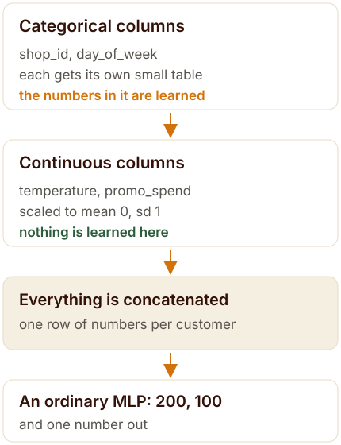
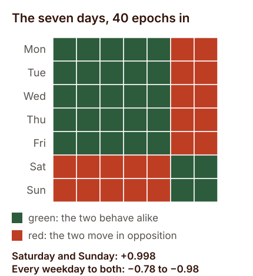
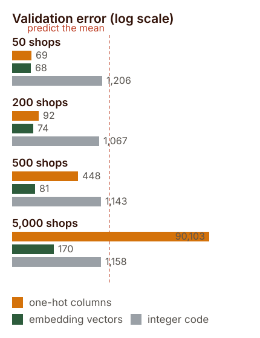

<style>

/* Mobile readability for this post (phone widths only) */

@media (max-width: 768px) {

  /* Figures: full width, caption directly underneath instead of in the margin */

  figure.quarto-float,

  figure.quarto-float > div,

  figure.quarto-float img.img-fluid {

    width: 100% !important;

    max-width: 100% !important;

    float: none !important;

    margin-left: 0 !important;

    margin-right: 0 !important;

  }

  figure.quarto-float figcaption,

  figcaption.quarto-float-caption,

  .margin-caption {

    position: static !important;

    display: block !important;

    width: 100% !important;

    max-width: 100% !important;

    margin: 0.6rem 0 0 0 !important;

    padding: 0 !important;

    text-align: left !important;

    font-size: 0.9rem;

    line-height: 1.5;

  }

  /* Long words, links and code must never push the page sideways */

  #quarto-document-content { overflow-wrap: break-word; word-wrap: break-word; }

  #quarto-document-content pre {

    overflow-x: auto;

    -webkit-overflow-scrolling: touch;

    font-size: 0.82rem;

  }

  /* The comparison table becomes a stack of cards instead of a squeezed grid */

  #quarto-document-content table { display: block; width: 100%; border: 0; }

  #quarto-document-content thead { display: none; }

  #quarto-document-content tbody,

  #quarto-document-content tr,

  #quarto-document-content td { display: block; width: 100%; }

  #quarto-document-content tr {

    background: #FFFFFF;

    border: 1px solid #F2EBD8;

    border-radius: 0.75rem;

    padding: 0.9rem 1rem;

    margin-bottom: 0.85rem;

    box-shadow: 0 2px 10px rgba(92, 45, 30, 0.06);

  }

  #quarto-document-content td { border: 0 !important; padding: 0.2rem 0; }

  #quarto-document-content td:first-child {

    font-size: 1.05rem;

    font-weight: 700;

    color: #321208;

    margin-bottom: 0.25rem;

  }

  /* Tighter callouts so text is not cramped in a narrow column */

  .callout { margin: 1.1rem 0 !important; }

  .callout .callout-body-container { padding: 0.85rem 1rem !important; font-size: 1rem; }

  .callout .callout-header { padding: 0.7rem 1rem !important; }

  blockquote { padding-left: 0.9rem; font-size: 1rem; }

  /* Headings scale down a notch */

  #quarto-document-content h2 { font-size: 1.5rem; line-height: 1.25; }

  #quarto-document-content h3 { font-size: 1.2rem; line-height: 1.3; }

}

</style>

::: {.callout-note title="The short version"}

A shop column with 1,115 values is a category, not a quantity. One-hot encoding says every shop is equally unlike every other shop. Labelling them 1 to 1,115 invents an ordering that does not exist and then lets the network believe shop 812 is further from 406 than 407 is.

**Entity embeddings** give each value a small vector that the network itself moves while training, so shops that affect sales the same way end up near each other. It came out of the Rossmann sales competition in 2016, fast.ai taught it to a generation of practitioners, and the code is roughly forty lines of PyTorch.

Then there is the part the diagrams leave out. I ran the three encodings head to head on the same network and the same data at fifty, two hundred, five hundred and five thousand shops. At fifty they are indistinguishable. By five hundred the embeddings are six times better, and at five thousand one-hot has stopped working altogether — worse than predicting the average, at three times the parameters.

:::

## One column, one thousand values {#column}

In 2016 Kaggle ran a competition that 3,738 people entered. The job was to forecast six weeks of daily sales for 1,115 stores, a chain that in reality was Rossmann, a German drugstore company. The forum filled up with gradient boosting, as it always does, because boosted trees win on tables.

*Source: Cheng Guo, third-place interview, Rossmann Store Sales, Kaggle blog, 22 January 2016 — read via the Internet Archive, [web.archive.org](http://web.archive.org/web/20191020194732/http://blog.kaggle.com/2016/01/22/rossmann-store-sales-winners-interview-3rd-place-cheng-gui/){target="_blank"}.*

Now look at what one of those columns looks like to a model. A row is a shop on a day. The shop is written as `store_id`: 1, 2, 3, up to 1,115. The network is arithmetic, so it will happily treat that number as a quantity. It will average shop 812 with shop 406 and get shop 609, and it will believe that shop 812 is exactly twice shop 406.

None of that is true. Shops are not quantities. The one thing you want the model to know about a shop is which other shops it behaves like, and the column as written cannot say that to it.

Think of a big market with 1,115 lock-up shops and no map. The register lists every shop on its own page. That is one-hot encoding, and it is honest: every shop is equally unlike every other shop, and to compare two of them you flip through the whole register. The alternative some pipelines use is to number the shops 1 to 1,115 in alphabetical order and hand that number over as a measurement. The machinery now carries an order that nobody put there.

The idea in this post gives the market a layout instead: a map where each shop sits somewhere, and shops whose customers overlap end up in the same aisle. The map starts as noise and redraws itself while the network trains, because the only thing that matters is where a shop sits in relation to the others.

## The month that broke the median {#month}

Cheng Guo, who entered that competition as part of a team called Neokami, was not a typical competitor. He had done a PhD in theoretical physics, and the month he spent on Rossmann was one of his first serious machine-learning projects. His first submission used the historical median of four features: shop, day of week, promotion, and year.

That scored 0.133 on his own validation split. Then he added *month* to the same median and the score got worse, because now every combination of shop and month had too few rows behind it to take a median of. Sparsity, in one move, had eaten the feature.

*Source: Cheng Guo, Rossmann Store Sales third-place interview, Kaggle blog, 22 January 2016 (archive link above).*

His fix is the whole of this post. Instead of letting each category sit in its own empty column, he mapped the categories into a small continuous space where distance means similarity, and trained the network on those coordinates. “In this way one can interpolate or use nearby data points to approximate missing data points,” he wrote. The paper he and Felix Berkhahn published two weeks before the competition closed calls it an **entity embedding**.

*Source: Cheng Guo and Felix Berkhahn, *Entity Embeddings of Categorical Variables*, arXiv:1604.06737, 22 April 2016, [arxiv.org/abs/1604.06737](https://arxiv.org/abs/1604.06737){target="_blank"}.*

What makes the result memorable is not the ranking. It is the geography. They took the learned vectors for German states — 12 categories, no latitude, no longitude, no map — and drew them with t-SNE. “Though the algorithm does not know anything about German geography and society, the relative positions of the learned embeddings of German states resemble that on the map surprisingly well,” the paper says. Places near each other in the data ended up near each other in the vector space.

Guo finished third. His submission was a plain average of ten networks, each trained in about twenty minutes on a GTX 980, for roughly three and a half hours of total compute. His dropout after the input layer was 0.02, absurdly small by the standards of the day, because he wanted the embeddings to keep their detail. He used Keras, scikit-learn, numpy and pandas, and he wrote the whole thing in a month.

*Source: Cheng Guo interview (archive link above): dropout, training time per network, the ten-network average, and the tooling are all stated there.*

And he chose a neural network on purpose. “When reading the Rossmann competition forum I was surprised that most top teams used tree based methods like xgboost rather than neural network,” he said. “I decided to use only neural network and see how it compares.” The first and second places used complicated ensembles with hand-built domain features. Third place used one model type and no domain-specific feature engineering.

*Source: Cheng Guo interview; the comparison of first, second and third place approaches is also noted by Rachel Thomas, [fast.ai, 29 April 2018](https://rachel.fast.ai/posts/2018-04-29-categorical-embeddings/){target="_blank"}.*

## How big should the vector be? {#size}

Every practitioner asks this next, and the honest answer is that nobody settled it. Guo and Berkhahn treated the dimension as a hyperparameter, bounded between 1 and one less than the number of categories, and said plainly that when they had no better idea they started at that upper bound and tuned down by hand. What they actually shipped rarely matched the rule.

The paper’s own table gives the store column 1,115 values and **10** dimensions. Month and state, at 12 values each, got 6. Day of week got 6 as well, one dimension short of its own maximum. Promotion, with two values, got 1. The team with no formula ended up choosing smaller vectors than either rule that came later.

*Source: Guo and Berkhahn, arXiv:1604.06737, Table I, and the surrounding discussion of equation (1).*

fast.ai turned it into a formula, and it is the one most people have seen: the minimum of 600 and 1.6 times the cardinality raised to 0.56. The documentation is candid that this came out of trial and error rather than theory — “through trial and error, this general rule takes the lower of two values: a dimension space of 600; a dimension space equal to 1.6 times the cardinality of the variable to 0.56” — and adds that you should tweak it at your discretion.

*Source: fast.ai documentation, `emb_sz_rule`, [docs.fast.ai/tabular.model.html](https://docs.fast.ai/tabular.model.html){target="_blank"}; implementation in [fastai/tabular/model.py](https://github.com/fastai/fastai/blob/master/fastai/tabular/model.py){target="_blank"}.*

PyTorch Tabular uses a third rule. If you leave the embedding dimensions empty it infers them from the column’s cardinality as the minimum of 50 and half of cardinality plus one, and that cap of 50 is the difference that matters. It is the rule most quoted around the internet today, and it is not fast.ai’s.

*Source: PyTorch Tabular documentation, [pytorch-tabular.readthedocs.io](https://pytorch-tabular.readthedocs.io/en/latest/models/){target="_blank"}: “If left empty, will infer using the cardinality of the categorical column using the rule `min(50, (x + 1) // 2)`.”*

| Column | Values | Guo, 2016 | fast.ai | PyTorch Tabular |
|---|---|---|---|---|
| Column | Values | Guo, 2016 | fast.ai | PyTorch Tabular |
| store | 1,115 | **10** | 81 | 50 |
| state | 12 | **6** | 6 | 6 |
| month | 12 | **6** | 6 | 6 |
| day of week | 7 | **6** | 5 | 4 |
| promotion | 2 | **1** | 2 | 1 |

*The two rules agree with Guo’s choices on the small columns and disagree wildly on the big one: a store vector of 10 dimensions, or 50, or 81, all defensible. My own runs use 50 unless stated otherwise, which is the PyTorch Tabular rule.*

Read down that column of numbers and the lesson is unglamorous. The dimension is a knob. The paper that invented the technique tuned it by hand, fast.ai ships a formula capped at 600, PyTorch Tabular ships one capped at 50, and all three are in production use. If a rule of thumb is being sold to you as theory, it is not theory.

## What fast.ai actually does {#fastai}

The architecture has been stable since 2018, and it is short enough to describe in a paragraph. Each categorical column gets its own embedding table, plus dropout. The continuous columns get normalised through a batch-norm layer. Everything is concatenated into one vector per row, and that vector goes through a stack of fully connected layers with batch norm and dropout, ending in a single number.

The defaults in fast.ai’s documentation are worth reading because they are unremarkable: two hidden layers of 200 and 100 units, batch norm on, continuous columns batch-normed, embedding dropout at zero, no output range clamp. The examples pass columns as pairs of cardinality and dimension, like a 4-value column asking for 2 dimensions.

*Source: fast.ai documentation for `TabularModel`: `emb_szs`, `layers=[200,100]`, `use_bn=True`, `bn_cont=True`, `embed_p=0.0`, [docs.fast.ai/tabular.model.html](https://docs.fast.ai/tabular.model.html){target="_blank"}.*

{#fig-architecture}

If you would rather not hand-roll that, PyTorch Tabular wraps it: one configuration class per architecture, ten of them at the time of writing, including the plain category-embedding model, TabNet, TabTransformer, FT-Transformer, NODE, AutoInt, DANet, GANDALF, a mixture-density network, and a gated additive tree ensemble. It is MIT licensed and still getting commits — the last one I checked landed on 17 September 2026.

*Source: [github.com/pytorch-tabular/pytorch_tabular](https://github.com/pytorch-tabular/pytorch_tabular){target="_blank"} and its documentation (the available model configurations are listed under `available_models()`); the package was introduced in Manu Joseph, arXiv:2104.13638, 2021.*

## Building it in raw PyTorch {#build}

The dataset below is synthetic on purpose: 5,000 rows shaped like the Rossmann problem, with 50 shops instead of 1,115 so it trains in seconds. The shop column is linear in the target, which I will come back to, because that small decision turns out to matter more than it looks.

```python
import numpy as np, pandas as pd, torch, torch.nn as nn

rng = np.random.default_rng(0)
n = 5000
df = pd.DataFrame({
    "store_id":    rng.integers(0, 50, n),
    "day_of_week": rng.integers(0, 7, n),
    "promo":       rng.integers(0, 2, n),
    "temperature": rng.normal(15, 8, n),
    "promo_spend": rng.exponential(200, n),
})
df["sales"] = (50
    + df.store_id * 1.3
    + np.where(df.day_of_week.isin([5, 6]), 40, 0)
    + df.promo * 25
    + df.temperature * 0.8
    + df.promo_spend * 0.05
    + rng.normal(0, 10, n))

for c in ("temperature", "promo_spend"):
    df[c] = (df[c] - df[c].mean()) / df[c].std()

cat_cols  = ["store_id", "day_of_week", "promo"]
cont_cols = ["temperature", "promo_spend"]
cardinalities = [int(df[c].max()) + 1 for c in cat_cols]   # not nunique()
```

Every categorical column has to be a contiguous block of integers starting at zero, because an embedding table is an array and the column is an index into it. Category code 1,500 with a table of 50 rows is not a rounding error; it is an index out of range. Taking the cardinality as the maximum plus one, rather than the number of distinct values, keeps the table big enough for whatever codes are present.

```python
from torch.utils.data import Dataset, DataLoader

class TabularDataset(Dataset):
    def __init__(self, df):
        self.cats = [torch.as_tensor(df[c].to_numpy(np.int64)) for c in cat_cols]
        self.cont = torch.as_tensor(df[cont_cols].to_numpy(np.float32))
        self.y    = torch.as_tensor(df["sales"].to_numpy(np.float32))

    def __len__(self):
        return len(self.y)

    def __getitem__(self, i):
        return [c[i] for c in self.cats], self.cont[i], self.y[i]
```

The model is the diagram, written out. One embedding table per categorical column, batch norm on the continuous columns, everything concatenated, then a plain multilayer perceptron. The embedding dimension here follows fast.ai’s formula; swapping in 50, the PyTorch Tabular cap, changes the results by very little.

```python
class TabularModel(nn.Module):
    def __init__(self, cards, emb_dims, n_cont, hidden=(200, 100), dropout=0.2):
        super().__init__()
        self.embeddings = nn.ModuleList(
            [nn.Embedding(c, d) for c, d in zip(cards, emb_dims)])
        self.bn_cont = nn.BatchNorm1d(n_cont)
        self.emb_dropout = nn.Dropout(dropout)
        d = sum(emb_dims) + n_cont
        layers = []
        for h in hidden:
            layers += [nn.Linear(d, h), nn.ReLU(), nn.BatchNorm1d(h), nn.Dropout(dropout)]
            d = h
        self.mlp = nn.Sequential(*layers, nn.Linear(d, 1))

    def forward(self, cats, cont):
        e = torch.cat([emb(c) for emb, c in zip(self.embeddings, cats)], dim=1)
        return self.mlp(torch.cat([self.emb_dropout(e), self.bn_cont(cont)], dim=1)).squeeze(1)

emb_dims = [min(600, round(1.6 * c ** 0.56)) for c in cardinalities]   # [14, 5, 2]
model = TabularModel(cardinalities, emb_dims, len(cont_cols))
```

Two details in the training loop matter more than they look, and I got both wrong on the first attempt. Feed it mini-batches rather than the whole table at once, and standardise the target on the training split. The generator’s target has a mean of 128 and a standard deviation of 33, while a fresh output layer starts near zero, so without standardisation the layer has to walk 128 units before it starts earning its keep. Adam takes about one step of size `lr` to do that.

```python
ym, ys = train.sales.mean(), train.sales.std()      # standardise the target
opt = torch.optim.Adam(model.parameters(), lr=1e-3, weight_decay=1e-5)
loss_fn = nn.MSELoss()

for epoch in range(40):
    model.train()
    for cats, cont, y in DataLoader(TabularDataset(train), batch_size=128, shuffle=True):
        loss = loss_fn(model(cats, cont), (y - ym) / ys)
        opt.zero_grad(); loss.backward(); opt.step()
```

That is the whole build: thirty-odd lines, no library beyond PyTorch. Everything after this point is measurement, and the first thing worth measuring is what the loss does when you actually let it finish.

## What the training actually looks like {#training}

Here is the first result, and it is not the one the post was going to report. Run the three encodings through the identical network on that toy data, forty epochs, and nothing separates them: ordinal codes 108.3, embeddings 118.0, one-hot 124.5. The noise floor is 100 and predicting the mean scores 1,129.2, so all three have solved the problem.

Worse for the story I wanted to tell: the integer codes *win*. The reason is in the generator. Its target is `50 + store_id × 1.3 + …`, and the correlation between that target and the raw store code is 0.579. The toy hands the integer encoding free information and then asks it to prove a point about encodings.

I had two other things to fix before any of this could be trusted. My first harness trained on the whole table in one batch, which gives Adam one step per epoch; over sixty epochs it reached a validation error of 16,812, which is worse than guessing the average. Standardising the target alone — the mean is 128 and the standard deviation 33, while a fresh output layer starts near zero — got the same setup to 603. Doing both, mini-batches of 128 and a standardised target, is what produces the numbers in this post.

| Encoding | Val MSE | Input width | Verdict on the toy data |
|---|---|---|---|
| Encoding | Val MSE | Input width | Verdict on the toy data |
| Integer code | **108.3** | 12 | Wins, because the target is linear in the code |
| Embeddings | 118.0 | 25 | Within noise of the winner |
| One-hot | 124.5 | 61 | Within noise of the winner |
| Predict the mean | 1,129.2 | — | The baseline everything must beat |
| Theoretical floor | 100 | — | The generator’s own noise, sd 10 |

*Forty epochs, mini-batches of 128, target standardised on the training split, identical architecture for all three. The toy data cannot tell the encodings apart.*

So the rest of this post uses a second dataset where the shop’s effect on the target is drawn from one of ten latent clusters and mixed in through a curve, with no relationship at all between the effect and the shape of the code. It is still synthetic, still my own, and it is built to be able to fail: if embeddings were a shortcut rather than a trade, this data would show it.

## Does the map appear? Two tests {#geometry}

The claim is that categories with similar effects end up with similar vectors. That is testable, so I tested it twice, once with seven values and once with two hundred.

The seven days of the week are the easy case, because the only structure in the data is one weekend bump. Train for ten epochs and the weekends have already collapsed onto each other: Saturday and Sunday reach a cosine of 0.97, while Saturday and Tuesday sit at −0.78. Give it forty epochs and the split is almost perfectly clean — Saturday and Sunday at 0.998, Saturday and Tuesday at −0.984.

{#fig-daymap}

Look closer and the interesting part is what the map refuses to do. Inside the weekday camp the arrangement is arbitrary: Monday’s nearest neighbour came out as Friday in one setting, Monday in another, and Wednesday in a third. That is not a failure. Monday to Friday all have *identical* effects on the target, so the loss has no opinion about where they sit, and gradient descent leaves them wherever it happened to put them.

That is the rule this whole idea obeys: **the geometry only records differences the target pays for.** Structure the data does not contain cannot appear in the vectors. This is also why the t-SNE page in the 2016 paper is impressive and why it is dangerous to generalise from: German states really do differ from each other in ways that show up in sales, so there was something to find.

The second test is the one that matters, because 200 shops with ten real clusters is closer to a practitioner’s problem than seven days of the week. Same embeddings, same network, all shops present in training. Shops in the same latent cluster came out with a mean cosine of 0.144 against each other, and shops in different clusters at −0.016. The nearest neighbour of a shop sat in its own cluster 52 times out of 200, where chance would give 20.

Two and a half times better than chance is a real signal, and it is smaller than the pictures suggest. The same measurement on random vectors gives a mean absolute cosine of 0.113. The learned geometry beats that, but not by much, and the honest description of the result is that the ranking carries the information rather than the distances. Do not promise your client clean islands in a scatter plot.

## The fair fight: three encodings, one network {#fight}

Now the comparison the toy data could not make. Same 200 shops, same ten clusters, the same network three times, changing only how the shop column enters. Sixteen thousand rows for training, four thousand held back.

| How the shop column enters | Val MSE | vs predicting the mean | Input width |
|---|---|---|---|
| How the shop column enters | Val MSE | vs predicting the mean | Input width |
| Embedding vectors | **78.3** | 20.4× better | 61 |
| One-hot columns | 97.9 | 16.3× better | 211 |
| Integer code | 1,117.2 | 1.4× better | 12 |
| Predict the mean | 1,593.4 | the baseline | — |

*200 shops from ten latent clusters, twenty epochs, mini-batches of 128. The embedding model is 20% better than one-hot while using a third of the input width.*

The number that should stop you is the integer code. When the effect has no relationship to the code, a bare integer is worth 1.4 times the mean — essentially nothing. Two hundred consumers of that column and the model has learned only that shops differ, with no idea which ones differ in the same direction.

But the code deserves its defence, because it won the previous experiment honestly. If the thing you are encoding really is ordered — a rating scale, a size band, a risk grade, a house number on one street — then the integer is not a lie, it is the feature, and no embedding will beat it for less. The failure mode is not that integer codes are always wrong. It is that they are wrong silently, and they keep working just well enough on the ordinal features that you stop checking the rest.

## The cliff at five thousand {#cliff}

Everything so far says embeddings are respectable. The reason they are not merely respectable is what happens to one-hot encoding when the column gets wide. Same experiment, same ten-cluster data, same sixteen thousand rows, four cardinalities, all three encodings each time.

{#fig-cliff}

| Shops | Rows per shop | One-hot | Embedding | Integer code | Mean predictor |
|---|---|---|---|---|---|
| Shops | Rows per shop | One-hot | Embedding | Integer code | Mean predictor |
| 50 | 320 | 69.3 | **67.9** | 1,206 | 1,685 |
| 200 | 80 | 92.5 | **73.5** | 1,067 | 1,530 |
| 500 | 32 | 447.9 | **80.7** | 1,143 | 1,613 |
| 5,000 | 3.2 | 90,103 | **169.7** | 1,158 | 1,594 |

*Twenty epochs each, 16,000 training rows, ten latent clusters of shop behaviour throughout. Lower is better.*

At fifty shops, one-hot and embeddings are the same model for practical purposes: 69.3 against 67.9, a difference of two percent, on data that took thirteen seconds either way. At two hundred the embeddings pull ahead. At five hundred, one-hot is six times worse than it was fifty shops earlier. At five thousand it has stopped being a model: 90,103 against 1,594 for predicting the average, and it cost 52 seconds a run against the embedding’s 21, with 1,033,223 parameters against 283,323.

The mechanism is not mysterious. One-hot gives every shop its own private weight, so it needs rows per shop to spend. My data has 320 rows per shop at the low end and 3.2 at the high end. An embedding also gives every shop its own row in a table, but it constrains those rows to a shared space of a few dozen numbers per row, and the thousand shops that behave alike are allowed to use the same region of it.

That constraint is the whole trick, and it is why the embedding’s input width in that table never moves: 61 features whether there are 50 shops or 5,000. One-hot went from 61 to 5,011. When you see a practitioner say embeddings *scale*, this is what they mean, and it is a statement about rows per category and the width of your input, not about accuracy in general.

## What bites you in practice {#bites}

Three failures I hit while building this, with the exact errors, because each one is a five-minute fix and an afternoon of confusion if you meet it at speed.

**Your category codes are not a contiguous block starting at zero.** Real shop IDs are 1001, 1002, 1008. Feed one of those to a table with four rows and PyTorch says `IndexError: index out of range in self`. The fix is to map codes to 0 to n−1 when you build the table and keep that mapping beside the model, because at prediction time you will need it again.

**A category appears at validation that never appeared in training.** A new shop opens in week six. The same error arrives, one call later in the pipeline. Reserve an index for unknown and let the network learn what that row means, or accept that you cannot serve that shop yet. There is no third option: the table has no row to look up.

**Your last batch has a single row.** Batch norm needs more than one value per channel while training, and a batch of one produces `ValueError: Expected more than 1 value per channel when training, got input size torch.Size([1, 5])`. Set `drop_last=True` on the loader, or drop the batch-norm layer from the continuous block, or pad the batch.

And the assumption worth killing: embeddings do *not* solve cold start. Hold twenty shops out of training entirely and the best of the three encodings scores 1,443 against 1,804 for the mean predictor, with the embedding at 1,472 — between the two, and closer to the useless end. The embedding’s nearest known shop landed in the correct latent cluster once in twenty attempts, which is worse than the one-in-ten you would get by guessing. A shop with no history has no position on the map, and no encoding can invent one for it.

*Source: all figures in this section are from my own runs, `run_final.py` and `run_experiments.py`, on the datasets described above.*

## Where the field went next {#field}

Ten years on, the trick is still in the toolbox, but the toolbox moved. Three developments are worth knowing, and none of them is a replacement for the idea in this post.

The first is that transformers came for tables too. **FT-Transformer**, from Yandex’s Gorishniy and colleagues at NeurIPS 2021, treats each feature as a token and lets attention mix them, with categorical columns still entering through embeddings. It is a strong baseline, and the paper’s own conclusion is refreshingly unexcited: after comparing architectures carefully, “we conclude that there is still no universally superior solution.” Trees are not beaten by default.

*Source: Gorishniy, Rubachev, Khrulkov, Babenko, *Revisiting Deep Learning Models for Tabular Data*, arXiv:2106.11959, NeurIPS 2021 camera-ready, [arxiv.org/abs/2106.11959](https://arxiv.org/abs/2106.11959){target="_blank"}.*

The second is **TabNet**, from Google Cloud in 2019, which uses attention to choose which columns to look at in each decision step, and pretrains on the table itself before it ever sees a label. That is the same instinct as an embedding, one level up: learn a representation from the data you have, then spend the labels you have sparingly.

*Source: Arik and Pfister, *TabNet: Attentive Interpretable Tabular Learning*, arXiv:1908.07442, first posted 20 August 2019, [arxiv.org/abs/1908.07442](https://arxiv.org/abs/1908.07442){target="_blank"}.*

The third is the most useful, because it explains why embeddings never quite took over. Grinsztajn, Oyallon and Varoquaux tested tree models against deep networks on 45 datasets of medium size, roughly ten thousand rows, and the trees won even before you count their speed advantage. Their study spent 20,000 compute hours on hyperparameter search per learner. Their conclusion names three challenges any tabular network must overcome to compete: be robust to uninformative features, preserve the orientation of the data, and learn irregular functions easily.

*Source: Grinsztajn, Oyallon, Varoquaux, *Why do tree-based models still outperform deep learning on typical tabular data?*, arXiv:2207.08815, [arxiv.org/abs/2207.08815](https://arxiv.org/abs/2207.08815){target="_blank"}.*

That list is a precise description of what a rough-edged table does to a network. One-hot columns with a single 1 in them are mostly zeros and mostly uninformative. Batch norm and standardisation are attempts at orientation, and they are why my training loop had a batch-norm layer bolted to the front. And jagged effects are exactly the case where an embedding’s smoothness hurts you and a tree’s staircase helps.

Meanwhile the embedding tooling kept improving. Yandex’s tabular research line moved on from the package that FT-Transformer shipped in — the original `rtdl` is deprecated and the models now live in `rtdl_revisiting_models` — and produced TabR, which retrieves neighbours from the training set at prediction time, TabDDPM for generating synthetic tables, and **TabM**, an ensemble-in-one-model that won its way into Kaggle solutions and handles tables far larger than the ones in this post.

*Source: the RTDL repository and its successors, [github.com/yandex-research/rtdl](https://github.com/yandex-research/rtdl){target="_blank"} and [github.com/yandex-research/tabm](https://github.com/yandex-research/tabm){target="_blank"}; TabM was published at ICLR 2025.*

*Source: PyTorch Frame, [github.com/pyg-team/pytorch-frame](https://github.com/pyg-team/pytorch-frame){target="_blank"}; the framework is described in Hu et al., arXiv:2404.00776, and handles categorical, numerical, text and timestamp columns in one model.*

Where embeddings keep an edge that trees cannot match is *reuse*. A trained embedding table is a portable set of features: you can feed the shop vectors to a second model, cluster shops with them, or look up the nearest neighbour of a shop you have never seen. This is the part of the Rossmann story that outlived the competition — the idea that a category can have a learned *location*, and that the location is worth keeping.

In Nigeria we would call that a trader’s *esusu* record. The savings collector keeps a book, page per contributor, and after a year that page is worth more than the money: a second collector will accept it, because it says something about the person that transfers. An embedding is the same kind of document. You train it once on the shops you have, and then it travels to the next model, the next quarter, the next problem.

*Source: for the reuse argument in its original form, Rachel Thomas, *An Introduction to Deep Learning for Tabular Data*, fast.ai, 29 April 2018 — Pinterest’s 128-dimension Pin2Vec vectors and Instacart’s product and store embeddings are both discussed there: [rachel.fast.ai](https://rachel.fast.ai/posts/2018-04-29-categorical-embeddings/){target="_blank"}.*

## The foundation models, and the licence line {#foundation}

The last five years produced something genuinely different: models that never see your table during training, because they were pretrained on thousands of synthetic tables and then read yours in context. **TabPFN** was the first of them, in 2022, and its pitch was that a classification problem under a thousand rows and a hundred numeric features can be solved in under a second with no hyperparameter tuning at all.

*Source: Hollmann, Müller, Eggensperger, Hutter, *TabPFN: A Transformer That Solves Small Tabular Classification Problems in a Second*, arXiv:2207.01848, published at ICLR 2023, [arxiv.org/abs/2207.01848](https://arxiv.org/abs/2207.01848){target="_blank"}.*

The second version made the field take notice, and it is worth stating its numbers plainly because they are the reason the phrase *tabular foundation model* exists. It handles up to 10,000 samples and 500 features, and the authors report that in 2.8 seconds it outperforms an ensemble of the strongest baselines tuned for four hours — a speed advantage they measure at 5,140 times for classification and 3,000 times for regression. Most real tables are in its range: the paper notes that 76% of datasets on OpenML have fewer than 10,000 rows.

*Source: Hollmann et al., *Accurate predictions on small data with a tabular foundation model*, Nature 637, 319–326, 8 January 2025, doi:10.1038/s41586-024-08328-6, [doi.org/10.1038/s41586-024-08328-6](https://doi.org/10.1038/s41586-024-08328-6){target="_blank"}. The quoted speed-ups and limits are from that paper’s abstract.*

By 2026 there is a small zoo, and AutoGluon’s documentation keeps the table that matters: which model, when it appeared, how much data it accepts, and what its licence says. TabPFN-1 arrived in July 2022 under Apache-2.0, TabDPT in October 2024, TabPFNv2 in January 2025, TabICL in February 2025, Mitra in July 2025, then a run of updates through 2026 — RealTabPFN-2.5, TabICLv2, TabPFN-2.6, TabPFN-3 in May, TabDPT-Turbo and Nori in June.

*Source: AutoGluon documentation, *Tabular Foundation Models* tutorial, version 1.6.1, [auto.gluon.ai](https://auto.gluon.ai/stable/tutorials/tabular/tabular-foundational-models.html){target="_blank"}; the release dates and data limits quoted above are from that page’s overview table.*

Read the licence column before you read the accuracy column. The TabPFN models from 2.5 onward are free for research and internal experimentation, but the documentation states that any commercial use — production, client work, or even benchmarking that informs a business decision — requires a licence or an API agreement from Prior Labs. TabPFNv2, TabICL, TabDPT, Mitra and Nori are the ones listed as free for commercial use. AutoGluon ships presets so you do not have to hold all of that in your head: one that restricts itself to models you are allowed to ship, and one for non-commercial work.

*Source: AutoGluon, *Tabular Foundation Models* tutorial, 1.6.1 — the licensing paragraph and the accompanying presets.*

For a consultant, that paragraph is the most important one in this post. A model that is four times more accurate and not licensed for your client’s production system is worth exactly nothing to your client, and it is a genuinely easy mistake to make in a week where every benchmark table looks the same.

So the column’s map stopped being drawn by hand. In 2016 a physicist guessed ten dimensions for 1,115 shops and tuned them by watching a score. In 2026 a model that has already read thousands of other tables reads yours and produces a prediction before your coffee lands. The idea underneath is unchanged — give each category a place, let the data decide where — and the thing that changed is who does the drawing, and who owns the drawing when it is time to ship.

## What I would tell you on Monday {#limits}

If you are facing a table with a wide categorical column this week, the order of operations is short. Fit a boosted-tree baseline first, because on medium tables it is still the thing to beat, and CatBoost handles categorical columns natively without you writing anything. Reach for embeddings when the column is genuinely wide, when you need the vectors as features for something else, when the model is part of a larger deep-learning system, or when the table has columns of different kinds — text, timestamps — that one model has to absorb.

Before you blame the architecture for a poor score, count your rows per category. Three rows per category is not a modelling problem, it is a data problem, and no embedding dimension fixes it. Then check the three failure modes above, because the errors are unhelpful and the fixes are small. And if you are tempted by a tabular foundation model, read its licence before you read its accuracy, because the strongest ones in 2026 are not all free to ship.

Then the limits of what I have shown you, stated plainly, since this is my data and not yours. Four cardinalities, one architecture, one seed for the sweep, sixteen thousand training rows, and a target I designed. The shape of the result — one-hot fine at small cardinality, unreliable past a few hundred categories, embeddings degrading gracefully — is the part I would defend. The exact numbers are a controlled illustration and nothing more, and the one thing I would not carry over from this post is a claim about *your* table.

## Sources and further reading {#sources}

### The origin

- Cheng Guo and Felix Berkhahn, *Entity Embeddings of Categorical Variables*, arXiv:1604.06737, 22 April 2016 — [arxiv.org/abs/1604.06737](https://arxiv.org/abs/1604.06737){target="_blank"}. The paper’s Table I is where the Rossmann embedding dimensions come from, and the t-SNE discussion of German states is in the results section.
- Cheng Guo, third-place interview, Rossmann Store Sales, Kaggle blog, 22 January 2016 — read through the Internet Archive: [web.archive.org](http://web.archive.org/web/20191020194732/http://blog.kaggle.com/2016/01/22/rossmann-store-sales-winners-interview-3rd-place-cheng-gui/){target="_blank"}. The original Kaggle blog address now redirects to Medium and the article is gone.
- The first-place solution to the Kaggle Taxi Trajectory competition, cited by Rachel Thomas as the clearest early example of neural networks winning a tabular Kaggle contest: [arXiv:1508.00021](https://arxiv.org/abs/1508.00021){target="_blank"}.

### The teaching canon

- Rachel Thomas, *An Introduction to Deep Learning for Tabular Data*, fast.ai, 29 April 2018 — [rachel.fast.ai](https://rachel.fast.ai/posts/2018-04-29-categorical-embeddings/){target="_blank"}. The post this whole generation of practitioners learned from, including the Pinterest and Instacart reuse examples.
- fast.ai documentation, `TabularModel` and `emb_sz_rule` — [docs.fast.ai/tabular.model.html](https://docs.fast.ai/tabular.model.html){target="_blank"}, with the implementation in [fastai/tabular/model.py](https://github.com/fastai/fastai/blob/master/fastai/tabular/model.py){target="_blank"}.
- PyTorch Tabular documentation and repository — [pytorch-tabular.readthedocs.io](https://pytorch-tabular.readthedocs.io/en/latest/models/){target="_blank"} and [github.com/pytorch-tabular/pytorch_tabular](https://github.com/pytorch-tabular/pytorch_tabular){target="_blank"}. The `min(50, (x + 1) // 2)` rule and the list of available model configurations are both documented there.

### The scoreboard

- Grinsztajn, Oyallon and Varoquaux, *Why do tree-based models still outperform deep learning on typical tabular data?* — [arXiv:2207.08815](https://arxiv.org/abs/2207.08815){target="_blank"}. Forty-five datasets, and the three challenges for tabular networks.
- Gorishniy, Rubachev, Khrulkov and Babenko, *Revisiting Deep Learning Models for Tabular Data* (FT-Transformer), NeurIPS 2021 — [arXiv:2106.11959](https://arxiv.org/abs/2106.11959){target="_blank"}.
- Arik and Pfister, *TabNet: Attentive Interpretable Tabular Learning* — [arXiv:1908.07442](https://arxiv.org/abs/1908.07442){target="_blank"}.
- PyTorch Frame (PyTorch Geometric), including the benchmark note about parity with boosted trees at 5 to 100 times the training cost — [github.com/pyg-team/pytorch-frame](https://github.com/pyg-team/pytorch-frame){target="_blank"}, described in [arXiv:2404.00776](https://arxiv.org/abs/2404.00776){target="_blank"}.
- The RTDL line of work, where the original package is now deprecated in favour of `rtdl_revisiting_models`, plus TabR, TabDDPM and TabM — [github.com/yandex-research/rtdl](https://github.com/yandex-research/rtdl){target="_blank"} and [github.com/yandex-research/tabm](https://github.com/yandex-research/tabm){target="_blank"}.

### Foundation models

- Hollmann, Müller, Eggensperger and Hutter, *TabPFN: A Transformer That Solves Small Tabular Classification Problems in a Second*, ICLR 2023 — [arXiv:2207.01848](https://arxiv.org/abs/2207.01848){target="_blank"}.
- Hollmann and colleagues, *Accurate predictions on small data with a tabular foundation model*, *Nature* 637, 319–326, 8 January 2025 — [doi:10.1038/s41586-024-08328-6](https://doi.org/10.1038/s41586-024-08328-6){target="_blank"}.
- AutoGluon 1.6.1 documentation: the [tabular tutorials](https://auto.gluon.ai/stable/tutorials/tabular/index.html){target="_blank"}, and the [tabular foundation models](https://auto.gluon.ai/stable/tutorials/tabular/tabular-foundational-models.html){target="_blank"} page that supplied the model table, the data limits and the licensing paragraph.
