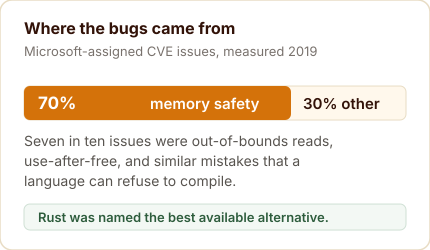
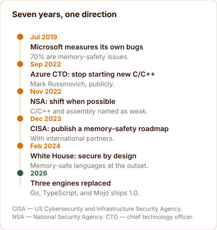
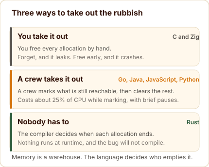
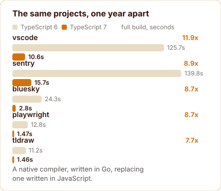
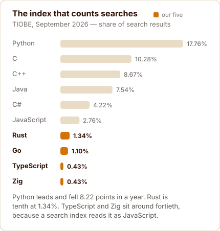

RustThe compiler never forgets.2026 · ships in Android, Amazon, Meta

GoBoring on purpose.10 Feb 2026 Go 1.26

TypeScriptSame types, twelve times faster.8 Jul 2026 TypeScript 7.0

ZigEvery allocation in plain sight.14 Apr 2026 Zig 0.16.0

MojoReads like Python, runs like C.11 Aug 2026 Mojo 1.0

Five different doors, one direction of travel: safety the compiler enforces, speed from the metal, behaviour you can read.

Every programming language carries the fingerprints of the machine it was designed for. C arrived in 1972 to write an operating system on hardware that measured memory in kilobytes. Kernighan and Ritchie made a pragmatic trade: the language would trust the programmer, and the programmer would be responsible for keeping every array access inside its bounds.

That trade worked for five decades of software. It also produced a category of bug that no amount of care fixes, because the mistake and its consequence can sit thousands of lines apart in time and space. Read past the end of an array and the program may do something harmless today, corrupt its own state next week, and hand an attacker control of the machine next year.

In 2026, three of the most conservative engineering organisations in the industry stopped treating that as an acceptable price. Not by arguing about it, but by rebuilding their own engines.

This shortlist covers the five, one at a time, with the primary source attached to every number. Each section ends with the same practical question: watch it, learn it, or both.

## The measurement that started the argument {#measured}

The argument about memory safety is usually conducted as a matter of taste. It becomes much less interesting once somebody counts.

In July 2019, Microsoft's Security Response Center published the number that reframed the discussion. Of the CVE issues assigned to Microsoft over the period they examined — CVE stands for Common Vulnerabilities and Exposures, the public catalogue of known security flaws — roughly 70 per cent were memory-safety issues. Not logic errors, not design flaws, not configuration mistakes. Out-of-bounds reads, use-after-free, uninitialised memory: bugs whose existence depends on the language permitting them.

*Source: Microsoft Security Response Center, Why Rust for safe systems programming, 22 July 2019 — [microsoft.com/en-us/msrc/blog/2019/07/why-rust-for-safe-systems-programming](https://www.microsoft.com/en-us/msrc/blog/2019/07/why-rust-for-safe-systems-programming){target="_blank"}.*

{#fig1}

Read that number again with the cost attached. Each of those issues is a security advisory, a patch, a distribution round, an update cycle, and a support tail that runs for years. A language that refuses to compile the bug is, from the finance side of the building, a cheaper language.

## The entry in the accounts {#cost}

There is a version of this argument that never mentions security at all. A memory-safety bug is a defect whose fix escapes the team that wrote it. The patch has to be shipped, the release cut, the customers notified, and the older versions supported long after the engineers have moved on to something else.

Multiply that by the number of issues a large vendor assigns to itself in a year, and the choice of language stops being a matter of taste. It becomes a line in a budget.

That is the unglamorous reason memory safety moved from engineering folklore into policy. It acquired an invoice.

## Then the governments said the same thing {#agencies}

What makes the following sequence more than a vendor position is that independent agencies reached it separately, on their own timetables, with their own threat data.

The National Security Agency published its software memory-safety guidance in November 2022, revised the following April. Its recommendation is precise and worth quoting in full, because the wording matters as much as the direction.

::: {.callout-note title="On the record"}

“NSA advises organizations to consider making a strategic shift from programming languages that provide little or no inherent memory protection, such as C/C++ and assembly, to a memory safe language when possible.” National Security Agency, *Software Memory Safety*, Cybersecurity Information Sheet, November 2022, revised April 2023 — [media.defense.gov/2022/Nov/10/2003112742/-1/-1/0/CSI_SOFTWARE_MEMORY_SAFETY.PDF](https://media.defense.gov/2022/Nov/10/2003112742/-1/-1/0/CSI_SOFTWARE_MEMORY_SAFETY.PDF){target="_blank"}

:::

Two words in that sentence carry the entire policy: when possible. It is a recommendation, not a prohibition, and every document in this sequence uses the same register.

The Cybersecurity and Infrastructure Security Agency (CISA), the US federal body for civilian cyber defence, and its international partners went further in December 2023, asking manufacturers not merely to prefer safe languages but to publish roadmaps showing how they would get there. The White House Office of the National Cyber Director made memory-safe languages part of its secure-by-design argument in February 2024.

At no point did any of them ban C or C++. That distinction survives most retellings badly, and it is the difference between describing a direction of travel and inventing a deadline.

{#fig2}

Meanwhile the loudest version of this argument came from a practitioner rather than a policy document. In September 2022, Mark Russinovich, the chief technology officer of Microsoft Azure, posted a one-line call to stop starting new projects in C and C++ where a non-garbage-collected language would do, and to treat the old languages as deprecated.

His post is a personal engineering opinion, reproduced in full by the technology press at the time. This matters because it is regularly quoted as a Microsoft corporate position, which it is not, and because it makes the comparison sharper: a company can employ people who say this and still not have adopted it everywhere.

*Source: Mark Russinovich, 19 September 2022, as reproduced by The Register — [twitter.com/markrussinovich/status/1571995117233504257](https://twitter.com/markrussinovich/status/1571995117233504257){target="_blank"}.*

## Why a language needs a collector {#collection}

Memory is a warehouse, and every program fills it as it runs. A request body is parsed, a string is built, a session object is created for a user who has since gone home. All of it stays until something decides to clear it, and the language has to answer one question: who takes the rubbish out?

In C, and in Zig, you do. You allocate, you free, and nothing happens that you did not write. The advantage is total control with nothing running behind you. The cost is that every error path, every early return and every callback has to remember to release exactly what it took.

Two failures follow, and they are predictable enough to have names. Forget to free, and the warehouse fills with rubbish nobody can reach until the process dies: a memory leak. Free too early, while something still points at it, and the next reader picks up somebody else’s rubbish: a use-after-free, which is among the most exploited defects in software.

A garbage collector is the other answer. The language does the work. The collector starts from the places a program can still reach — the stack, the registers, the globals — walks every reference it finds, and marks what is alive. Whatever it cannot reach from those roots cannot be reached by the program either, so it can be cleared. That is tracing, and it is what Go, Java, C#, JavaScript and Python all run.

{#fig3}

The trade becomes obvious the moment you picture a municipal service. A crew walks the streets, marks which houses are still occupied, and hauls away what is left. The crew costs money: Go’s own documentation is admirably direct that collection consumes two resources, physical memory and CPU time, and that the collector takes about 25 per cent of available CPU while it is marking.

The crew also blocks the street. Go’s guide lists the four places where that shows up as latency: brief stop-the-world pauses as the collector moves between marking and sweeping, scheduling delays caused by its share of the CPU, your own goroutines being drafted to help when allocation runs hot, and extra work on pointer writes while marking is under way.

*Source: A Guide to the Go Garbage Collector, the four sources of garbage-collection latency — [go.dev/doc/gc-guide](https://go.dev/doc/gc-guide){target="_blank"}.*

Green Tea, which became Go’s default collector in February 2026, was a change to the route rather than the crew. Instead of visiting objects one at a time, the collector scans them in bulk, using wide vector instructions on modern processors. Picture the same truck arriving with bigger bins and a route that covers a street per stop, rather than a house.

The result is measured rather than asserted: 10 to 40 per cent less collection overhead in programs that lean on it, with roughly 10 per cent more available on newer AMD64 processors — the ordinary 64-bit PC chip — using vector scanning. Nobody asked for a new syntax, and nobody had to learn one. The default simply became cheaper.

Rust takes the third road, and it is why it sits at the top of this shortlist. There is no crew at all. Ownership rules decide at compile time exactly when each allocation ends, and the borrow checker refuses to compile code that would touch memory after it has been released. Nothing to schedule. Nothing to pause.

The cost moves to the developer, who negotiates with the compiler about who owns what before the program ever runs. What comes back is a whole category of bug turned into a compile error, and a runtime with no background service competing for the processor — which is exactly what a kernel driver, a game loop or a low-latency service wants.

## Rust: the answer where the problem started {#rust}

The compiler never forgets.

Rust is the clearest case because it was designed to remove the trade rather than balance it. Borrow checking happens before the program runs, so the class of mistake Microsoft counted in 2019 becomes a compile error, not an advisory.

The mechanism is the borrow checker, which tracks who owns each value in a program and refuses to compile code that reaches for memory after it has been released, or that lets two parts of a program write to the same place at once. The cost is a learning curve that new Rust developers describe in remarkably similar terms. The benefit is that a whole category of defect never reaches production.

*Source: Microsoft Security Response Center on the unsafe escape hatch — [microsoft.com/en-us/msrc/blog/2019/07/why-rust-for-safe-systems-programming](https://www.microsoft.com/en-us/msrc/blog/2019/07/why-rust-for-safe-systems-programming){target="_blank"}.*

Microsoft stated the exception as carefully as the rule: Rust is completely memory safe unless code explicitly opts out through the unsafe keyword. That escape hatch is the reason Rust can be used for kernels and drivers at all, and the reason a careful team still reviews whatever sits inside it.

The same 2019 post is worth reading for its restraint. It argued the case for Rust while noting that adoption at Microsoft had not yet been demonstrated at company scale. Six years later the Android numbers and the AWS (Amazon Web Services) component list are the answer to that caveat, and stating it plainly at the time is what made the position credible.

The adoption evidence is now large enough to stop being anecdotal. Google reported in November 2025 that first-party Android code was adding Rust at volumes comparable to C++, and cited memory-safety vulnerability density roughly a thousand times lower in the Rust components.

The list continues across the largest infrastructure operators. Amazon Web Services (AWS) ships Rust components in Firecracker, S3 for storage, EC2 for virtual machines, CloudFront, Bottlerocket and its Nitro work. Meta replaced a media library written in 160,000 lines of C++ with 90,000 lines of Rust, and ships it monthly to billions of devices. Cloudflare built its core-network system in Rust, and the Linux kernel maintains official documentation for Rust support.

*Source: Rust in Android, Google Security Blog, 13 November 2025 — [blog.google/security/rust-in-android-move-fast-fix-things](https://blog.google/security/rust-in-android-move-fast-fix-things/){target="_blank"}.*

*Source: Sustainability with Rust, AWS Open Source Blog — [aws.amazon.com/blogs/opensource/sustainability-with-rust](https://aws.amazon.com/blogs/opensource/sustainability-with-rust/){target="_blank"}.*

The Linux kernel deserves its own sentence. Rust support is documented officially by a project whose maintainers spent three decades declining to add a second language to the tree, which makes the documentation a threshold rather than a curiosity.

*Source: Linux kernel Rust documentation — [docs.kernel.org/rust/index.html](https://docs.kernel.org/rust/index.html){target="_blank"}.*

*Source: Rust at scale, Meta Engineering, 27 January 2026 — [engineering.fb.com/2026/01/27/security/rust-at-scale-security-whatsapp](https://engineering.fb.com/2026/01/27/security/rust-at-scale-security-whatsapp/){target="_blank"}.*

*Source: 20% of the Internet, Cloudflare Blog — [blog.cloudflare.com/20-percent-internet-upgrade](https://blog.cloudflare.com/20-percent-internet-upgrade/){target="_blank"}.*

One piece of vocabulary is worth fixing here, because it circulates constantly and inverts the meaning. In the Rust project, tier 1 describes platform targets that are guaranteed to build and pass the test suite, with official binaries and continuous integration. It is a support guarantee for a processor and operating system combination. No company, language, or framework can be tier 1, and calling one that way is confusion rather than emphasis.

*Source: Rust compiler team, Target Tier Policy — [doc.rust-lang.org/rustc/target-tier-policy.html](https://doc.rust-lang.org/rustc/target-tier-policy.html){target="_blank"}.*

Where Rust is gaining ground fastest in 2026 is not in new projects. It is in migrations away from languages that already shipped, and the clearest case is the most surprising one.

Bun is a JavaScript runtime: the program that executes your JavaScript and TypeScript, in the position Node.js occupied for a decade. It was written in Zig, 535,496 lines of it, and in 2026 it became a Rust codebase. The port was done in eleven days by one engineer working with an AI agent, with the existing test suite as the referee.

The motivation was precisely the class of bug described in the last section. Bun’s author was direct about it: a large share of the outstanding bugs were use-after-free, double-free and forgotten frees on error paths, and mixing a garbage-collected JavaScript engine with manually managed memory is a combination almost no language is designed for.

*Source: Bun, Rewriting Bun in Rust — [bun.com/blog/bun-in-rust](https://bun.com/blog/bun-in-rust){target="_blank"}.*

He was equally clear that Zig was not at fault, and that it made Bun possible in the first place: the language gave him the low-level control to build a runtime in a year. The difficulty was the combination, not the language, and his conclusion was that compiler errors are a better feedback loop than a style guide.

The switch shipped quietly, which is the point. Bun 1.3.14 was the last Zig version. Bun 1.4.0 is the first Rust one. Claude Code has run on the Rust port since version 2.1.181 in June, with startup about 10 per cent faster on Linux, and in the author’s words, barely anyone noticed.

For this shortlist the Bun story earns its place twice. It is the strongest production evidence Rust has, and it arrived as a port rather than a rewrite: same architecture, same behaviour, same performance, with one whole category of bug made impossible by the compiler. It is also evidence of something new about 2026, that one engineer plus an agent moved half a million lines of systems code in under a fortnight.

::: {.callout-note title="Watch it, learn it, or both"}

Both, and learn it first. It is the only one of the five that removes the memory-safety category by construction, the production evidence is now broad, and the learning curve is the entry fee rather than a warning sign.

:::

## Go: the discipline of concurrency, with a cheaper collector {#go}

Boring on purpose.

Go comes from the opposite direction. Its creators were not trying to prove a thesis about safety; they were trying to make a large codebase of networked services tolerable to build and operate. Robert Griesemer, Rob Pike and Ken Thompson sketched the goals in September 2007, and the project became public in November 2009.

*Source: Go FAQ, origins and history — [go.dev/doc/faq](https://go.dev/doc/faq){target="_blank"}.*

The design bet was concurrency as a language property rather than a library. A goroutine starts with a few kilobytes of stack that grows and shrinks as needed, and the language's own documentation states that it is practical to create hundreds of thousands of them in the same address space. That is the sentence behind a generation of server software, and it explains why Kubernetes, the Docker engine and Terraform are all principally written in Go.

What changed in 2026 is plumbing rather than syntax, and it is the most measurable thing in this post. Go 1.26, released on 10 February 2026, made the Green Tea garbage collector the default. Green Tea had been experimental in Go 1.25. The release notes give the expected payoff directly: a reduction of somewhere between 10 and 40 per cent in garbage collection overhead for real-world programs that lean heavily on the collector, with roughly another 10 per cent available on newer AMD64 processors using vector scanning.

*Source: Go 1.26 Release Notes, Green Tea collector — [go.dev/doc/go1.26](https://go.dev/doc/go1.26){target="_blank"}.*

Two details in those notes deserve more attention than they usually get. The release maintains the Go 1 promise of compatibility, so the collector change arrives without a migration guide or a rewrite. And the published improvement is a range attached to a workload: 10 to 40 per cent, in programs that lean heavily on the collector. That is the honest way to publish a performance number.

> A quarter of the runtime overhead that nobody asked for, removed by changing a default.

The concurrency model has one nuance that catches newcomers. GOMAXPROCS limits how many goroutines execute at the same moment on the processor. It does not limit how many can be waiting on input or output. Hundreds of thousands of blocked connections are not hundreds of thousands of running tasks, and confusing the two produces capacity estimates that fail under load.

*Source: Go FAQ, goroutines and GOMAXPROCS — [go.dev/doc/faq](https://go.dev/doc/faq){target="_blank"}.*

Why infrastructure tooling settled on Go has a practical answer. The tools had to compile quickly, ship as a single static binary with no runtime to install, and handle network concurrency without ceremony. A language that makes distributed coordination boring is exactly what software for managing thousands of machines needs.

Notice the shape of that change. No new syntax, no migration guide, no rewrite. The team replaced the engine underneath an existing contract and kept the compatibility promise. That is how a maturing language improves: quietly, in the parts users never see.

Its footprint in production is unusually concentrated for a language that sits sixteenth on the usage tables. Kubernetes, the system that schedules most of the world’s containerised software, is written in Go. So are the Docker engine, Terraform, Prometheus and etcd. When a company rebuilds its internal platform today, Go is the default language for the control plane.

That is a professional-vocabulary fact rather than a benchmark result, and it explains the shape of the appeal. The problems Go solves are the ones that appear when a system has many moving parts and a team has to keep it running at three in the morning.

*Source: Go case studies — [go.dev/solutions/case-studies](https://go.dev/solutions/case-studies){target="_blank"}.*

::: {.callout-note title="Watch it, learn it, or both"}

Learn it if you run services. The language stays small, the toolchain is quick, and the 2026 collector work lowered what it costs to operate. Watch the release notes rather than the syntax, because the changes now arrive underneath.

:::

## TypeScript: when the tooling becomes the excuse {#typescript}

Same types, twelve times faster.

TypeScript is the useful counterweight to everything above, because it makes no claim to memory safety at all. It is a static type checker for JavaScript programs, running before your code runs. Its types are a design-time discipline over an existing runtime, and ordinary annotations and assertions are removed during compilation.

One correction to the tidy version of that sentence: not every feature is erased. Enums emit real JavaScript and exist at runtime. The accurate claim is that there is no TypeScript virtual machine, and that type-only constructs disappear. Say it precisely and the point survives; overstate it and a reader who uses enums will stop trusting the rest.

*Source: TypeScript Handbook, the type checker and enums — [typescriptlang.org/docs/handbook/2/everyday-types.html](https://www.typescriptlang.org/docs/handbook/2/everyday-types.html#enums){target="_blank"}.*

The 2026 news is that Microsoft replaced the engine, and the numbers are public. TypeScript 7 reached general availability on 8 July 2026 with the compiler and language service rewritten as a native implementation in Go, replacing the original JavaScript codebase. The company's own wording for the result: speedups typically between 8 and 12 times on full builds.

*Source: Announcing TypeScript 7.0, Microsoft TypeScript team, 8 July 2026 — [devblogs.microsoft.com/typescript/announcing-typescript-7-0](https://devblogs.microsoft.com/typescript/announcing-typescript-7-0/){target="_blank"}.*

{#fig4}

The vendor table is worth reading in full because it is unusually honest about spread. Visual Studio Code goes from 125.7 seconds to 10.6, an 11.9 times improvement. Sentry goes from 139.8 to 15.7. Bluesky, Playwright and tldraw improve by roughly eight times each. Aggregate memory falls too: 5.2 gigabytes to 4.2 on the largest project, and 1.8 to 1.3 on Bluesky.

Alongside it sits the number that speaks to daily work rather than benchmarks. Canva reported that the time to see the first error in their editors fell from about 58 seconds to about 4.8 seconds.

That is the part worth pausing on. TypeScript was never slow because types are expensive; it was slow because the tooling ran on one core of a JavaScript engine. Microsoft did not make typing cheaper. They changed the engine, added multithreading, and kept the semantics.

Editor support moved with the compiler. TypeScript 7 speaks the language server protocol, and Microsoft ships a dedicated extension for Visual Studio Code, so the speedup lands in completions, reference searches and diagnostics rather than only in build times. That distinction matters more than the headline multiple, because a full build is the part of a developer’s day that happens least often.

The migration is not entirely free. The announcement directs readers to their editor’s own documentation for support status, which is a polite way of saying the surrounding tooling has to keep up. Your typed code does not change. The tools around it do.

What stays true is the architecture. TypeScript compiles to JavaScript, JavaScript runs on a JavaScript engine, and no TypeScript runtime is installed anywhere. Version 7 is a faster compiler, not a new platform.

Native, in this context, means compiled to machine code rather than executed through another interpreter. It is the same distinction that separates Go from Python and Rust from JavaScript. The pattern in 2026 is that the interpreters doing valuable work are being replaced by compilers, wherever the language permits it.

The strongest evidence that TypeScript is gaining ground is not the compiler speed. It is GitHub’s own annual report: in August 2025, TypeScript overtook both Python and JavaScript to become the most used language on the platform, which Octoverse called the most significant language shift in more than a decade.

*Source: GitHub, Octoverse 2025 — [github.blog](https://github.blog/news-insights/octoverse/octoverse-a-new-developer-joins-github-every-second-as-ai-leads-typescript-to-1/){target="_blank"}.*

The report ties the change to typed languages and agent-assisted coding. Types make machine-generated edits easier to review and safer to accept, because the compiler catches what a tired reviewer would miss, and TypeScript is where most of that agent-written code lands.

Usage numbers agree with the repository data. In Stack Overflow’s 2025 survey, 43.6 per cent of respondents had done extensive work in TypeScript over the past year, against 27.8 per cent for C#, 16.4 per cent for Go and 14.8 per cent for Rust.

::: {.callout-note title="Watch it, learn it, or both"}

Both, and it is the cheapest of the five to adopt. If you already write JavaScript, this is a version bump with an eight to twelve times build speedup attached, and there is nothing to unlearn.

:::

## Zig: control without hidden behaviour {#zig}

Every allocation in plain sight.

Zig sits at the opposite end of the spectrum from TypeScript. Its appeal is not safety by default but legibility: nothing happens that the source does not say. The language's own overview puts it bluntly. There is no hidden control flow, no hidden memory allocations, no preprocessor and no macros.

*Source: Zig, Overview — [ziglang.org/learn/overview](https://ziglang.org/learn/overview/){target="_blank"}.*

It also has no exception system in the throw-and-catch sense. Failure is expressed as error unions with explicit handling, and the documentation is firm that errors are values which may not be ignored. Panics and runtime safety checks remain, so the honest summary is that Zig replaces implicit unwinding with explicit returns rather than eliminating failure.

*Source: Zig, Language Reference, errors — [ziglang.org/documentation/master](https://ziglang.org/documentation/master/){target="_blank"}.*

The reason to care is interoperability. Zig imports C headers directly through its own compiler interface, translates C headers into Zig with a dedicated tool, compiles C and C++ source, and treats cross-compilation as a first-class use case rather than a specialist ritual. For teams with decades of C in production, that is the difference between an option and a curiosity.

That interoperability has two doors. One imports C declarations directly, including types, variables, functions and simple macros, so an existing library can be called without hand-written bindings. The other converts C headers into Zig source, which suits a project that wants to move away from C gradually rather than all at once.

For a team with a large body of C, the question is rarely whether to rewrite. It is whether the new component can live beside the old one without a bridge that costs more than it saves. Zig is designed around that question.

The version story is a reminder that this ecosystem is young. Zig 0.16.0 was released on 14 April 2026 and remained the stable release as September ended, which means the language is still pre-1.0 by its own numbering.

*Source: Zig, release announcement and download page — [ziglang.org/download](https://ziglang.org/download/){target="_blank"}.*

Zig’s presence in production is small and serious. TigerBeetle, a financial transactions database built for high-volume accounting, is written in Zig, and in October 2025 it pledged 512,000 dollars to the Zig Software Foundation alongside Synadia, payable over two years. Ghostty, a terminal emulator released in late 2024, is also written in Zig.

*Source: TigerBeetle, Synadia and TigerBeetle pledge $512k to the Zig Software Foundation — [tigerbeetle.com/blog](https://tigerbeetle.com/blog/2025-10-25-synadia-and-tigerbeetle-pledge-512k-to-the-zig-software-foundation/){target="_blank"} · [ghostty.org](https://ghostty.org){target="_blank"}.*

Admiration runs well ahead of adoption, and unusually far ahead. Zig was the fourth most admired language in Stack Overflow’s 2025 survey at 64 per cent, behind Rust, Gleam and Elixir, while its usage sat below two per cent of respondents. It is a language its users defend loudly, and one most developers have never written a line of.

Then the largest Zig codebase in the world left. Bun’s port to Rust is the correction to any claim that Zig is quietly taking over systems work, and the honest reading is narrower: Zig is excellent at what it was designed for, and it is still pre-1.0 in a decade when the languages around it are shipping their version numbers.

::: {.callout-note title="Watch it, learn it, or both"}

Watch it, and learn it only if you have C to live with. Pre-1.0 is not a technicality: the language still changes between releases, so the cost of following it is a real one.

:::

## Mojo: Python's syntax at systems speed {#mojo}

Reads like Python, runs like C.

Mojo is the newest of the five and the one whose story changed most this year. Its pitch is a language that reads like Python and performs like a systems language, aimed squarely at machine-learning workloads where the Python layer has become the slow part of an otherwise fast machine.

For most of its life it was a language you could use but not inspect. That ended in August 2026. Mojo 1.0 shipped on 11 August, and the compiler plus the surrounding toolchain were released under the Apache 2.0 licence: compiler, runtime, language server, debugger, formatter, and the full commit history of the project.

*Source: Modular, Mojo 1.0 is here, 11 August 2026 — [modular.com](https://www.modular.com/){target="_blank"}.*

Nine days later, Qualcomm completed its acquisition of Modular, the company behind the language. The deal had been announced in June at a reported value of about four billion dollars, in stock. Qualcomm's own announcement frames it as a bet on developer-friendly platforms that run across diverse compute environments.

*Source: Qualcomm, Qualcomm Completes Acquisition of Modular, 20 August 2026 — [qualcomm.com/news/releases/2026/07/qualcomm-completes-acquisition-of-modular](https://www.qualcomm.com/news/releases/2026/07/qualcomm-completes-acquisition-of-modular){target="_blank"}.*

The promise to Python developers rests on interoperation rather than translation. Mojo is designed to import Python packages and call into existing Python code, so the parts of a system that already work keep working while the parts that need speed are rewritten one file at a time.

Ownership in Mojo is explicit: the compiler tracks where values live and who may use them. That is how a language that reads like Python can compile to something that runs like C. It is the same trade Rust made, aimed at a different audience, and it is the reason the two languages keep appearing in the same conversations.

Put those two facts side by side and a reasonable question appears. A language whose toolchain is now open source, owned by a chipmaker that has just spent billions acquiring it, raises a governance question that openness alone does not answer. The source is available. The direction is corporate. Both can be true.

Where Mojo is gaining ground is the machine-learning stack, and the reason is mundane. The Python layer wrapped around fast accelerators has become the slow part of the pipeline: the code that moves tensors, checks shapes and dispatches kernels runs at a fraction of the speed of the hardware underneath it. A language that reads like Python and compiles closer to the metal makes that glue cheaper, which is the pitch Modular has been making since 2023.

Where it is not yet gaining ground is breadth. There is no large body of Mojo in production, the package ecosystem is thin, and the toolchain was closed until August 2026. On a shortlist of five, it is the one where the honest advice is to read the roadmap before writing the code.

*Source: Modular, Mojo documentation and release notes — [docs.modular.com/mojo](https://docs.modular.com/mojo/){target="_blank"}.*

::: {.callout-note title="Watch it, learn it, or both"}

Watch it first. Version 1.0 and an open toolchain make it credible for the first time, but the ecosystem is young and the company that owns it now reports to a chipmaker.

:::

## The pattern, rather than the list {#pattern}

Five languages, five different origins, and one shared movement. Each of them is pushing the same three things: safety that the compiler enforces rather than the programmer remembers, speed that comes from the hardware underneath rather than cleverness above it, and behaviour that can be read in the source.

Line them up and the convergence is difficult to unsee.

| Language | What it stands for in 2026 | The receipt |
|---|---|---|
| Rust | Memory safety as a compile-time obligation | Android reports roughly a thousand times lower vulnerability density in Rust components |
| Go | Concurrency as a language property, now with cheaper runtime overhead | Green Tea collector default in 1.26, a 10 to 40 per cent cut in collection overhead |
| TypeScript | Types as design-time discipline, with tooling finally fast enough not to matter | Native Go compiler; Visual Studio Code builds fell from 125.7 seconds to 10.6 |
| Zig | Explicit control with nothing hidden, and C interop as the bridge | No hidden allocations, no preprocessor, no macros; cross-compilation first-class |
| Mojo | Python's ergonomics at systems performance, aimed at AI hardware | 1.0 shipped on 11 August 2026, toolchain released under Apache 2.0 |

There are three pressures behind that, and they are worth separating because they explain why the movement is happening now rather than in 2015.

The first is money. Memory-safety bugs have become an operating expense with a long tail, and the 2019 measurement gave finance teams a number to attach to it. The second is hardware. Accelerators and specialised silicon are evolving faster than the abstractions built to command them, which punishes any layer that adds overhead without adding capability. The third is scale. A service that runs across continents and thousands of machines turns a rare fault into a routine one, and routines get budgeted for.

None of that requires anyone to abandon C. Most of the world's critical software will run on C for decades, and that is a reasonable engineering decision rather than a lapse. What shifted in 2026 is the default, and defaults decide where new work goes.

## The layer each one is claiming {#layers}

There is a second way to read this shortlist, and it is the one that explains why these five arrived together rather than five others. Line them up against the AI stack and every one of them sits in a different layer.

Start with the layer none of them is contesting. The models, and the training around them, belong to Python: Hugging Face’s production inference server is 79 per cent Python, and so is nearly everything that treats a GPU cluster as a research instrument. No language on this list is trying to take that ground.

What they are competing for is everything wrapped around it. The figures in this section come from GitHub’s own language statistics for each repository, read on 23 September 2026. They describe the code inside a repository rather than what that code runs, which is worth remembering before anyone quotes them as adoption.

TypeScript holds the layer that talks to the models. Google’s Gemini CLI is 97 per cent TypeScript. The official Model Context Protocol SDK, the library most agent tools are built on, is 100 per cent TypeScript. Claude Code runs on Bun, and Anthropic bought Bun to keep it that way.

It could win because it already is the interface. Agent loops, tool calls, editor integrations and chat surfaces are where models meet people, and typed JavaScript is where that code lands. GitHub’s own annual report puts TypeScript first among all languages on the platform and attributes the rise to typed code plus AI-assisted editing — a builder that checks types catches more of what a machine writes than one that does not.

*Source: MCP TypeScript SDK — [github.com/modelcontextprotocol/typescript-sdk](https://github.com/modelcontextprotocol/typescript-sdk){target="_blank"} · [github.com/google-gemini/gemini-cli](https://github.com/google-gemini/gemini-cli){target="_blank"} · Anthropic, [acquiring Bun](https://www.anthropic.com/news/anthropic-acquires-bun-as-claude-code-reaches-usd1b-milestone){target="_blank"}.*

Rust holds two layers at once, and one of them is new. Below, in the runtime: Hugging Face’s tokenizers are 95 per cent Rust, and the router in its inference server is Rust too. Above, in the harness: OpenAI rewrote its Codex command-line agent out of TypeScript and into Rust, and that repository is now 97 per cent Rust. Bun, after the port, is 67 per cent Rust.

It could win because it is where the AI wave keeps arriving. Where a machine writes the code, a compiler that refuses to let memory be freed twice is the cheapest reviewer available, and where a service holds thousands of open model connections, predictable latency is the entire product. Both pressures push the same way.

*Source: Hugging Face tokenizers — [github.com/huggingface/tokenizers](https://github.com/huggingface/tokenizers){target="_blank"} · [TGI architecture, the router in Rust](https://huggingface.co/docs/text-generation-inference/en/architecture){target="_blank"} · [github.com/openai/codex](https://github.com/openai/codex){target="_blank"}.*

Go holds the serving and operations layer, which is the least glamorous and most load-bearing part of any AI deployment. Ollama, the tool most people use to run a model on their own machine, is 69 per cent Go. The systems that schedule and package everything else — Kubernetes, Docker, Terraform — are Go as well.

It could win by being unremarkable. When the interesting part of a system is the model, everything wrapped around it should be boring enough to forget, and that is the property Go was designed to have.

*Source: Ollama, repository language statistics — [github.com/ollama/ollama](https://github.com/ollama/ollama){target="_blank"}.*

Mojo is aiming at the silicon. The repository holding Modular’s engine is 47 per cent Mojo and 33 per cent Python, the largest concentration of the language anywhere, and a fair measure of what it is for: kernels that read like Python and run like the hardware underneath.

It could win if reaching the hardware keeps requiring a language of its own rather than a library. The risk is the same fact seen from the other side: the largest concentration of Mojo in the world is one company’s repository, and that company now belongs to a chipmaker.

*Source: Modular, engine repository — [github.com/modular/modular](https://github.com/modular/modular){target="_blank"}.*

Zig holds the layer underneath all of them, and it is the one with no AI story yet. Its two flagship users are a terminal emulator, at 77 per cent Zig, and a financial database, at 79 per cent. The AI-adjacent bet is narrower and older than the hype: Ollama’s repository is 22 per cent plain C, and C is the layer Zig was built to replace without rewriting.

It could win if the engines stay in C and somebody eventually has to modernise that layer in place. Against it: no flagship AI user, still pre-1.0, and the largest Zig codebase in the world having just left for Rust.

Put the layers together and the picture is cleaner than any single language. Python trains the models. TypeScript talks to them. Rust runs them, and is increasingly what they are written in. Go serves them. Mojo is trying to reach the chips underneath. Zig is still waiting under the floor. The AI wave did not invent these languages, and it did not rescue them either: it made the layers beneath the model valuable, and each of these five is standing in one.

| Layer | Language | The code share, read 23 September 2026 | Could win if |
|---|---|---|---|
| The models and training | Python, not on this shortlist | Inference server 79 per cent Python | Not contested here |
| Talking to models: harnesses, tool calls, editors | TypeScript | Gemini CLI 97 per cent; MCP TypeScript SDK 100 per cent | Agent tooling keeps being written where the SDKs are |
| Runtimes, and the code agents rewrite | Rust | Codex CLI 97 per cent; tokenizers 95 per cent; Bun 67 per cent | The compiler stays the cheapest reviewer of machine-written code |
| Serving and scheduling | Go | Ollama 69 per cent Go | Serving stays unglamorous and the fleets keep growing |
| Kernels and accelerators | Mojo | Engine repository 47 per cent Mojo | Reaching the hardware keeps needing its own language |
| Underneath the engines | Zig | Ghostty 77 per cent; TigerBeetle 79 per cent; Ollama 22 per cent C | C finally needs replacing inside the AI engines |

## What the rankings actually say {#rankings}

There is no single ranking of programming languages, because each index measures something different. Four of them are worth knowing in 2026, and the disagreements between them are more useful than any one position.

TIOBE counts how often languages are searched for across the web. The index is published by a Dutch company of the same name, whose initials come from Oscar Wilde’s play *The Importance of Being Earnest*. Its September 2026 edition puts Python first at 17.76 per cent, down 8.22 points in a year, with C second at 10.28 and C++ third at 8.67. Search share measures curiosity and troubleshooting, and it moves slowly.

*Source: TIOBE Index, September 2026 — [tiobe.com/tiobe-index](https://www.tiobe.com/tiobe-index/){target="_blank"}.*

Our five sit far down that table. Rust is tenth at 1.34 per cent and rising, Go is twelfth at 1.10 and falling, and TypeScript and Zig both sit at 0.43 per cent, around fortieth. One caveat is fair to TIOBE because it explains most of the surprise: a search-based index reads TypeScript queries as JavaScript ones, so a language used by 43.6 per cent of survey respondents registers as a rounding error.

RedMonk ranks usage in code against discussion, weighing GitHub against Stack Overflow. Its January 2026 edition has JavaScript first, Python second and Java third, with TypeScript sixth ahead of C++ and C, Go twelfth and Rust twentieth. TypeScript’s climb up this index is the clearest trend in it.

*Source: RedMonk, Programming Language Rankings, January 2026 — [redmonk.com](https://redmonk.com/sogrady/2026/04/14/language-rankings-1-26/){target="_blank"}.*

Stack Overflow asks the opposite question, and it is the one that speaks to this shortlist. Rust was the most admired language in its 2025 survey at 72 per cent, ahead of Gleam at 70, Elixir at 66 and Zig at 64. Admiration is the share of people who have used a language and want to keep using it.

*Source: Stack Overflow Developer Survey 2025, technology section — [survey.stackoverflow.co/2025/technology](https://survey.stackoverflow.co/2025/technology){target="_blank"}.*

The two columns part company sharply. TypeScript was used by 43.6 per cent of respondents, Go by 16.4, Rust by 14.8 and Zig below two, while the admiration order runs almost exactly in reverse. The most admired language on the list is one that about one developer in seven touched last year.

GitHub’s Octoverse measures what new code is actually written in. TypeScript took first place from Python and JavaScript in August 2025, the largest language shift the platform has recorded in a decade, and the report attributes the move to typed languages and AI-assisted coding.

{#fig5}

Read together, the four say something no single index says. Usage belongs to JavaScript and Python. Search interest belongs to Python and C. Admiration belongs to Rust and Zig. The newest code on the largest code host belongs to TypeScript. All four are true at once, which is why one ranking number is a poor basis for a decision.

There is one more caveat, and it is the kind that keeps a post honest. The 2026 Stack Overflow survey was still collecting responses while this was written, so the admiration figures above are last year’s. When the results land, these numbers should be re-checked rather than assumed to have held.

What no ranking can tell you is what you intend to build. Every index here measures other people’s behaviour, and other people are not writing your service, your driver or your data pipeline. The ranking is context. The decision is still yours.

## How to read a language claim {#readcarefully}

The same evidence that makes this story legible also makes it easy to misuse, so three habits are worth keeping.

The first is to separate a release date from adoption. A version number tells you what the maintainers shipped. It tells you nothing about who runs it in production, which is a different question with different evidence.

The second is to treat benchmark rankings as controlled comparisons rather than verdicts. The long-running TechEmpower suite, for example, is genuinely useful and genuinely limited: its methodology permits raw database access, allows framework-specific optimisations, and its maintainers describe the results as a test of specific implementations. Practitioners including Axum's own maintainers have warned that benchmark code can diverge substantially from ordinary application code. A rank measures the harbour, not the sea.

*Source: TechEmpower, Framework Benchmarks, methodology and results — [techempower.com/benchmarks](https://www.techempower.com/benchmarks/){target="_blank"}.*

It also helps to keep two kinds of safety apart, because they are constantly confused. Rust’s guarantee is about memory: it prevents a program from reading or writing where it should not. TypeScript’s guarantee is about shape: it checks that the values moving through a program match the types described for them. The second catches a great many mistakes and cannot prevent a single buffer overflow.

The third is to notice the difference between a recommendation and a mandate, because the two get flattened in retelling. Every government document in this post recommends, advises, or strongly encourages. None of them prohibits. Direction of travel is a real and reportable thing; a deadline is a claim about law, and it needs a legal source.

## Choosing from the shortlist {#practical}

If you are choosing a language this year, the useful question is not which one wins. It is which constraint is binding for you.

If your problem is a body of existing C or C++ that cannot be rewritten, Zig is the low-friction option, because interoperability is its design centre rather than an afterthought.

If it is a service that must absorb enormous concurrency on modest hardware, Go's model and its 2026 collector work pay off in operational cost rather than elegance.

If it is a codebase where a memory-safety bug would end the company, Rust is the only one of the five that removes the category by construction.

If it is a large JavaScript codebase, and your developers spend their mornings waiting for an editor, TypeScript 7 changed that this year for free. The upgrade is closer to a version bump than a migration.

That list is deliberately boring, and it is the honest answer. The interesting claim in 2026 is not that five languages will change everything. It is that the industry spent the year replacing the engines underneath languages it had already chosen, rather than asking developers to learn new ones.

> A list of predictions ages. A direction with receipts does not.

Go kept its syntax and changed its collector. TypeScript kept its syntax and changed its compiler. Mojo gave away its toolchain. Rust kept being Rust, and quietly became what the largest engineering organisations build their safety-critical parts with. None of them asked for a rewrite, and all of them removed overhead that had been tolerated for years.

Those are the five, and none of them asks for a leap of faith. Each made a measurable change this year, or arrived with production evidence attached. That is the only reason any of them is on a shortlist rather than in a forecast.

It is also worth saying what would count as evidence next, so the claim stays checkable rather than becoming a mood. Adoption of TypeScript 7 across large published codebases, rather than benchmark tables. Whether the memory-safety share of advisories falls at the organisations that have been migrating for years. Whether Go’s next release keeps the compatibility promise while moving more overhead out of the runtime.

Those are measurable, dated, and falsifiable. Anyone repeating this story in a year can check them, which is the difference between a direction of travel and a forecast dressed up as one.

If there is a single sentence to take from the year, it is that the interesting work happened in the parts of a language nobody types. Collectors, compilers and toolchains were replaced by teams who understood that asking a million developers to change their habits is the expensive option, and changing a default is the cheap one.

The shortlist will look different in two years, and it should. What will not change is the test: a language earns attention when something measurable moves, and keeps its place while it keeps moving.

## Sources and further reading {#sources}

- Grouped by what each source settles. Every link opens in a new tab.

### Where the bugs come from

- Microsoft Security Response Center, *Why Rust for safe systems programming*, 22 July 2019 — [microsoft.com/en-us/msrc/blog/2019/07/why-rust-for-safe-systems-programming](https://www.microsoft.com/en-us/msrc/blog/2019/07/why-rust-for-safe-systems-programming){target="_blank"}

- Rust target tier policy, for what “tier 1” actually means — [doc.rust-lang.org/rustc/target-tier-policy.html](https://doc.rust-lang.org/rustc/target-tier-policy.html){target="_blank"}

### The policy sequence

- National Security Agency, *Software Memory Safety*, November 2022, revised April 2023 — [media.defense.gov/2022/Nov/10/2003112742/-1/-1/0/CSI_SOFTWARE_MEMORY_SAFETY.PDF](https://media.defense.gov/2022/Nov/10/2003112742/-1/-1/0/CSI_SOFTWARE_MEMORY_SAFETY.PDF){target="_blank"}

- CISA, *The Urgent Need for Memory Safety in Software Products*, 6 December 2023 — [cisa.gov/news-events/news/urgent-need-memory-safety-software-products](https://www.cisa.gov/news-events/news/urgent-need-memory-safety-software-products){target="_blank"}

- Office of the National Cyber Director, *Back to the Building Blocks*, February 2024 — [bidenwhitehouse.archives.gov/wp-content/uploads/2024/02/Final-ONCD-Technical-Report.pdf](https://bidenwhitehouse.archives.gov/wp-content/uploads/2024/02/Final-ONCD-Technical-Report.pdf){target="_blank"}

- Mark Russinovich on C and C++, 19 September 2022, as reproduced by *The Register* — [twitter.com/markrussinovich/status/1571995117233504257](https://twitter.com/markrussinovich/status/1571995117233504257){target="_blank"}

### Production use

- Bun, *Rewriting Bun in Rust* — [bun.com/blog/bun-in-rust](https://bun.com/blog/bun-in-rust){target="_blank"}

- TigerBeetle, *Synadia and TigerBeetle pledge $512k to the Zig Software Foundation*, 25 October 2025 — [tigerbeetle.com/blog](https://tigerbeetle.com/blog/2025-10-25-synadia-and-tigerbeetle-pledge-512k-to-the-zig-software-foundation/){target="_blank"}

- Ghostty, a terminal emulator written in Zig — [ghostty.org](https://ghostty.org){target="_blank"}

- Go, *Case Studies*, companies solving problems with Go — [go.dev/solutions/case-studies](https://go.dev/solutions/case-studies){target="_blank"}

- Modular, Mojo documentation — [docs.modular.com/mojo](https://docs.modular.com/mojo/){target="_blank"}

- Google Security Blog, *Rust in Android*, 13 November 2025 — [blog.google/security/rust-in-android-move-fast-fix-things](https://blog.google/security/rust-in-android-move-fast-fix-things/){target="_blank"}

- AWS Open Source Blog, *Sustainability with Rust* — [aws.amazon.com/blogs/opensource/sustainability-with-rust](https://aws.amazon.com/blogs/opensource/sustainability-with-rust/){target="_blank"}

- Meta Engineering, *Rust at scale*, 27 January 2026 — [engineering.fb.com/2026/01/27/security/rust-at-scale-security-whatsapp](https://engineering.fb.com/2026/01/27/security/rust-at-scale-security-whatsapp/){target="_blank"}

- Cloudflare Blog, *20% of the Internet* — [blog.cloudflare.com/20-percent-internet-upgrade](https://blog.cloudflare.com/20-percent-internet-upgrade/){target="_blank"}

- Linux kernel Rust documentation — [docs.kernel.org/rust/index.html](https://docs.kernel.org/rust/index.html){target="_blank"}

- Kubernetes — [github.com/kubernetes/kubernetes](https://github.com/kubernetes/kubernetes){target="_blank"} · Moby, the Docker engine — [github.com/moby/moby](https://github.com/moby/moby){target="_blank"} · Terraform — [github.com/hashicorp/terraform](https://github.com/hashicorp/terraform){target="_blank"}

### The 2026 releases

- Go 1.26 release notes, including the Green Tea collector, released 10 February 2026 — [go.dev/doc/go1.26](https://go.dev/doc/go1.26){target="_blank"}

- Go FAQ, for goroutines and origins — [go.dev/doc/faq](https://go.dev/doc/faq){target="_blank"}

- Microsoft TypeScript team, *Announcing TypeScript 7.0*, 8 July 2026 — [devblogs.microsoft.com/typescript/announcing-typescript-7-0](https://devblogs.microsoft.com/typescript/announcing-typescript-7-0/){target="_blank"}

- TypeScript Handbook, on enums and runtime behaviour — [typescriptlang.org/docs/handbook/2/everyday-types.html](https://www.typescriptlang.org/docs/handbook/2/everyday-types.html#enums){target="_blank"}

- Zig download page and release announcement for 0.16.0, 14 April 2026 — [ziglang.org/download](https://ziglang.org/download/){target="_blank"}

- Zig overview and language reference — [ziglang.org/learn/overview](https://ziglang.org/learn/overview/){target="_blank"}

- Modular, Mojo 1.0, 11 August 2026 — [modular.com](https://www.modular.com/){target="_blank"}

- Qualcomm, acquisition of Modular completed 20 August 2026 — [qualcomm.com/news/releases/2026/07/qualcomm-completes-acquisition-of-modular](https://www.qualcomm.com/news/releases/2026/07/qualcomm-completes-acquisition-of-modular){target="_blank"}

### Where the code sits (read 23 September 2026)

- Shares are GitHub’s own repository language statistics for each project, read on 23 September 2026. They describe the code in the repository, not what the software runs on.

- Model Context Protocol TypeScript SDK — [github.com/modelcontextprotocol/typescript-sdk](https://github.com/modelcontextprotocol/typescript-sdk){target="_blank"}

- Google, Gemini CLI — [github.com/google-gemini/gemini-cli](https://github.com/google-gemini/gemini-cli){target="_blank"}

- OpenAI, Codex CLI — [github.com/openai/codex](https://github.com/openai/codex){target="_blank"}

- Anthropic, *Anthropic acquires Bun* — [anthropic.com/news](https://www.anthropic.com/news/anthropic-acquires-bun-as-claude-code-reaches-usd1b-milestone){target="_blank"}

- Ollama — [github.com/ollama/ollama](https://github.com/ollama/ollama){target="_blank"}

- Hugging Face tokenizers and the Text Generation Inference architecture, where the router is Rust — [github.com/huggingface/tokenizers](https://github.com/huggingface/tokenizers){target="_blank"} · [huggingface.co/docs/text-generation-inference](https://huggingface.co/docs/text-generation-inference/en/architecture){target="_blank"}

- Modular, engine repository — [github.com/modular/modular](https://github.com/modular/modular){target="_blank"}

### Memory and collection

- Go, *A Guide to the Go Garbage Collector*, on tracing, mark-sweep, the 25% CPU share and the sources of garbage-collection latency — [go.dev/doc/gc-guide](https://go.dev/doc/gc-guide){target="_blank"}

### Rankings and sentiment

- TIOBE Index, September 2026 edition — [tiobe.com/tiobe-index](https://www.tiobe.com/tiobe-index/){target="_blank"}

- RedMonk, *Programming Language Rankings, January 2026*, 14 April 2026 — [redmonk.com/sogrady/2026/04/14/language-rankings-1-26](https://redmonk.com/sogrady/2026/04/14/language-rankings-1-26/){target="_blank"}

- Stack Overflow Developer Survey 2025, programming languages — [survey.stackoverflow.co/2025/technology](https://survey.stackoverflow.co/2025/technology){target="_blank"}

- GitHub, *Octoverse 2025*, TypeScript as the most used language on GitHub from August 2025 — [github.blog/news-insights/octoverse](https://github.blog/news-insights/octoverse/octoverse-a-new-developer-joins-github-every-second-as-ai-leads-typescript-to-1/){target="_blank"}

- TechEmpower framework benchmarks and methodology — [techempower.com/benchmarks](https://www.techempower.com/benchmarks/){target="_blank"}
