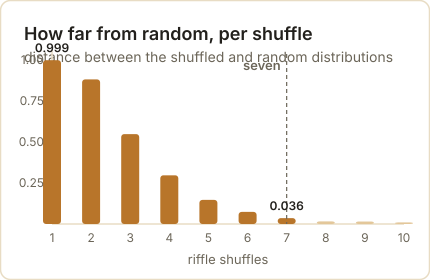

<style>

/* Mobile readability for this post (phone widths only) */

@media (max-width: 768px) {

  /* Figures: full width, caption directly underneath instead of in the margin */

  figure.quarto-float,

  figure.quarto-float > div,

  figure.quarto-float img.img-fluid {

    width: 100% !important;

    max-width: 100% !important;

    float: none !important;

    margin-left: 0 !important;

    margin-right: 0 !important;

  }

  figure.quarto-float figcaption,

  figcaption.quarto-float-caption,

  .margin-caption {

    position: static !important;

    display: block !important;

    width: 100% !important;

    max-width: 100% !important;

    margin: 0.6rem 0 0 0 !important;

    padding: 0 !important;

    text-align: left !important;

    font-size: 0.9rem;

    line-height: 1.5;

  }

  /* Long words, links and code must never push the page sideways */

  #quarto-document-content { overflow-wrap: break-word; word-wrap: break-word; }

  #quarto-document-content pre {

    overflow-x: auto;

    -webkit-overflow-scrolling: touch;

    font-size: 0.82rem;

  }

  /* The comparison table becomes a stack of cards instead of a squeezed grid */

  #quarto-document-content table { display: block; width: 100%; border: 0; }

  #quarto-document-content thead { display: none; }

  #quarto-document-content tbody,

  #quarto-document-content tr,

  #quarto-document-content td { display: block; width: 100%; }

  #quarto-document-content tr {

    background: #FFFFFF;

    border: 1px solid #F2EBD8;

    border-radius: 0.75rem;

    padding: 0.9rem 1rem;

    margin-bottom: 0.85rem;

    box-shadow: 0 2px 10px rgba(92, 45, 30, 0.06);

  }

  #quarto-document-content td { border: 0 !important; padding: 0.2rem 0; }

  #quarto-document-content td:first-child {

    font-size: 1.05rem;

    font-weight: 700;

    color: #321208;

    margin-bottom: 0.25rem;

  }

  /* Tighter callouts so text is not cramped in a narrow column */

  .callout { margin: 1.1rem 0 !important; }

  .callout .callout-body-container { padding: 0.85rem 1rem !important; font-size: 1rem; }

  .callout .callout-header { padding: 0.7rem 1rem !important; }

  blockquote { padding-left: 0.9rem; font-size: 1rem; }

  /* Headings scale down a notch */

  #quarto-document-content h2 { font-size: 1.5rem; line-height: 1.25; }

  #quarto-document-content h3 { font-size: 1.2rem; line-height: 1.3; }

}

</style>

Three things you have almost certainly used this week run on one idea. One decided whether a wartime reactor would stay lit or run away. One decided which of the billions of pages on the web you were shown first. One decided the next word your phone offered you. The idea is a chain, and it is old enough to have been used on a poem.

A chain is a way of describing something that moves between states. A coin is heads or tails. A page is one of the pages on the web. A letter is a vowel or a consonant. What makes it a *chain* rather than a list of states is one restriction: where it goes next depends only on where it is now, and not on how it got there.

That sounds like a small restriction. It is the whole trick.

Put the states in a row, write down the chance of moving from each one to each other, and the future becomes arithmetic. You can draw a sample from it, average over it, or multiply a vector by it until the numbers stop moving. There is no need to remember history, because there is no history to remember.

The idea went into the literature through an argument about free will, and it reached the world's computers through a card game played during a slow recovery from illness. Between those two points sits a counting exercise on a Russian poem that a mathematician did to win a fight. This post follows the whole line, and every number in it was produced by the code you will see, on this machine, a few minutes ago.

## A fight about whether independence was necessary

The story starts with a theorem that had been standing for nearly two centuries. Jacob Bernoulli's *Ars Conjectandi* was published in 1713, eight years after his death, and it contained the first serious proof of what we now call the law of large numbers: as you take more observations, the average of what you see closes in on the underlying probability.

Bernoulli's proof assumed the observations were independent of each other. That assumption sat quietly under the result for two hundred years, the way a foundation sits under a house.

In the Russia of the early 1900s, one mathematician decided to make the assumption do political work. Pavel Nekrasov argued from statistical regularities in social data to a conclusion about human freedom: if births, marriages and crimes settle into steady averages, he reasoned, then individual human acts must be independent of one another, and that independence pointed to something beyond material cause.

The historian of probability Eugene Seneta has traced this argument in detail. What Nekrasov was doing, in effect, was reading a theorem backwards. The law of large numbers says that independence produces steady averages. Nekrasov wanted it to say that steady averages prove independence.

Andrey Markov would not let it stand. He called this use of probability an abuse of mathematics, and rather than argue the philosophy he went after the implication itself: if steady averages require independence, then he would produce steady averages from something that was plainly not independent.

He chose the letters of a poem.

## Twenty thousand letters of Eugene Onegin

Markov took the first chapter of Pushkin's *Eugene Onegin*, sixteen stanzas of the second chapter, and stripped it to bare letters — no punctuation, no spaces, and none of the Russian hard and soft signs. That left him 20,000 characters to work with.

He sorted the letters into two kinds, vowels and consonants, and counted. The result, published in 1913 in the *Bulletin of the Imperial Academy of Sciences of St Petersburg*, was **43.19%** vowels. If letters were independent of one another, then a vowel would be followed by a vowel about 0.4319 squared of the time, which is **18.65%**. Markov counted 1,104 vowel-vowel pairs among his 20,000 letters, or **5.52%**.

That gap is the argument. Letters are not independent — Russian vowels and consonants alternate far more than chance would allow — and yet the average still settled down. Independence was not required.

Here is that count, redone on a public-domain text of the poem. The code reads the letters, drops the hard and soft signs, and takes the first 20,000.

```{python}
#| label: onegin-count
"""Markov's count, redone: the letters of Eugene Onegin."""
text = open("onegin_markov_scope.txt", encoding="utf-8").read()

# Markov counted letters only: no punctuation, no spaces, and he left out the
# Russian hard and soft signs. Everything here is lowercase Cyrillic.
def letters(s, drop="ъь"):
    return "".join(c for c in s.lower() if "а" <= c <= "я" and c not in drop)

VOWELS = set("аеёиоуыэюя") | {"й"}   # as it turns out, he counted й as a vowel

L = letters(text)[:20000]
n_v = sum(1 for c in L if c in VOWELS)
vv = sum(1 for a, b in zip(L, L[1:]) if a in VOWELS and b in VOWELS)
p = n_v / len(L)
print(f"letters counted             {len(L):,}")
print(f"vowels                      {n_v:,}  ({p:.2%})")
print(f"vowel after vowel           {vv:,}  ({vv / (len(L) - 1):.2%})")
print(f"if letters were independent {p ** 2:.2%}  <- what independence predicts")
print(f"p(vowel | vowel)            {vv / n_v:.4f}")
print("\nMarkov published 1913: 43.19% vowels | 5.52% vowel-vowel | p = 0.128")
```

That "as it turns out" in the code is doing real work, so it is worth stopping on. Markov's paper does not spell out which letters he counted as vowels, and a different edition of the poem is not the same text he held in his hands. What the paper does give is three numbers — 43.19%, 5.52%, and the conditional probability of 0.128 — and those three are enough to work out how he was classifying letters, because only one classification reproduces all three.

```{python}
#| label: onegin-conventions
"""Which letters did he call vowels? Only one convention reproduces his three figures."""
print(f"{'variant':<44}{'vowels':>9}{'vowel-vowel':>13}{'p(v|v)':>9}")
for label, drop, extra in [
    ("everything kept", "", set()),
    ("hard and soft signs dropped (ъ, ь)", "ъь", set()),
    ("that, and й counted as a vowel", "ъь", {"й"}),
]:
    L2 = letters(text, drop)[:20000]
    V = set("аеёиоуыэюя") | extra
    nv = sum(1 for c in L2 if c in V)
    vv2 = sum(1 for a, b in zip(L2, L2[1:]) if a in V and b in V)
    print(f"{label:<44}{nv / len(L2):>8.2%}{vv2 / (len(L2) - 1):>12.2%}{vv2 / nv:>9.3f}")
print(f"{'Markov, published 1913':<44}{0.4319:>8.2%}{0.0552:>12.2%}{0.128:>9.3f}")
```

Keep every letter and you get 40.28% vowels and vowel-vowel pairs at 3.02% — too low on both. Drop the hard and soft signs as he did and it rises to 41.16% and 3.11%, still short. Drop them *and* count й as a vowel and the three figures land at **43.20%, 5.55% and 0.1285** against his published **43.19%, 5.52% and 0.128**.

Reproducing a dead man's arithmetic within three thousandths, on a Soviet edition of the poem printed forty-six years after his paper, is how you find out what he meant.

<p class="src">Source: A. A. Markov, "An Example of Statistical Investigation of the Text Eugene Onegin Concerning the Connection of Samples in Chains," 1913, English translation in <em>Science in Context</em> 19(4), 2006, 591–600; Eugene Seneta, "Statistical Regularity and Free Will: L. A. J. Quetelet and P. A. Nekrasov," <em>International Statistical Review</em> 71, 2003, 319–334.</p>
{#fig-letter-chain}


## The chain, not the average

The move that survived is the one in the next block. Instead of counting the letters, Markov wrote down the chance of each letter following each state: after a vowel, a vowel came 12.85% of the time; after a consonant, a vowel came 66.29% of the time.

Then he generated letters from those two numbers alone. The poem was never consulted again, and the averages still settled down.

```{python}
#| label: onegin-chain
"""The same letters as a two-state chain, generating text from two numbers."""
import numpy as np

states = ["v" if c in VOWELS else "c" for c in L]
counts = {"v": {"v": 0, "c": 0}, "c": {"v": 0, "c": 0}}
for a, b in zip(states, states[1:]):
    counts[a][b] += 1
P = {s: {t: counts[s][t] / sum(counts[s].values()) for t in ("v", "c")} for s in ("v", "c")}
print("transition probabilities from the poem itself")
for s in ("v", "c"):
    print(f"   after a {'vowel' if s == 'v' else 'consonant'}: "
          f"vowel {P[s]['v']:.4f} | consonant {P[s]['c']:.4f}")

rng = np.random.default_rng(1913)
start = states[0]
shares = []
for run in range(20):
    state, out = start, []
    for _ in range(20000):
        state = "v" if rng.random() < P[state]["v"] else "c"
        out.append(state)
    shares.append(out.count("v") / len(out))
print(f"\n20 runs of 20,000 letters from the chain alone: {np.mean(shares):.2%} vowels on average")
print(f"the poem itself: {states.count('v') / len(states):.2%} vowels")
```

Twenty runs of twenty thousand letters, drawn from two numbers, average 43.07% vowels. The poem itself is 43.20%. Nekrasov's implication is dead: the regularity survives the loss of independence, and it survives it completely.

Markov's 1906 paper had already carried the theorem where he needed it. Its title translates as *Extension of the Law of Large Numbers to Quantities Depending on Each Other*, and it is the ancestor of everything that follows in this post. What he did with the poem in 1913 was demonstrate the result on something nobody could accuse of being ordered.

## What the restriction buys

A chain is memoryless, and that is the reason it is used. To predict the next letter you do not need the poem so far, only the kind of letter you are standing on. The state is the memory.

That property is what makes the arithmetic cheap. A system with a thousand states needs a thousand-by-thousand table of moves, and nothing else. You can multiply a vector by that table and watch the distribution settle; you can draw paths through it; you can count how often each state is visited in the long run. All of it is multiplication and sampling.

The cost is that the chain forgets on purpose. A chain cannot tell you that a long run of vowels is overdue for a consonant, or that a sentence has a subject waiting for a verb, because none of that is in the state. Everything that matters has to be squeezed into "where am I right now".

Which is exactly why the restriction is useful, and exactly why it eventually breaks. Both halves of that sentence get their turn below. First the useful half, in a desert in New Mexico.
## A solitaire game in Los Alamos

In early 1946, Stanislaw Ulam was in a hospital bed in Los Alamos with encephalitis, and he was playing a great deal of solitaire. He was also meant to be thinking about how neutrons behave inside a piece of plutonium, which is a hard problem in a way that is worth stating plainly: a neutron's life is a sequence of collisions, and each collision depends on the energy and direction the neutron arrived with.

Ulam's observation was that you did not have to solve that sequence. You could play it. Deal a neutron a random collision, then another, and follow it until it is absorbed, leaks out, or splits an atom. Do that a few thousand times and count what happened.

John von Neumann, who had the computing machinery in mind, worked the idea up with him. The two of them noted that this is a chain: the neutron's next collision depends on its current state and nothing earlier. Their 1949 paper in the *Journal of the American Statistical Association* describes cascading nuclear processes as Markoff chains and follows neutron transport as a sequence of random histories.

The name came from Nicholas Metropolis, and it came from gambling. Ulam had an uncle who gambled away his money at the casino in Monte Carlo, and the method was a game of chance played out at scale.

The number Ulam picked as his example of a game too large to enumerate was the number of ways to order a 52-card deck: 52 factorial, about 8.07 followed by 67 zeros. That figure is often given as the number of solitaire games, which is not quite it — it is the number of arrangements of the deck, and it is already a number no one will ever list.

The problem the method was built to answer has a name. Call it **k**: the average number of neutrons that the next generation of fissions produces, per neutron in this one. The Nuclear Regulatory Commission states the three cases in its reactor physics manual, and they are the whole of reactor design:

> k below 1: the population shrinks and the reaction dies.
> k equals 1: the population holds steady and the reaction is self-sustaining.
> k above 1: the population grows, generation after generation.

The first Monte Carlo calculations ran on ENIAC, the Electronic Numerical Integrator and Computer, in the spring of 1948. By December of that year the same machine was being used on reactor problems for Argonne National Laboratory. The method that began as a way to follow one neutron became the standard way to design a core.

You can build the same thing in a few dozen lines. Each neutron travels, scatters, is absorbed, leaks out, or splits an atom; one knob sets how often it splits. Everything else is arithmetic. Here is k measured for seven settings of that knob, forty thousand neutrons each.

```{python}
#| label: neutron-k
"""Neutrons as a chain: the multiplication factor k, measured."""
import numpy as np

STATE = ["travel", "scatter", "absorbed", "left", "fission"]

def table(fission_chance, fast=False):
    """The five outcomes, scaled so the fission share is what we set."""
    base = {"scatter": 0.40, "absorbed": 0.10, "left": 0.20, "fission": 0.30}
    if fast:
        base = {"scatter": 0.30, "absorbed": 0.20, "left": 0.30, "fission": 0.20}
    rest = 1.0 - fission_chance
    w = {k: v for k, v in base.items() if k != "fission"}
    scale = rest / sum(w.values())
    row = np.zeros(len(STATE))
    for k, v in w.items():
        row[STATE.index(k)] = v * scale
    row[STATE.index("fission")] = fission_chance
    t = np.tile(row, (len(STATE), 1))
    for dead in ("absorbed", "left"):     # a neutron that is gone stays gone
        t[STATE.index(dead)] = 0.0
        t[STATE.index(dead), STATE.index(dead)] = 1.0
    return t

def simulate(rng, probs, n_neutrons):
    """Follow each neutron until it is absorbed, lost, or splits an atom."""
    alive = np.ones(n_neutrons, dtype=bool)
    state = np.zeros(n_neutrons, dtype=np.int8)      # all start in travel
    released = np.zeros(n_neutrons, dtype=np.int8)   # what each neutron frees
    for _ in range(400):
        idx = np.flatnonzero(alive)
        if idx.size == 0:
            break
        u = rng.random(idx.size)
        nxt = (u[:, None] > np.cumsum(probs[state[idx]], axis=1)).sum(axis=1)
        state[idx] = nxt
        f = idx[nxt == 4]
        released[f] += rng.integers(2, 4, size=f.size)   # a split frees 2 or 3
        state[f] = 0                                     # and the neutron walks on
        alive[idx[(nxt == 2) | (nxt == 3)]] = False      # absorbed or leaked out
    return released

rng = np.random.default_rng(1946)
print("one knob: the chance a neutron splits an atom instead of leaving")
print(f"{'fission chance':>15}{'k (neutrons per neutron)':>27}")
for chance in (0.05, 0.10, 0.145, 0.15, 0.20, 0.25, 0.30):
    print(f"{chance:>15.3f}{simulate(rng, table(chance), 40000).mean():>27.3f}")
```

The knob moves k across the critical line: at a fission chance of 0.145 the core measures 0.982, at 0.15 it measures 1.031. Somewhere between those two settings sits the difference between a design that dies and a design that holds.

{#fig-k-curve}

Plot that against a population of neutrons and the three regimes stop being words and become a table. Four hundred neutrons, eight generations.

```{python}
#| label: neutron-generations
"""The same core, three settings, run generation by generation."""
print("and what that does to a population of 400 neutrons, over 8 generations")
CORES = (0.05, 0.145, 0.30)
drawn = {c: simulate(np.random.default_rng(7), table(c), 40000) for c in CORES}
ks = {c: float(drawn[c].mean()) for c in CORES}
print(f"{'generation':>11}" + "".join(f"{'k = ' + format(ks[c], '.2f'):>12}" for c in CORES))
pop = {c: 400 for c in CORES}
print(f"{0:>11}" + "".join(f"{pop[c]:>12,}" for c in CORES))
rngs = {c: np.random.default_rng(int(c * 1000)) for c in CORES}
for gen in range(1, 9):
    row = []
    for c in CORES:
        pop[c] = int(np.sum(rngs[c].choice(drawn[c], size=pop[c])))
        row.append(pop[c])
    print(f"{gen:>11}" + "".join(f"{x:>12,}" for x in row))
```

Four hundred neutrons at k = 0.30 are five and then nothing. At k = 2.52 they are 646,325 in eight generations. In between, at k = 0.99, they wander — up to 420, down to 258 — and that wandering is the point of the last measurement.

A core whose k sits at 1 does not behave like a core whose k is 1. Run it three hundred times and the average lands near 1 while individual runs do anything.

```{python}
#| label: neutron-spread
"""The same core, 300 times: why one run proves nothing."""
rng = np.random.default_rng(99)
runs = np.array([simulate(rng, table(0.20, fast=True), 300).mean() for _ in range(300)])
print(f"300 separate runs of the same core (fast neutrons):")
print(f"   mean k {runs.mean():.3f} | smallest {runs.min():.3f} | largest {runs.max():.3f}")
print(f"   runs that died out (k < 1): {(runs < 1).mean():.0%} of them")
```

Three hundred runs of one core, mean k = 0.997. More than half of them — 53% — finished below 1 and died. The Los Alamos group was not building one reactor; it was sampling a distribution of them, which is precisely the thing a chain simulation is for.

A note on the Trinity test, since that is where this arithmetic was first pointed. The device detonated on 16 July 1945 was a plutonium bomb, and the approximately 6 kilograms usually quoted for it refer to the plutonium content of the core, not the weight of the bomb. Published yields are lower than the roundest retelling: the Department of Energy's history gives about 21 kilotons, and an Air Force history gives 18.6. The frequently repeated "nearly 25,000 tons of TNT" is on the high side of the official figures.

<p class="src">Source: Terrence R. Fehner and F. G. Gosling, <em>Origins of the Nevada Test Site</em>, U.S. Department of Energy, 2000; Beck et al., "Accounting for Unfissioned Plutonium from the Trinity Atomic Bomb Test," <em>Health Physics</em> 119, 2020.</p>

## The web as a chain

By the mid-1990s the web had a search problem. Pages were being matched to queries mostly by the words on them, and the words on a page are chosen by whoever wrote the page, so a page could be pushed up the list by stuffing it with terms. Sergey Brin and Larry Page, both then doctoral candidates at Stanford, proposed in 1998 that a page's importance should be decided by who links to it.

A link was a vote, in their formulation, and a page's vote was divided evenly among the pages it linked to. Two pages linking to you are worth more than one, and a single link from a page that everyone else links to is worth more than a hundred links from nowhere.

The result is a number per page, and the way to compute it is a chain. Imagine a reader who clicks links forever at random, and ask what fraction of the time they spend on each page. That fraction is the page's rank. Brin and Page wrote it as the principal eigenvector of the normalized link matrix and set the damping factor — the chance the reader follows a link rather than jumping to a random page — at 0.85.

Here is a toy web of four pages, scored by repeatedly multiplying a vector by the table of moves.

```{python}
#| label: pagerank-toy
"""The web as a chain: four pages, scored by repeated multiplication."""
import numpy as np

def rank(edges, pages, d=0.85, iters=100):
    """edges: {page: [pages it links to]}. d: chance the surfer follows a link."""
    n = len(pages)
    idx = {p: i for i, p in enumerate(pages)}
    M = np.zeros((n, n))
    for src, outs in edges.items():
        if outs:
            for dst in outs:
                M[idx[dst], idx[src]] = 1 / len(outs)   # votes split evenly
    dangling = [idx[p] for p in pages if not edges.get(p)]
    v = np.ones(n) / n
    if not d:
        for _ in range(iters):
            v = M @ v
        return v, v.sum()              # no jump: mass drains through the dead end
    for d0 in dangling:                # with the jump on, a dead end sends the surfer anywhere
        M[:, d0] = 1 / n
    for _ in range(iters):
        v = d * (M @ v) + (1 - d) / n
    return v, v.sum()

pages = ["Amy", "Ben", "Chris", "Dan"]
web = {"Amy": ["Ben"], "Ben": ["Amy", "Chris", "Dan"], "Chris": ["Amy", "Dan"], "Dan": ["Ben"]}
v, total = rank(web, pages)
print("a toy web: Amy -> Ben; Ben -> Amy, Chris, Dan; Chris -> Amy, Dan; Dan -> Ben")
for p, s in sorted(zip(pages, v), key=lambda t: -t[1]):
    print(f"   {p:<6}{s:.4f}")
print(f"   total mass {total:.4f}")
```

Ben takes 0.41 of the reader's time, Amy and Dan 0.22 each, Chris 0.15. Ben wins because the links into him come from pages that are themselves linked to, while Chris's single vote has to be split two ways.

{#fig-toy-web}

Now the failure that forced the damping factor into the design. Give Dan no links at all — a page with nothing to click — and run the same arithmetic without letting the reader jump anywhere.

```{python}
#| label: pagerank-leak
"""A page with no links: what the random jump is actually for."""
broken = {"Amy": ["Ben"], "Ben": ["Amy", "Chris", "Dan"], "Chris": ["Amy", "Dan"], "Dan": []}
v0, t0 = rank(broken, pages, d=0)
v1, t1 = rank(broken, pages)
print(f"   follow links only        (d = 0): total mass {t0:.3f}")
print(f"   with the 15% random jump (d = 0.85): total mass {t1:.3f}")
```

The mass goes to zero. A reader who follows links and finds none has nowhere to go, so the walk dies and the ranking has nothing left to rank. The 15% jump is what keeps the walk alive: it teleports the reader to a random page, which is also why the rank of a page nobody links to is small but never zero.

Which raises the question every site owner asked in the years after 1998: if links are votes, why not build pages that vote for you? Hide a hundred pages that link only to your page, and see what it buys.

```{python}
#| label: pagerank-farm
"""A hundred pages linking only to Amy."""
spam = [f"spam{i:03d}" for i in range(100)]
big = dict(web)
for s in spam:
    big[s] = ["Amy"]
bv, _ = rank(big, pages + spam)
print(f"   Amy  {v[0]:.4f} -> {bv[pages.index('Amy')]:.4f}   (Ben still {bv[pages.index('Ben')]:.4f})")
print(f"   the best-placed spam page: {bv[len(pages):].max():.4f}, and all 100 together hold "
      f"{bv[len(pages):].sum():.3f} of the vote")
```

Amy rises from 0.2187 to 0.2652 and Ben stays on top at 0.3480. The hundred fake pages hold 0.144 of the total between them, and the best of them is worth 0.0014 — because each one has no links pointing at it, so under this arithmetic there is nothing to inherit.

That is the shape of the defence, and it is worth being honest about the shape of the attack. A link farm does move the number; it just cannot buy the top spot, and the pages doing the work stay at the bottom where nobody will find them.

Google incorporated in August 1998, after a rename from BackRub. The name is a misspelling of googol, the word for ten to the hundredth power, and Brin and Page's own paper calls Google "a common spelling of googol". The more specific story — that a fellow student typed the misspelling while registering the domain — comes from a Stanford account written years later, so treat it as a good story rather than a document.

Alphabet was worth about two trillion dollars in July 2025 and more than four trillion by early 2026. Yahoo, for the record, was founded in 1994 by Jerry Yang and David Filo, and Masayoshi Son did offer roughly 105 million dollars for a third of it the following year.

<p class="src">Source: Sergey Brin and Lawrence Page, "The Anatomy of a Large-Scale Hypertextual Web Search Engine," <em>Computer Networks and ISDN Systems</em> 30, 1998, 107–117; Randall Lane, "Master of the Internet," <em>Forbes</em>, 5 July 1999; CNBC, January 2026.</p>

## Shannon's approximation, and what happens when a model reads itself

Claude Shannon's 1948 paper *A Mathematical Theory of Communication* is where information theory starts, and it contains a demonstration that belongs in this post: he approximated English with chains and printed the results to show how much structure each order adds.

At the first order, letters are drawn independently and the output is noise. At higher orders, the chain conditions on the previous few letters or words, and the text starts to look like language. Here is the same experiment on a public-domain novel, with the information content measured at each order.

```{python}
#| label: shannon-orders
"""Shannon's approximations to English, with bits per token measured."""
import re
import numpy as np
from collections import Counter, defaultdict

book = open("corpus_pride_and_prejudice.txt", encoding="utf-8").read()
words = re.findall(r"[a-z']+", book.lower())
chars = re.findall(r"[a-z ]", book.lower())
print(f"corpus: {len(words):,} words of Pride and Prejudice (Project Gutenberg ebook 1342)")

def chain_of(tokens, order):
    c = defaultdict(Counter)
    for i in range(len(tokens) - order):
        c[tuple(tokens[i:i + order])][tokens[i + order]] += 1
    return c

def bits(chain):
    total = sum(sum(v.values()) for v in chain.values())
    h = 0.0
    for counter in chain.values():
        n = sum(counter.values())
        p = np.array(list(counter.values())) / n
        h += n / total * float(-(p * np.log2(p)).sum())
    return h

def speak(chain, order, rng, n, tokens):
    i = int(rng.integers(0, len(tokens) - order - 1))
    state, out = tuple(tokens[i:i + order]), []
    out.extend(state)
    for _ in range(n):
        if state not in chain:
            break
        options, weights = zip(*chain[state].items())
        state = (state + (rng.choice(options, p=np.array(weights) / sum(weights)),))[1:]
        out.append(state[-1])
    return out

rng = np.random.default_rng(1948)
print("\nword by word, learning from the book:")
for order in (1, 2, 3, 4):
    c = chain_of(words, order)
    print(f"\n   order {order}  ({bits(c):5.2f} bits per word, {len(c):,} states)")
    print(f"   \"{' '.join(speak(c, order, rng, 26, words))[:200]}\"")
```

The numbers fall as the order rises: 4.74 bits per word at order 1, 1.36 at order 2, 0.21 at order 3, 0.03 at order 4. That is Shannon's point restated for words — the more context you allow the chain, the less surprise is left in each new word.

Do not read the low numbers as a good model. The measure collapses because the corpus is far too small to fill the higher orders, so most states are seen once and their continuation is a single recorded word. The chain is not learning the language, it is reciting.

That shows up when you ask a blunter question: of the word sequences this thing writes, how many were ever actually written, in that order, in the book?

```{python}
#| label: shannon-recites
"""How much of what the chain writes was ever actually written?"""
for order in (2, 3, 4):
    c = chain_of(words, order)
    real = {tuple(words[i:i + order + 1]) for i in range(len(words) - order)}
    text = speak(c, order, rng, 300, words)
    hit = sum(1 for i in range(len(text) - order) if tuple(text[i:i + order + 1]) in real)
    single = sum(1 for v in c.values() if len(v) == 1) / len(c)
    print(f"   order {order}: {hit}/{len(text) - order} generated {order + 1}-word runs appear "
          f"in the book ({hit / (len(text) - order):.1%}); {single:.1%} of its states have only "
          f"one recorded continuation")
```

Every one of them, at every order. With 43,000 words to learn from, 81% of the two-word states and 99% of the four-word states have exactly one continuation on record, so the chain mostly walks a path the book already contains. What looks like fluent text is a quotation engine with small steps.

Shannon's own examples make the same point more elegantly. His third-order letter approximation, printed in the 1948 paper, reads: "IN NO IST LAT WHEY CRATICT FROURE BIRS GROCID PONDENOME OF DEMONSTURES OF THE REPTAGIN IS REGOACTIONA OF CRE".

Modern language models are the same idea with two changes: the states are built from tokens rather than letters, and instead of conditioning on a fixed window of the last few, **attention** weighs every earlier token in the text. That last change is the whole difference between a chain and a transformer, and it is what lets a model use a noun from four paragraphs ago.

Now the part that has no precedent in 1913. Take the chain trained on the book, let it write, then train a new chain on what it wrote, then a new one on that, five times over. This is what happened when the web started filling up with model output.

```{python}
#| label: model-collapse
"""Feed each chain its own output, five generations over, eight chains at once."""
import statistics

print("feed the chain its own output, five generations over, eight chains at once:")
runs, sample = [], ""
for seed in range(8):
    r = np.random.default_rng(1000 + seed)
    text, row = words, []
    for gen in range(1, 6):
        c = chain_of(text, 2)
        text = speak(c, 2, r, 4000, words if gen == 1 else text)
        row.append((len(set(text)), len(c)))
        if seed == 0 and gen == 5:
            sample = " ".join(text[100:150])
    runs.append(row)
print(f"{'generation':>11}{'vocabulary':>14}{'distinct pairs':>16}")
for gen in range(5):
    v = statistics.mean(r[gen][0] for r in runs)
    p = statistics.mean(r[gen][1] for r in runs)
    print(f"{gen + 1:>11}{v:>14,.0f}{p:>16,.0f}")
print(f"\nand what it writes by then: \"{sample}\"")
```


Run that five generations deep over eight independent chains and the numbers fall in step: the average vocabulary drops from 1,070 words to 260, and the count of distinct two-word states from 24,870 to 674. What comes out stays grammatical and loses its footing slowly — one of the fifth-generation chains writes: "nor its writer were in fact very fine a young man too like you whose very countenance may vouch for the honour of her situation in life".

{#fig-collapse}

Five generations is a small demonstration of a real effect. Ilia Shumailov and colleagues showed in *Nature* in 2024 that training models recursively on their own output degrades the distribution — the rare cases thin out first, then the language narrows toward what is common — and that keeping the original human data in the mix substantially reduces the damage.

The lesson is not that self-training is fatal. It is that a chain can only visit states it has been given, so a model trained on a narrowed world stays in that world.

<p class="src">Source: Claude E. Shannon, "A Mathematical Theory of Communication," <em>Bell System Technical Journal</em> 27, 1948, 379–423 and 623–656; Ilia Shumailov et al., "AI models collapse when trained on recursively generated data," <em>Nature</em> 631, 2024, 755–759.</p>

## Seven shuffles

The last stop is the one Ulam started from, because a shuffled deck is a chain too. Every arrangement of the cards is a state, and every shuffle is a step.

The shuffle worth modelling is the dovetail: cut the deck at a random point, then interleave the two halves so that the order inside each half is kept. Dave Bayer and Persi Diaconis worked out its mixing time in 1992, and got the number that has been repeated ever since — seven.

Seven is the point where the deck is close to random, not where it becomes random. Their table gives the total variation distance from a well-shuffled deck as 0.924 after five shuffles, 0.614 after six, **0.334 after seven** and 0.167 after eight. The distance is the fraction of the deck's arrangements that would have to be re-weighted to make the shuffle exactly uniform, so 0.334 is still a noticeable gap.

{#fig-shuffle}

You can see the same thing without their mathematics by watching one statistic: how many rising sequences the deck has. A deck in perfect order has one. A random deck has about 26.5, since the average is half of 52 plus a half. Each riffle can at most double the number.

```{python}
#| label: shuffle-distance
"""How many riffle shuffles randomise a deck? Measured, not quoted."""
import numpy as np

N, TRIALS = 52, 30000

def riffle(deck, rng):
    """Cut at a Binomial(52, 1/2) point, then interleave, keeping each packet's order."""
    cut = rng.binomial(N, 0.5)
    left, right = deck[:cut], deck[cut:]
    out, i, j = np.empty(N, dtype=np.int8), 0, 0
    for k in range(N):
        if rng.random() < (left.size - i) / max(1, (left.size - i) + (right.size - j)):
            out[k] = left[i]; i += 1
        else:
            out[k] = right[j]; j += 1
    return out

def rising(deck):
    return int((np.diff(deck) < 0).sum()) + 1

def spread(values):
    counts = np.bincount(values, minlength=N + 1)[1:N + 1]
    return counts / counts.sum()

rng = np.random.default_rng(1992)
base = spread(np.array([rising(rng.permutation(N)) for _ in range(TRIALS)]))
print(f"{'shuffles':>9}{'top card still on top':>23}{'rising sequences':>18}{'distance from random':>22}")
for n in range(1, 11):
    tops, rs = 0, np.empty(TRIALS, dtype=np.int16)
    for trial in range(TRIALS):
        deck = np.arange(N, dtype=np.int8)
        for _ in range(n):
            deck = riffle(deck, rng)
        tops += int(deck[0] == 0)
        rs[trial] = rising(deck)
    dist = 0.5 * float(np.abs(spread(rs) - base).sum())
    print(f"{n:>9}{tops / TRIALS:>23.2%}{rs.mean():>18.2f}{dist:>22.3f}")
print(f"\na random deck keeps the same top card {1/52:.2%} of the time")
```

The distance falls by roughly half with each shuffle — 0.999, 0.882, 0.548, 0.297, 0.147, 0.074, 0.036 — and by seven shuffles there is almost nothing left for this statistic to measure. The top card is back to being the top card about 2% of the time, which is the random rate.

Two honest caveats about that table. The distance reported is between the distributions of one statistic, not between the full distributions of deck arrangements, so it is a lower bound on the true distance — which is why it reaches 0.036 at seven shuffles while Bayer and Diaconis give 0.334. And my riffle is the tidy textbook one. A real riffle, done by hands, mixes faster or slower depending on how well the packets interleave, and the common estimate that an overhand shuffle needs thousands of passes comes from a different and much slower model.

## Where the chain stops

Everything above works because the state is small and the rules do not change. Both of those are assumptions, and both fail somewhere useful.

The first failure is memory. A chain that conditions on the last two words cannot know what the sentence is about, and one that conditions on the current temperature cannot know that the planet has been warming for a century. Where the thing being modelled feeds back into itself — water vapour rising with temperature, models trained on text that models wrote — the state is not enough, and the chain gives a confidently narrow answer.

The second failure is stationarity, the assumption that the table of moves stays the same. A chain estimated on last decade's data will keep predicting last decade's behaviour, because nothing in it can represent a change in the rules.

Those are not reasons to abandon the idea. They are the reasons it is still being extended: hidden states for the things you cannot observe, time-varying tables for the things that drift, and attention for the history a single state cannot hold. The pattern is always the same. Find the state, write down the moves, and multiply.

Which is a good place to leave Markov's feud. He won the argument he was having — independence is not required for regularity, and his two numbers from a poem prove it — and then the machinery he built to win it went further than the argument ever did.

## Sources and further reading

The poem and the feud:

- A. A. Markov, *An Example of Statistical Investigation of the Text Eugene Onegin Concerning the Connection of Samples in Chains* (1913), English translation in *Science in Context* 19(4), 2006, 591–600 — [the translation](https://gwern.net/doc/statistics/probability/2006-markov.pdf){target="_blank"}; original in the *Bulletin of the Imperial Academy of Sciences of St Petersburg* 7(3), 153–162 — [record](https://eudml.org/doc/128778){target="_blank"}
- A. A. Markov, *Extension of the Law of Large Numbers to Quantities Depending on Each Other* (1906), Izvestiya of the Kazan Physico-Mathematical Society
- Eugene Seneta, *Markov and the Birth of Chain Dependence Theory*, International Statistical Review 64, 1996, 255–263 — [record](https://www.landsburg.org/markov2.pdf){target="_blank"}
- Eugene Seneta, *Statistical Regularity and Free Will: L. A. J. Quetelet and P. A. Nekrasov*, International Statistical Review 71, 2003, 319–334
- Jacob Bernoulli, *Ars Conjectandi*, 1713

The poem itself:

- A. A. Pushkin, *Eugene Onegin*, Russian text of the 1959 collected works — [Wikisource](<https://ru.wikisource.org/wiki/%D0%95%D0%B2%D0%B3%D0%B5%D0%BD%D0%B8%D0%B9_%D0%9E%D0%BD%D0%B5%D0%B3%D0%B8%D0%BD_(%D0%9F%D1%83%D1%88%D0%BA%D0%B8%D0%BD)/%D0%A1%D0%A1_1959_(%D0%A1%D0%9E)>

Monte Carlo and the bomb:

- Nicholas Metropolis and Stanislaw Ulam, *The Monte Carlo Method*, Journal of the American Statistical Association 44(247), 1949, 335–341 — [PDF](https://web.williams.edu/Mathematics/sjmiller/public_html/105Sp10/handouts/MetropolisUlam_TheMonteCarloMethod.pdf){target="_blank"}
- Owen Summerscales, *Hitting the Jackpot: The Birth of the Monte Carlo Method*, Los Alamos National Laboratory, 2023 — [LANL](https://www.lanl.gov/media/publications/actinide-research-quarterly/1123-hitting-the-jackpot-the-birth-of-the-monte-carlo-method){target="_blank"}
- Terrence R. Fehner and F. G. Gosling, *Origins of the Nevada Test Site*, U.S. Department of Energy, 2000 — [PDF](https://www.energy.gov/sites/prod/files/DOENevadaTestSite.pdf){target="_blank"}
- U.S. Nuclear Regulatory Commission, *Reactor Physics*, GE Systems Technology Manual chapter 1.7 — [PDF](https://www.nrc.gov/docs/ml1125/ml11258a296.pdf){target="_blank"}
- A. Sood et al., *Neutronics Calculation Advances at Los Alamos: Manhattan Project to Monte Carlo*, Nuclear Technology 207(sup1), 2021, S100–S133

Search and text:

- Sergey Brin and Lawrence Page, *The Anatomy of a Large-Scale Hypertextual Web Search Engine*, Computer Networks and ISDN Systems 30, 1998, 107–117 — [PDF](https://snap.stanford.edu/class/cs224w-readings/Brin98Anatomy.pdf){target="_blank"}
- Claude E. Shannon, *A Mathematical Theory of Communication*, Bell System Technical Journal 27, 1948 — [PDF](https://people.math.harvard.edu/~ctm/home/text/others/shannon/entropy/entropy.pdf){target="_blank"}
- Ilia Shumailov et al., *AI models collapse when trained on recursively generated data*, Nature 631, 2024, 755–759 — [paper](https://www.nature.com/articles/s41586-024-07566-y){target="_blank"}
- CNBC, *Alphabet hits $4 trillion market capitalization*, 12 January 2026 — [report](https://www.cnbc.com/2026/01/12/alphabet-4-trillion-market-cap.html){target="_blank"}

Shuffling:

- Dave Bayer and Persi Diaconis, *Trailing the Dovetail Shuffle to its Lair*, The Annals of Applied Probability 2(2), 1992, 294–313 — [PDF](https://www.stat.berkeley.edu/~aldous/157/Papers/bayer_diaconis.pdf){target="_blank"}
- Robin Pemantle, *Randomization Time for the Overhand Shuffle*, 2007

The data:

- Jane Austen, *Pride and Prejudice*, 1813, Project Gutenberg ebook 1342 — [Gutenberg](https://www.gutenberg.org/ebooks/1342){target="_blank"}
