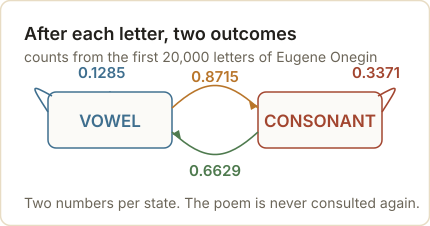
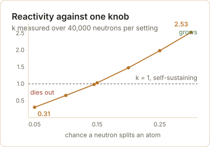
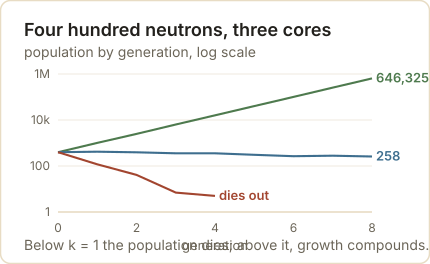
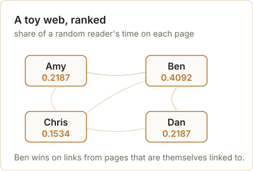
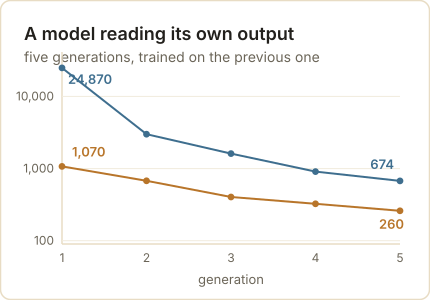

<style>

/* Mobile readability for this post (phone widths only) */

@media (max-width: 768px) {

  /* Figures: full width, caption directly underneath instead of in the margin */

  figure.quarto-float,

  figure.quarto-float > div,

  figure.quarto-float img.img-fluid {

    width: 100% !important;

    max-width: 100% !important;

    float: none !important;

    margin-left: 0 !important;

    margin-right: 0 !important;

  }

  figure.quarto-float figcaption,

  figcaption.quarto-float-caption,

  .margin-caption {

    position: static !important;

    display: block !important;

    width: 100% !important;

    max-width: 100% !important;

    margin: 0.6rem 0 0 0 !important;

    padding: 0 !important;

    text-align: left !important;

    font-size: 0.9rem;

    line-height: 1.5;

  }

  /* Long words, links and code must never push the page sideways */

  #quarto-document-content { overflow-wrap: break-word; word-wrap: break-word; }

  #quarto-document-content pre {

    overflow-x: auto;

    -webkit-overflow-scrolling: touch;

    font-size: 0.82rem;

  }

  /* The comparison table becomes a stack of cards instead of a squeezed grid */

  #quarto-document-content table { display: block; width: 100%; border: 0; }

  #quarto-document-content thead { display: none; }

  #quarto-document-content tbody,

  #quarto-document-content tr,

  #quarto-document-content td { display: block; width: 100%; }

  #quarto-document-content tr {

    background: #FFFFFF;

    border: 1px solid #F2EBD8;

    border-radius: 0.75rem;

    padding: 0.9rem 1rem;

    margin-bottom: 0.85rem;

    box-shadow: 0 2px 10px rgba(92, 45, 30, 0.06);

  }

  #quarto-document-content td { border: 0 !important; padding: 0.2rem 0; }

  #quarto-document-content td:first-child {

    font-size: 1.05rem;

    font-weight: 700;

    color: #321208;

    margin-bottom: 0.25rem;

  }

  /* Tighter callouts so text is not cramped in a narrow column */

  .callout { margin: 1.1rem 0 !important; }

  .callout .callout-body-container { padding: 0.85rem 1rem !important; font-size: 1rem; }

  .callout .callout-header { padding: 0.7rem 1rem !important; }

  blockquote { padding-left: 0.9rem; font-size: 1rem; }

  /* Headings scale down a notch */

  #quarto-document-content h2 { font-size: 1.5rem; line-height: 1.25; }

  #quarto-document-content h3 { font-size: 1.2rem; line-height: 1.3; }

}

</style>

Three things you have almost certainly used this week run on one idea. One decided whether a wartime reactor would stay lit or run away. One decided which of the billions of pages on the web you were shown first. One decided the next word your phone offered you. The idea is a chain, and it is old enough to have been used on a poem.

A chain is a way of describing something that moves between states. A coin is heads or tails. A page is one of the pages on the web. A letter is a vowel or a consonant. What makes it a *chain* rather than a list of states is one restriction: where it goes next depends only on where it is now, and not on how it got there.

That sounds like a small restriction. It is the whole trick.

Put the states in a row, write down the chance of moving from each one to each other, and the future becomes arithmetic. You can draw a sample from it, average over it, or multiply a vector by it until the numbers stop moving. There is no need to remember history, because there is no history to remember.

The idea went into the literature through an argument about free will, and it reached the world's computers through a card game played during a slow recovery from illness. Between those two points sits a counting exercise on a Russian poem that a mathematician did to win a fight. This post follows the whole line, and every number in it was produced by the code you will see, on this machine, a few minutes ago.

## A fight about whether independence was necessary

The story starts with a theorem that had been standing for nearly two centuries. Jacob Bernoulli's *Ars Conjectandi* was published in 1713, eight years after his death, and it contained the first serious proof of what we now call the law of large numbers: as you take more observations, the average of what you see closes in on the underlying probability.

Bernoulli's proof assumed the observations were independent of each other. That assumption sat quietly under the result for two hundred years, the way a foundation sits under a house.

In the Russia of the early 1900s, one mathematician decided to make the assumption do political work. Pavel Nekrasov argued from statistical regularities in social data to a conclusion about human freedom: if births, marriages and crimes settle into steady averages, he reasoned, then individual human acts must be independent of one another, and that independence pointed to something beyond material cause.

One of the tables behind the argument was Adolphe Quetelet's Belgian returns. Over five consecutive years, 1841 to 1845, the number of marriages registered in Belgium was 29,876, 29,023, 28,220, 29,326 and 29,210. The whole span stays inside 5.7% of its own average, and the typical year moves 2.81%. Nobody arranged that. A country of a few million people simply kept arriving at about twenty-nine thousand marriages a year.

Quetelet's own image for regularity was not about weddings. Reading an 1838 essay on French moral statistics, he stopped at a line about crime: "there is a budget which we pay with frightful regularity — it is that of prisons, dungeons, and scaffolds." He read it with surprise, then took it up a page later, calling the budget of the scaffold and the prisons more regularly paid than the financial one.

The same counting is still running. Germany recorded 387,423 marriages in 2012 and 390,743 in 2022 — eleven years apart, and 0.86% apart — while its marriage rate stayed between 4.3 and 5.4 per 1,000 residents across the ten years to 2022, averaging 4.8. Births in the United States never left the band 3,641,990 to 4,232,701 over the twenty-four years to 2023, and the typical year moved 1.15% from the one before.

```{python}
#| label: regularity-check
"""The same regularity, counted in Belgium in the 1840s and in two countries today."""
import csv
import statistics as st

rows = [r for r in csv.reader(open("national_regularity.csv", encoding="utf-8")) if r and not r[0].startswith("#")]
series = {}
for name, country, year, value in rows[1:]:
    series.setdefault(name, []).append((int(year), float(value)))


def band(name, fmt="{:,.0f}"):
    pts = sorted(series[name])
    years = [y for y, _ in pts]
    vals = [v for _, v in pts]
    moves = [100 * abs(vals[i + 1] - vals[i]) / vals[i] for i in range(len(vals) - 1)]
    print(f"{name}  {min(years)}-{max(years)}, {len(vals)} years")
    print(f"   lowest {fmt.format(min(vals))}   highest {fmt.format(max(vals))}   average {fmt.format(st.mean(vals))}")
    print(f"   typical move year to year {st.median(moves):.2f}%   biggest {max(moves):.2f}%")
    print(f"   the whole span sits inside {100 * (max(vals) - min(vals)) / st.mean(vals):.1f}% of the average")
    return vals


print("the numbers Nekrasov was arguing about are still being counted.")
print()
print("Belgian marriages, the five years Quetelet tabulated")
be = band("be_marriages")
print("   " + "   ".join(f"{int(v):,}" for v in be))
print()
print("German marriages, a century and a half later")
de = band("de_marriages")
print(f"   {int(de[0]):,} in 2012 against {int(de[-1]):,} in 2022 — {100 * abs(de[-1] - de[0]) / de[0]:.2f}% apart, eleven years on")
print()
print("Births in the United States")
us = band("us_births")
print()
rate = [v for _, v in sorted(series["de_marriages_per_1000"])]
print(f"and the German marriage rate never left {min(rate):.1f} to {max(rate):.1f} marriages per 1,000 residents")
print(f"in the ten years to 2022, averaging {st.mean(rate):.1f}.")
```

The historian of probability Eugene Seneta has traced this argument in detail. What Nekrasov was doing, in effect, was reading a theorem backwards. The law of large numbers says that independence produces steady averages. Nekrasov wanted it to say that steady averages prove independence.

None of that proves the individual acts were independent. The yearly totals wander — one German year moved 10% — and a chain behaves exactly this way: because each year starts from the last, the aggregate moves slowly while the decisions inside it stay free. Nekrasov needed the steadiness to be evidence of independence. It is evidence of arithmetic.

Andrey Markov would not let it stand. He called this use of probability an abuse of mathematics, and rather than argue the philosophy he went after the implication itself: if steady averages require independence, then he would produce steady averages from something that was plainly not independent.

He chose the letters of a poem.

## Twenty thousand letters of Eugene Onegin

Markov took the first chapter of Pushkin's *Eugene Onegin*, sixteen stanzas of the second chapter, and stripped it to bare letters — no punctuation, no spaces, and none of the Russian hard and soft signs. That left him 20,000 characters to work with.

He sorted the letters into two kinds, vowels and consonants, and counted. The result, published in 1913 in the *Bulletin of the Imperial Academy of Sciences of St Petersburg*, was **43.19%** vowels. If letters were independent of one another, then a vowel would be followed by a vowel about 0.4319 squared of the time, which is **18.65%**. Markov counted 1,104 vowel-vowel pairs among his 20,000 letters, or **5.52%**.

That gap is the argument. Letters are not independent — Russian vowels and consonants alternate far more than chance would allow — and yet the average still settled down. Independence was not required.

Here is that count, redone on a public-domain text of the poem. The code reads the letters, drops the hard and soft signs, and takes the first 20,000.

```{python}
#| label: onegin-count
"""Markov's count, redone: the letters of Eugene Onegin."""
text = open("onegin_markov_scope.txt", encoding="utf-8").read()

# Markov counted letters only: no punctuation, no spaces, and he left out the
# Russian hard and soft signs. Everything here is lowercase Cyrillic.
def letters(s, drop="ъь"):
    return "".join(c for c in s.lower() if "а" <= c <= "я" and c not in drop)

VOWELS = set("аеёиоуыэюя") | {"й"}   # as it turns out, he counted й as a vowel

L = letters(text)[:20000]
n_v = sum(1 for c in L if c in VOWELS)
vv = sum(1 for a, b in zip(L, L[1:]) if a in VOWELS and b in VOWELS)
p = n_v / len(L)
print(f"letters counted             {len(L):,}")
print(f"vowels                      {n_v:,}  ({p:.2%})")
print(f"vowel after vowel           {vv:,}  ({vv / (len(L) - 1):.2%})")
print(f"if letters were independent {p ** 2:.2%}  <- what independence predicts")
print(f"p(vowel | vowel)            {vv / n_v:.4f}")
print("\nMarkov published 1913: 43.19% vowels | 5.52% vowel-vowel | p = 0.128")
```

That "as it turns out" in the code is doing real work, so it is worth stopping on. Markov's paper does not spell out which letters he counted as vowels, and a different edition of the poem is not the same text he held in his hands. What the paper does give is three numbers — 43.19%, 5.52%, and the conditional probability of 0.128 — and those three are enough to work out how he was classifying letters, because only one classification reproduces all three.

```{python}
#| label: onegin-conventions
"""Which letters did he call vowels? Only one convention reproduces his three figures."""
print(f"{'variant':<44}{'vowels':>9}{'vowel-vowel':>13}{'p(v|v)':>9}")
for label, drop, extra in [
    ("everything kept", "", set()),
    ("hard and soft signs dropped (ъ, ь)", "ъь", set()),
    ("that, and й counted as a vowel", "ъь", {"й"}),
]:
    L2 = letters(text, drop)[:20000]
    V = set("аеёиоуыэюя") | extra
    nv = sum(1 for c in L2 if c in V)
    vv2 = sum(1 for a, b in zip(L2, L2[1:]) if a in V and b in V)
    print(f"{label:<44}{nv / len(L2):>8.2%}{vv2 / (len(L2) - 1):>12.2%}{vv2 / nv:>9.3f}")
print(f"{'Markov, published 1913':<44}{0.4319:>8.2%}{0.0552:>12.2%}{0.128:>9.3f}")
```

Keep every letter and you get 40.28% vowels and vowel-vowel pairs at 3.02% — too low on both. Drop the hard and soft signs as he did and it rises to 41.16% and 3.11%, still short. Drop them *and* count й as a vowel and the three figures land at **43.20%, 5.55% and 0.1285** against his published **43.19%, 5.52% and 0.128**.

Reproducing a dead man's arithmetic within three thousandths, on a Soviet edition of the poem printed forty-six years after his paper, is how you find out what he meant.

<p class="src">Source: A. A. Markov, "An Example of Statistical Investigation of the Text Eugene Onegin Concerning the Connection of Samples in Chains," 1913, English translation in <em>Science in Context</em> 19(4), 2006, 591–600; Eugene Seneta, "Statistical Regularity and Free Will: L. A. J. Quetelet and P. A. Nekrasov," <em>International Statistical Review</em> 71, 2003, 319–334.</p>

{#fig-letter-chain}


## The chain, not the average

The move that survived is the one in the next block. Instead of counting the letters, Markov wrote down the chance of each letter following each state: after a vowel, a vowel came 12.85% of the time; after a consonant, a vowel came 66.29% of the time.

Then he generated letters from those two numbers alone. The poem was never consulted again, and the averages still settled down.

```{python}
#| label: onegin-chain
"""The same letters as a two-state chain, generating text from two numbers."""
import numpy as np

states = ["v" if c in VOWELS else "c" for c in L]
counts = {"v": {"v": 0, "c": 0}, "c": {"v": 0, "c": 0}}
for a, b in zip(states, states[1:]):
    counts[a][b] += 1
P = {s: {t: counts[s][t] / sum(counts[s].values()) for t in ("v", "c")} for s in ("v", "c")}
print("transition probabilities from the poem itself")
for s in ("v", "c"):
    print(f"   after a {'vowel' if s == 'v' else 'consonant'}: "
          f"vowel {P[s]['v']:.4f} | consonant {P[s]['c']:.4f}")

rng = np.random.default_rng(1913)
start = states[0]
shares = []
for run in range(20):
    state, out = start, []
    for _ in range(20000):
        state = "v" if rng.random() < P[state]["v"] else "c"
        out.append(state)
    shares.append(out.count("v") / len(out))
print(f"\n20 runs of 20,000 letters from the chain alone: {np.mean(shares):.2%} vowels on average")
print(f"the poem itself: {states.count('v') / len(states):.2%} vowels")
```

Twenty runs of twenty thousand letters, drawn from two numbers, average 43.07% vowels. The poem itself is 43.20%. Nekrasov's implication is dead: the regularity survives the loss of independence, and it survives it completely.

Markov's 1906 paper had already carried the theorem where he needed it. Its title translates as *Extension of the Law of Large Numbers to Quantities Depending on Each Other*, and it is the ancestor of everything that follows in this post. What he did with the poem in 1913 was demonstrate the result on something nobody could accuse of being ordered.

## What the restriction buys

A chain is memoryless, and that is the reason it is used. To predict the next letter you do not need the poem so far, only the kind of letter you are standing on. The state is the memory.

That property is what makes the arithmetic cheap. A system with a thousand states needs a thousand-by-thousand table of moves, and nothing else. You can multiply a vector by that table and watch the distribution settle; you can draw paths through it; you can count how often each state is visited in the long run. All of it is multiplication and sampling.

The cost is that the chain forgets on purpose. A chain cannot tell you that a long run of vowels is overdue for a consonant, or that a sentence has a subject waiting for a verb, because none of that is in the state. Everything that matters has to be squeezed into "where am I right now".

Which is exactly why the restriction is useful, and exactly why it eventually breaks. Both halves of that sentence get their turn below. First the useful half, in a desert in New Mexico.

## A solitaire game in Los Alamos

In early 1946, Stanislaw Ulam was in a hospital bed at Los Alamos with encephalitis, playing a great deal of solitaire and thinking about how neutrons behave inside a piece of plutonium. A neutron's life is a sequence of collisions, each depending on the energy and direction it arrived with, and Ulam's observation was that you did not have to solve that sequence. You could play it.

John von Neumann worked the idea up with him, and their 1949 paper in the *Journal of the American Statistical Association* describes cascading nuclear processes as Markoff chains and follows neutron transport as a sequence of random histories. Nicholas Metropolis named the method after gambling: Ulam had an uncle who gambled away his money at the casino in Monte Carlo.

The quantity it was built to answer is **k**, the average number of neutrons the next generation of fissions produces per neutron in this one. The Nuclear Regulatory Commission states the three cases in its reactor physics manual, and they are the whole of reactor design:

> k below 1: the population shrinks and the reaction dies.
> k equals 1: the population holds steady and the reaction is self-sustaining.
> k above 1: the population grows, generation after generation.

One knob decides which of the three you get: the chance that a neutron splits an atom rather than leaving. At a fission chance of 0.145 a core measures k = 0.982; at 0.15 it measures 1.031. That gap is the difference between a design that dies and a design that holds.

{#fig-k-curve}

Populations follow the same arithmetic. Four hundred neutrons at k = 0.30 fall to 118, then 41, then 7, then 5, then nothing. At k = 2.52 they reach 646,325 in eight generations. At k = 0.99 they wander — 420, 395, 355, 355, 308, 268, 281, 258 — and run that core three hundred times and 53% of the runs die even though the average sits at 0.997. Los Alamos was not building one reactor. It was sampling a distribution of them.

{#fig-generations}

The first calculations ran on ENIAC, the Electronic Numerical Integrator and Computer, in the spring of 1948, and by December the same machine was working on reactor problems for Argonne National Laboratory. The method that began as a way to follow one neutron became the standard way to design a core.

A note on the bomb itself, since that is where this arithmetic was first pointed. The device detonated on 16 July 1945 held about 6 kilograms of plutonium — a figure that describes the core's contents, not the weight of the bomb — and the published yields are lower than the roundest retelling: about 21 kilotons by the Department of Energy's history, 18.6 by an Air Force history. The frequently repeated "nearly 25,000 tons of TNT" is on the high side of the official figures.

<p class="src">Source: Terrence R. Fehner and F. G. Gosling, <em>Origins of the Nevada Test Site</em>, U.S. Department of Energy, 2000; Beck et al., "Accounting for Unfissioned Plutonium from the Trinity Atomic Bomb Test," <em>Health Physics</em> 119, 2020.</p>

Ulam's other preoccupation is the same arithmetic: seven riffle shuffles bring a 52-card deck within a total variation distance of 0.334 of random — close enough for a card game, which is not the same thing as random.

## The web as a chain

By the mid-1990s the web had a search problem. Pages were being matched to queries mostly by the words on them, and the words on a page are chosen by whoever wrote the page, so a page could be pushed up the list by stuffing it with terms. Sergey Brin and Larry Page, both then doctoral candidates at Stanford, proposed in 1998 that a page's importance should be decided by who links to it.

A link was a vote, in their formulation, and a page's vote was divided evenly among the pages it linked to. Two pages linking to you are worth more than one, and a single link from a page that everyone else links to is worth more than a hundred links from nowhere.

The result is a number per page, and the way to compute it is a chain. Imagine a reader who clicks links forever at random, and ask what fraction of the time they spend on each page. That fraction is the page's rank. Brin and Page wrote it as the principal eigenvector of the normalized link matrix and set the damping factor — the chance the reader follows a link rather than jumping to a random page — at 0.85.

Here is a toy web of four pages, scored by repeatedly multiplying a vector by the table of moves.

```{python}
#| label: pagerank-toy
"""The web as a chain: four pages, scored by repeated multiplication."""
import numpy as np

def rank(edges, pages, d=0.85, iters=100):
    """edges: {page: [pages it links to]}. d: chance the surfer follows a link."""
    n = len(pages)
    idx = {p: i for i, p in enumerate(pages)}
    M = np.zeros((n, n))
    for src, outs in edges.items():
        if outs:
            for dst in outs:
                M[idx[dst], idx[src]] = 1 / len(outs)   # votes split evenly
    dangling = [idx[p] for p in pages if not edges.get(p)]
    v = np.ones(n) / n
    if not d:
        for _ in range(iters):
            v = M @ v
        return v, v.sum()              # no jump: mass drains through the dead end
    for d0 in dangling:                # with the jump on, a dead end sends the surfer anywhere
        M[:, d0] = 1 / n
    for _ in range(iters):
        v = d * (M @ v) + (1 - d) / n
    return v, v.sum()

pages = ["Amy", "Ben", "Chris", "Dan"]
web = {"Amy": ["Ben"], "Ben": ["Amy", "Chris", "Dan"], "Chris": ["Amy", "Dan"], "Dan": ["Ben"]}
v, total = rank(web, pages)
print("a toy web: Amy -> Ben; Ben -> Amy, Chris, Dan; Chris -> Amy, Dan; Dan -> Ben")
for p, s in sorted(zip(pages, v), key=lambda t: -t[1]):
    print(f"   {p:<6}{s:.4f}")
print(f"   total mass {total:.4f}")
```

Ben takes 0.41 of the reader's time, Amy and Dan 0.22 each, Chris 0.15. Ben wins because the links into him come from pages that are themselves linked to, while Chris's single vote has to be split two ways.

{#fig-toy-web}

Now the failure that forced the damping factor into the design. Give Dan no links at all — a page with nothing to click — and run the same arithmetic without letting the reader jump anywhere.

```{python}
#| label: pagerank-leak
"""A page with no links: what the random jump is actually for."""
broken = {"Amy": ["Ben"], "Ben": ["Amy", "Chris", "Dan"], "Chris": ["Amy", "Dan"], "Dan": []}
v0, t0 = rank(broken, pages, d=0)
v1, t1 = rank(broken, pages)
print(f"   follow links only        (d = 0): total mass {t0:.3f}")
print(f"   with the 15% random jump (d = 0.85): total mass {t1:.3f}")
```

The mass goes to zero. A reader who follows links and finds none has nowhere to go, so the walk dies and the ranking has nothing left to rank. The 15% jump is what keeps the walk alive: it teleports the reader to a random page, which is also why the rank of a page nobody links to is small but never zero.

Which raises the question every site owner asked in the years after 1998: if links are votes, why not build pages that vote for you? Hide a hundred pages that link only to your page, and see what it buys.

```{python}
#| label: pagerank-farm
"""A hundred pages linking only to Amy."""
spam = [f"spam{i:03d}" for i in range(100)]
big = dict(web)
for s in spam:
    big[s] = ["Amy"]
bv, _ = rank(big, pages + spam)
print(f"   Amy  {v[0]:.4f} -> {bv[pages.index('Amy')]:.4f}   (Ben still {bv[pages.index('Ben')]:.4f})")
print(f"   the best-placed spam page: {bv[len(pages):].max():.4f}, and all 100 together hold "
      f"{bv[len(pages):].sum():.3f} of the vote")
```

Amy rises from 0.2187 to 0.2652 and Ben stays on top at 0.3480. The hundred fake pages hold 0.144 of the total between them, and the best of them is worth 0.0014 — because each one has no links pointing at it, so under this arithmetic there is nothing to inherit.

That is the shape of the defence, and it is worth being honest about the shape of the attack. A link farm does move the number; it just cannot buy the top spot, and the pages doing the work stay at the bottom where nobody will find them.

Google incorporated in August 1998, after a rename from BackRub. The name is a misspelling of googol, the word for ten to the hundredth power, and Brin and Page's own paper calls Google "a common spelling of googol". The more specific story — that a fellow student typed the misspelling while registering the domain — comes from a Stanford account written years later, so treat it as a good story rather than a document.

Alphabet was worth about two trillion dollars in July 2025 and more than four trillion by early 2026. Yahoo, for the record, was founded in 1994 by Jerry Yang and David Filo, and Masayoshi Son did offer roughly 105 million dollars for a third of it the following year.

<p class="src">Source: Sergey Brin and Lawrence Page, "The Anatomy of a Large-Scale Hypertextual Web Search Engine," <em>Computer Networks and ISDN Systems</em> 30, 1998, 107–117; Randall Lane, "Master of the Internet," <em>Forbes</em>, 5 July 1999; CNBC, January 2026.</p>

## Shannon's approximation, and what happens when a model reads itself

Claude Shannon's 1948 paper *A Mathematical Theory of Communication* is where information theory starts, and it contains a demonstration that belongs in this post: he approximated English with chains and printed the results to show how much structure each order adds.

At the first order, letters are drawn independently and the output is noise. At higher orders, the chain conditions on the previous few letters or words, and the text starts to look like language. Measured on a public-domain novel, the information content falls as the order rises: 4.74 bits per word at order 1, 1.36 at order 2, 0.21 at order 3, 0.03 at order 4.

Do not read the low numbers as a good model. The measure collapses because 43,000 words is far too small to fill the higher orders, so most states are seen once and their continuation is a single recorded word — 39,044 states at order 3, 42,487 at order 4. The chain is not learning the language. It is reciting it, one small step at a time.

Ask a blunter question and it shows: of the word runs this chain writes, how many were ever actually written, in that order, in the book? Every one of them, at every order. With 43,000 words to learn from, 81% of the two-word states and 99% of the four-word states have exactly one continuation on record, so the chain mostly walks a path the book already contains. What looks like fluent text is a quotation engine with small steps.

Shannon's own examples make the same point more elegantly. His third-order letter approximation, printed in the 1948 paper, reads: "IN NO IST LAT WHEY CRATICT FROURE BIRS GROCID PONDENOME OF DEMONSTURES OF THE REPTAGIN IS REGOACTIONA OF CRE".

Modern language models are the same idea with two changes: the states are built from tokens rather than letters, and instead of conditioning on a fixed window of the last few, **attention** weighs every earlier token in the text. That last change is the whole difference between a chain and a transformer, and it is what lets a model use a noun from four paragraphs ago.

Now the part that has no precedent in 1913. Take the chain trained on the book, let it write, then train a new chain on what it wrote, then a new one on that, five times over. This is what happened when the web started filling up with model output.

{#fig-collapse}

Run that five generations deep over eight independent chains and the numbers fall in step: the average vocabulary drops from 1,070 words to 260, and the count of distinct two-word states from 24,870 to 674. What comes out stays grammatical and loses its footing slowly — one of the fifth-generation chains writes: "nor its writer were in fact very fine a young man too like you whose very countenance may vouch for the honour of her situation in life".

Five generations is a small demonstration of a real effect. Ilia Shumailov and colleagues showed in Nature in 2024 that training models recursively on their own output degrades the distribution — the rare cases thin out first, then the language narrows toward what is common — and that keeping the original human data in the mix substantially reduces the damage. The lesson is not that self-training is fatal. It is that a chain can only visit states it has been given, so a model trained on a narrowed world stays in that world.

<p class="src">Source: Claude E. Shannon, "A Mathematical Theory of Communication," Bell System Technical Journal 27, 1948, 379–423 and 623–656; Ilia Shumailov et al., "AI models collapse when trained on recursively generated data," Nature 631, 2024, 755–759.</p>


## Where the chain stops

Everything above works because the state is small and the rules do not change. Both of those are assumptions, and both fail somewhere useful.

The first failure is memory. A chain that conditions on the last two words cannot know what the sentence is about, and one that conditions on the current temperature cannot know that the planet has been warming for a century. Where the thing being modelled feeds back into itself — water vapour rising with temperature, models trained on text that models wrote — the state is not enough, and the chain gives a confidently narrow answer.

The second failure is stationarity, the assumption that the table of moves stays the same. A chain estimated on last decade's data will keep predicting last decade's behaviour, because nothing in it can represent a change in the rules.

Those are not reasons to abandon the idea. They are the reasons it is still being extended: hidden states for the things you cannot observe, time-varying tables for the things that drift, and attention for the history a single state cannot hold. The pattern is always the same. Find the state, write down the moves, and multiply.

Which is a good place to leave Markov's feud. He won the argument he was having — independence is not required for regularity, and his two numbers from a poem prove it — and then the machinery he built to win it went further than the argument ever did.

## Sources and further reading

The poem and the feud:

- A. A. Markov, *An Example of Statistical Investigation of the Text Eugene Onegin Concerning the Connection of Samples in Chains* (1913), English translation in *Science in Context* 19(4), 2006, 591–600 — [the translation](https://gwern.net/doc/statistics/probability/2006-markov.pdf){target="_blank"}; original in the *Bulletin of the Imperial Academy of Sciences of St Petersburg* 7(3), 153–162 — [record](https://eudml.org/doc/128778){target="_blank"}
- A. A. Markov, *Extension of the Law of Large Numbers to Quantities Depending on Each Other* (1906), Izvestiya of the Kazan Physico-Mathematical Society
- Eugene Seneta, *Markov and the Birth of Chain Dependence Theory*, International Statistical Review 64, 1996, 255–263 — [record](https://www.landsburg.org/markov2.pdf){target="_blank"}
- Eugene Seneta, *Statistical Regularity and Free Will: L. A. J. Quetelet and P. A. Nekrasov*, International Statistical Review 71, 2003, 319–334
- Jacob Bernoulli, *Ars Conjectandi*, 1713
- Adolphe Quetelet, *A Treatise on Man and the Development of his Faculties* (Edinburgh, 1842), the passage on the budget of prisons, dungeons and scaffolds, pp. 82–83 — [scan](https://archive.org/details/treatiseonmandev00quet){target="_blank"}; French original, *Sur l'homme et le développement de ses facultés* (Paris, 1835) — [scan](https://archive.org/details/surlhommeetled00quet){target="_blank"}

The poem itself:

- A. A. Pushkin, *Eugene Onegin*, Russian text of the 1959 collected works — [Wikisource](<https://ru.wikisource.org/wiki/%D0%95%D0%B2%D0%B3%D0%B5%D0%BD%D0%B8%D0%B9_%D0%9E%D0%BD%D0%B5%D0%B3%D0%B8%D0%BD_(%D0%9F%D1%83%D1%88%D0%BA%D0%B8%D0%BD)/%D0%A1%D0%A1_1959_(%D0%A1%D0%9E)>){target="_blank"}

Monte Carlo and the bomb:

- Nicholas Metropolis and Stanislaw Ulam, *The Monte Carlo Method*, Journal of the American Statistical Association 44(247), 1949, 335–341 — [PDF](https://web.williams.edu/Mathematics/sjmiller/public_html/105Sp10/handouts/MetropolisUlam_TheMonteCarloMethod.pdf){target="_blank"}
- Owen Summerscales, *Hitting the Jackpot: The Birth of the Monte Carlo Method*, Los Alamos National Laboratory, 2023 — [LANL](https://www.lanl.gov/media/publications/actinide-research-quarterly/1123-hitting-the-jackpot-the-birth-of-the-monte-carlo-method){target="_blank"}
- Terrence R. Fehner and F. G. Gosling, *Origins of the Nevada Test Site*, U.S. Department of Energy, 2000 — [PDF](https://www.energy.gov/sites/prod/files/DOENevadaTestSite.pdf){target="_blank"}
- U.S. Nuclear Regulatory Commission, *Reactor Physics*, GE Systems Technology Manual chapter 1.7 — [PDF](https://www.nrc.gov/docs/ml1125/ml11258a296.pdf){target="_blank"}
- A. Sood et al., *Neutronics Calculation Advances at Los Alamos: Manhattan Project to Monte Carlo*, Nuclear Technology 207(sup1), 2021, S100–S133

Search and text:

- Sergey Brin and Lawrence Page, *The Anatomy of a Large-Scale Hypertextual Web Search Engine*, Computer Networks and ISDN Systems 30, 1998, 107–117 — [PDF](https://snap.stanford.edu/class/cs224w-readings/Brin98Anatomy.pdf){target="_blank"}
- Claude E. Shannon, *A Mathematical Theory of Communication*, Bell System Technical Journal 27, 1948 — [PDF](https://people.math.harvard.edu/~ctm/home/text/others/shannon/entropy/entropy.pdf){target="_blank"}
- Ilia Shumailov et al., *AI models collapse when trained on recursively generated data*, Nature 631, 2024, 755–759 — [paper](https://www.nature.com/articles/s41586-024-07566-y){target="_blank"}
- CNBC, *Alphabet hits $4 trillion market capitalization*, 12 January 2026 — [report](https://www.cnbc.com/2026/01/12/alphabet-4-trillion-market-cap.html){target="_blank"}

Shuffling:

- Dave Bayer and Persi Diaconis, *Trailing the Dovetail Shuffle to its Lair*, The Annals of Applied Probability 2(2), 1992, 294–313 — [PDF](https://www.stat.berkeley.edu/~aldous/157/Papers/bayer_diaconis.pdf){target="_blank"}

The regularity, counted today:

- Eurostat, *Crude marriage rate* (table tps00206), Germany, 2013–2022 — [table](https://ec.europa.eu/eurostat/databrowser/view/tps00206/default/table){target="_blank"}
- Eurostat, *Population change — demographic balance and crude rates* (table demo_nind), marriages in Germany, 2012–2022 — [table](https://ec.europa.eu/eurostat/databrowser/view/demo_nind/default/table){target="_blank"}
- United Nations, *World Population Prospects*, 2024 revision, births by country, read through [Our World in Data](https://ourworldindata.org/grapher/number-of-births){target="_blank"}
- The Belgian marriage counts for 1841–1845 are Quetelet's returns as reproduced in Seneta (2003), Table 1, page 323

The data:

- Jane Austen, *Pride and Prejudice*, 1813, Project Gutenberg ebook 1342 — [Gutenberg](https://www.gutenberg.org/ebooks/1342){target="_blank"}
